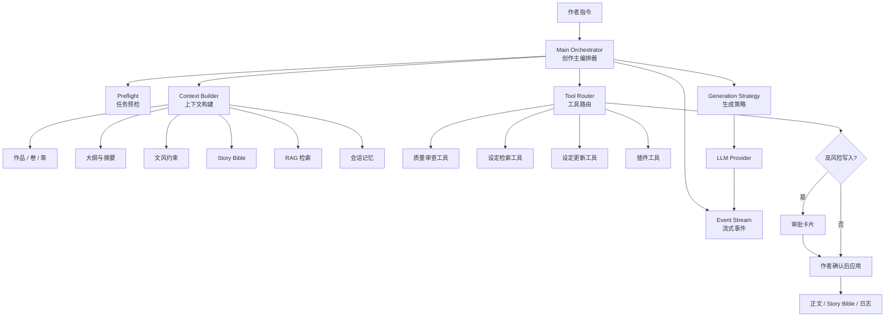
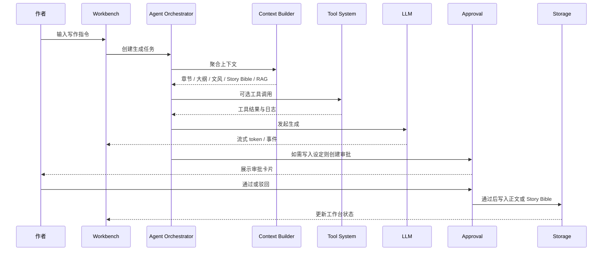
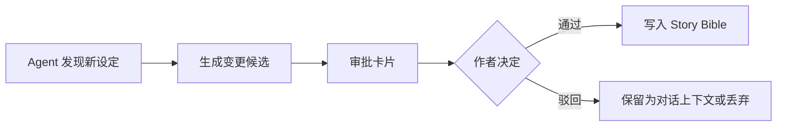

<div align="center">

# ✒️ PenMate

### 面向长篇小说作者的 AI Agent 创作工作台

<p>
  
  
  
  
</p>

PenMate 不是一个简单的“AI 续写框”。它更像一位懂长篇小说结构的创作搭档：能理解你的作品设定、章节进度、人物关系、文风偏好和历史上下文，并在需要修改关键设定时先向你确认。

**目标：让 AI 参与创作，但不夺走作者的控制权。**

[用户体验](#-用户体验) · [Agent 架构](#-agent-架构) · [核心能力](#-核心能力) · [快速开始](#-快速开始) · [部署](#-部署)

</div>

---

## 🌟 用户体验

PenMate 围绕小说作者的真实工作流设计：

### 1. 从作品开始，而不是从空白聊天开始

作者可以先创建作品，维护卷、章、大纲和正文草稿。AI 每次生成时都会围绕当前作品上下文工作，而不是只依赖一条孤立 prompt。

### 2. 在 Workbench 中边写边协作

Workbench 将常见写作任务放在一个界面里：

- 左侧：作品结构、卷章、大纲、故事圣经入口
- 中间：正文编辑器与版本预览
- 右侧：Agent 对话、生成进度、工具调用、审批卡片

作者可以让 Agent 执行诸如：

- “根据这一章大纲扩写正文”
- “保持当前文风，补一段人物冲突”
- “检查这段是否违反已有设定”
- “把新出现的组织加入故事圣经，但先让我确认”
- “参考前文伏笔，生成下一场戏”

### 3. AI 可以建议，但关键写入需要作者点头

长篇创作最怕 AI 自作主张改设定。PenMate 对高风险动作采用 **Human-in-the-Loop**：

1. Agent 发现可能需要新增或修改世界观、角色、地点、关系等设定。
2. 系统生成审批卡片。
3. 作者确认后才写入 Story Bible 或正文。
4. 所有变更都有状态和日志可追踪。

### 4. 写得越久，Agent 越懂这本书

PenMate 将长篇小说拆成可检索、可引用、可演化的上下文资产：

- 已写章节
- 大纲与章节摘要
- Story Bible 设定
- 角色关系与演化
- 文风规则
- Agent 历史对话与工具调用记录
- RAG 检索片段

这让 Agent 能在长篇创作中持续保持一致性。

---

## 🧠 Agent 架构

PenMate 的核心是一个面向小说创作的 Agent 编排系统。它不追求“无限自治”，而是追求 **可控、可观测、可审批、可扩展**。



### 架构原则

| 原则 | 说明 |
| --- | --- |
| 🎛 作者主权 | Agent 负责生成、建议和辅助决策，最终采用权仍属于作者。 |
| 🧩 单主编排 | 以 Main Orchestrator 作为主链路入口，避免多个 Agent 抢控制权。 |
| 🧠 上下文优先 | 生成前先构建作品、章节、文风、故事圣经、RAG 与会话上下文。 |
| 🧰 工具可审计 | 工具调用有输入摘要、输出摘要、耗时、状态与任务关联。 |
| ✅ 高风险审批 | 涉及设定落库、角色关系修改等动作进入审批流。 |
| 📡 事件驱动体验 | 通过生成事件把 token、工具调用、等待审批、完成/失败状态同步到界面。 |
| 🧱 可演进边界 | Agent 能力在既有 DDD 模块边界内增强，不以“重写系统”为代价。 |

---

## 🧬 Agent 运行链路

一次创作请求大致会经历以下阶段：



### Agent 状态模型

```text
pending -> running -> waiting_approval -> done -> applied
                         |                 |
                         v                 v
                      cancelled          failed
```

这些状态让用户可以清楚知道：AI 是正在写、正在调用工具、等待作者确认，还是已经可应用到编辑器。

---

## 📚 Story Bible：Agent 的长期记忆

Story Bible 是 PenMate 区别于普通 AI 写作工具的关键模块。它让 Agent 在长篇创作中记住并遵守作品事实。

可承载的信息包括：

- 角色：身份、动机、能力、关系、状态变化
- 地点：地理位置、势力范围、历史事件
- 组织：层级、目标、冲突关系
- 世界观：规则、禁忌、力量体系、时代背景
- 线索：伏笔、悬念、未回收信息
- 演化：某个设定在章节推进中的变化轨迹

Agent 在生成时可以检索 Story Bible，并在发现新设定时通过审批卡片建议写入。

---

## 🔎 RAG：让 Agent 带着证据写作

PenMate 使用 RAG 为 Agent 提供可检索上下文，而不是把全部历史文本一次性塞进 prompt。

适合进入 RAG 的内容：

- 已完成章节
- 人物设定与关系
- 世界观资料
- 历史对话摘要
- 风格样例
- 外部素材或研究笔记

RAG 的目标不是“越多越好”，而是让 Agent 在生成前拿到与当前场景最相关的上下文片段，并留下检索记录，方便后续排查生成质量。

---

## 🛠 工具系统与审批机制

PenMate 的 Agent 可以调用工具，但工具调用不是黑箱。

### 工具类型示例

| 工具 | 用途 |
| --- | --- |
| 设定检索工具 | 在 Story Bible 中查找角色、地点、组织、世界观规则。 |
| 设定更新工具 | 生成新增/修改设定的候选变更，并交由作者审批。 |
| 质量审查工具 | 检查剧情一致性、角色行为合理性、文风偏移等问题。 |
| 插件工具 | 为特定创作场景扩展能力，例如资料查询、结构分析、文本改写。 |

### 审批机制

当 Agent 准备执行高风险写入时，系统会创建审批卡片：



这使 PenMate 更适合严肃长篇创作：AI 可以主动辅助，但不会绕过作者修改作品事实。

---

## 🧩 核心能力

| 用户问题 | PenMate 如何解决 |
| --- | --- |
| AI 忘记前文 | 通过 Story Bible、RAG 与章节上下文构建长期记忆。 |
| AI 改坏设定 | 高风险写入进入审批流，作者确认后才落库。 |
| 长篇人物关系复杂 | 结构化管理角色、组织、地点、关系与演化记录。 |
| 不知道 AI 正在干嘛 | 生成任务、工具调用、审批状态、日志全部可追踪。 |
| 文风容易飘 | 每次生成注入文风约束与样例上下文。 |
| 生成内容难以落到正文 | Workbench 支持生成、预览、应用到编辑器的闭环。 |

---

## 🧱 系统组成

这里只保留必要的工程信息，方便开发和部署：

```text
PenMate/
├─ penmate-frontend/          # 作者工作台界面
├─ penmate-backend/           # Agent 编排、业务服务、数据与集成层
├─ docs/                      # PRD、架构分析、计划与部署文档
├─ scripts/                   # 部署与运维脚本
├─ docker-compose.yml         # 本地完整环境
└─ docker-compose.prod.yml    # 生产部署环境
```

核心依赖：

- LLM：OpenAI-compatible / Anthropic / Gemini 等模型 Provider
- 记忆：PostgreSQL 18.4 + pgvector 0.8.5 + Redis + S3 兼容存储
- 通信：REST API + 生成事件流
- 部署：Docker Compose + GitHub Actions + GHCR

---

## 🚀 快速开始

### 1. 准备配置

```bash
cp .env.example .env
```

首次启动需要填写管理员和默认模型配置：

```env
BOOTSTRAP_ADMIN_EMAIL=admin@example.com
BOOTSTRAP_ADMIN_PASSWORD=<strong-admin-password>
BOOTSTRAP_CHAT_PROVIDER=openai
BOOTSTRAP_CHAT_BASE_URL=https://api.openai.com/v1
BOOTSTRAP_CHAT_API_KEY=<your-api-key>
BOOTSTRAP_CHAT_MODEL_NAME=gpt-4o-mini

# Embedding 组可选；留空时项目只能使用非 RAG 模式
BOOTSTRAP_EMBEDDING_PROVIDER=openai
BOOTSTRAP_EMBEDDING_BASE_URL=https://api.openai.com/v1
BOOTSTRAP_EMBEDDING_API_KEY=<your-api-key>
BOOTSTRAP_EMBEDDING_MODEL_NAME=text-embedding-3-small
```

### 2. 启动完整环境

```bash
docker compose --env-file .env up -d --build
```

访问：`http://localhost:8090`

### 3. 本地开发模式

先用本机 PostgreSQL 18 创建开发库和测试库：

```bash
createdb -U postgres penmate
createdb -U postgres penmate_test
```

本地占位账号、管理员和模型配置位于 `penmate-backend/src/main/resources/application-local.yml`，按本机环境修改即可，不要求存在 `.env`。

后端：

```bash
cd penmate-backend
mvn spring-boot:run -Dspring-boot.run.profiles=local
```

前端：

```bash
cd penmate-frontend
npm install
npm run dev
```

需要本地演示数据时显式执行：

```powershell
.\scripts\db\seed-demo.ps1
.\scripts\db\cleanup-demo.ps1
```

```bash
./scripts/db/seed-demo.sh
./scripts/db/cleanup-demo.sh
```

脚本只处理 `920000` 到 `922999` 的 case 数据，并默认拒绝非本机数据库。远程目标必须用 PowerShell `-AllowRemote` 或 Bash `PENMATE_ALLOW_REMOTE_DB=true` 显式确认。

---

## 🧪 质量检查

```bash
# backend
cd penmate-backend
# 默认连接本机 PostgreSQL 的 penmate_test 数据库；连接参数可用 -Dpenmate.test.database.* 覆盖
mvn -B verify

# frontend
cd penmate-frontend
npm run lint
npm run typecheck
npm run test:run
npm run build
```

---

## 🚢 部署

生产部署使用 `docker-compose.prod.yml` 与 GitHub Actions：

1. CI 构建前后端镜像并推送到 GHCR。
2. 服务器通过 SSH 拉取最新镜像。
3. Compose 重启应用、PostgreSQL/pgvector 和 Redis 等服务。
4. 支持手动 workflow 回滚到指定镜像版本。

详细说明：[`docs/deployment/docker-ssh.md`](docs/deployment/docker-ssh.md)

---

## 🗺 Roadmap

- [x] 作者工作台：书架、章节编辑、Agent 面板
- [x] Agent 生成任务与状态流转
- [x] Story Bible 结构化设定管理
- [x] RAG 检索与向量基础设施
- [x] 工具调用与审批卡片
- [x] Docker / CI / 远程部署
- [ ] 更细粒度的 Agent 评估与质量评分
- [ ] 更强的长篇剧情规划能力
- [ ] 更完善的角色关系图谱与伏笔追踪
- [ ] 多作品、多作者协作体验

---

<div align="center">

**PenMate · 让 AI 成为懂设定、守边界、可协作的小说创作伙伴。**

</div>
