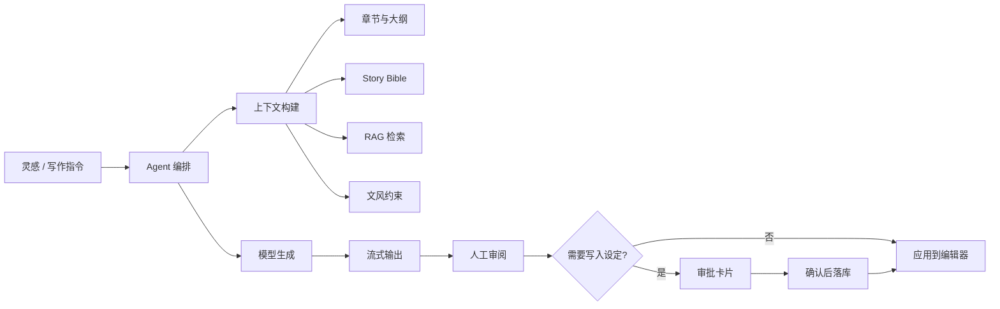
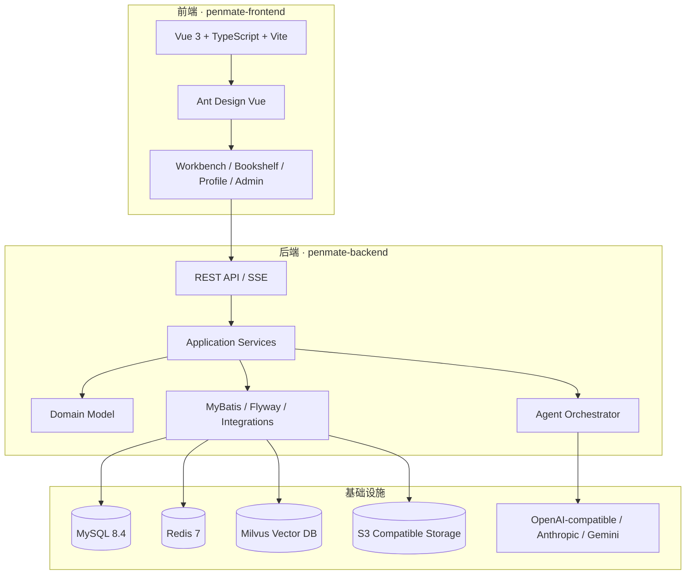

<div align="center">

# ✒️ PenMate

### AI 长篇小说创作工作台 · 从灵感、设定到正文交付的一体化写作伙伴

<p>
  
  
  
  
  
</p>

PenMate 是一个面向小说作者的 AI 创作系统：它把 **大纲、章节、故事圣经、文风、RAG 记忆、插件工具与人类审批** 连接到同一个 Workbench，让 AI 不只是“续写”，而是成为可控、可追溯、可迭代的写作协作者。

[功能亮点](#-功能亮点) · [技术架构](#-技术架构) · [快速开始](#-快速开始) · [部署](#-部署) · [项目结构](#-项目结构)

</div>

---

## ✨ 功能亮点

| 模块 | 能力 |
| --- | --- |
| 🧠 AI Agent 创作 | 基于上下文、章节草稿、风格约束与检索记忆进行智能生成，支持任务状态流转与生成链路追踪。 |
| 📚 Story Bible 故事圣经 | 管理角色、地点、组织、世界观、关系与演化记录，帮助长篇创作保持一致性。 |
| 🔎 RAG 记忆检索 | 接入向量数据库检索创作资料与历史设定，为 Agent 提供可追踪上下文。 |
| 📝 Workbench 写作台 | 左侧大纲、中间编辑器、右侧 Agent 面板组合式工作流，覆盖构思、生成、编辑与应用。 |
| ✅ HITL 人类审批 | 对高风险写入动作生成审批卡片，确认后再落库，避免 AI 自动破坏关键设定。 |
| 🔌 插件与工具调用 | 支持工具调用日志、降级策略与质量审查/故事圣经更新等工具化能力。 |
| 🔐 模型与密钥管理 | 支持模型配置、API Key 加密存储、用户偏好与安全设置。 |
| 🚀 Docker 化部署 | 提供本地/生产 Compose、GHCR 镜像流水线、SSH 部署与回滚工作流。 |

---

## 🧭 产品体验



---

## 🏗 技术架构

PenMate 采用前后端分离 + DDD 分层后端 + 容器化基础设施：



### 技术栈

**Frontend**

- Vue 3 / Vue Router / TypeScript
- Vite / Vitest / Vue Test Utils
- Ant Design Vue / Axios / Less

**Backend**

- Java 21 / Spring Boot 3.3
- Spring Security / JWT / SpringDoc OpenAPI
- MyBatis / Flyway / MySQL
- Redis / Actuator / Prometheus metrics
- LangChain4j / 多模型 Provider 接入
- S3 SDK / Milvus 向量检索

**DevOps**

- Docker Compose
- GitHub Actions
- GHCR 镜像发布
- SSH 远程部署与回滚

---

## 📦 项目结构

```text
PenMate/
├─ penmate-frontend/          # Vue 3 + Vite 前端应用
│  ├─ src/api/                # API 客户端与类型
│  ├─ src/components/         # 业务组件：工作台、书架、登录、个人设置等
│  ├─ src/composables/        # 组合式业务逻辑
│  └─ src/views/              # 页面：Home / Login / MyBooks / Workbench / Profile / Admin
├─ penmate-backend/           # Spring Boot 后端服务
│  ├─ src/main/java/...       # DDD 分层：interfaces / application / domain / infrastructure
│  └─ src/main/resources/     # application.yml、Flyway migration、Agent prompts
├─ docs/                      # PRD、技术分析、部署文档与演进计划
├─ scripts/                   # 部署脚本
├─ docker-compose.yml         # 本地开发 Compose
├─ docker-compose.prod.yml    # 生产部署 Compose
└─ .github/workflows/         # CI、部署与回滚流水线
```

---

## 🚀 快速开始

### 1. 环境要求

- JDK 21+
- Maven 3.9+
- Node.js 22+ / npm
- Docker + Docker Compose
- MySQL、Redis、Milvus 与 S3 兼容存储（可通过 Compose 或外部服务提供）

### 2. 准备配置

```bash
cp .env.example .env
```

按需填写 `.env` 中的数据库、Redis、S3、Milvus、LLM 与密钥配置。开发阶段可开启：

```env
LLM_MOCK_ENABLED=true
```

> 不要提交真实 `.env`、API Key、数据库密码或对象存储密钥。

### 3. 启动后端

```bash
cd penmate-backend
mvn spring-boot:run
```

后端默认地址：

- API: `http://localhost:8080/api`
- Health: `http://localhost:8080/actuator/health`
- Swagger UI: `http://localhost:8080/swagger-ui/index.html`

### 4. 启动前端

```bash
cd penmate-frontend
npm install
npm run dev
```

前端默认地址：`http://localhost:5173`

### 5. 使用 Docker Compose

如果你希望以容器方式启动完整应用：

```bash
docker compose --env-file .env up -d --build
```

默认访问：`http://localhost:8090`

停止服务：

```bash
docker compose --env-file .env down
```

---

## 🧪 测试与质量门禁

### 后端

```bash
cd penmate-backend
mvn -B verify
```

### 前端

```bash
cd penmate-frontend
npm run test:run
npm run test:coverage
npm run build
```

GitHub Actions 中包含 TDD/覆盖率质量门禁、镜像构建、部署和回滚工作流。

---

## 🚢 部署

生产环境推荐使用 `docker-compose.prod.yml` 搭配 GitHub Actions：

1. 配置 GitHub Secrets：`SSH_HOST`、`SSH_USER`、`SSH_PRIVATE_KEY`、`GHCR_USERNAME`、`GHCR_TOKEN` 等。
2. 在服务器准备 `/opt/penmate/.env` 并填写生产密钥。
3. 推送到 `master` / `main` 或手动触发 workflow。
4. CI 构建前后端镜像并推送到 GHCR。
5. 服务器通过 SSH 拉取镜像并重启 Compose 服务。

更多细节见：[`docs/deployment/docker-ssh.md`](docs/deployment/docker-ssh.md)

---

## 🔐 安全提示

- `.env`、生产密钥、模型 API Key 不应提交到 Git。
- 生产环境务必替换 `JWT_SECRET` 与 `MODEL_KEY_ENCRYPTION_KEY_BASE64`。
- 数据库、Redis、Milvus、对象存储建议仅暴露在内网或受控网络。
- 高风险 AI 写入动作应通过审批卡片确认后再应用。

---

## 🗺 Roadmap

- [x] 小说书架、章节编辑与工作台基础体验
- [x] Agent 生成链路、工具调用与任务状态管理
- [x] Story Bible 故事圣经管理
- [x] RAG / Milvus 检索基础设施
- [x] Docker Compose 与 GitHub Actions 部署
- [ ] 更丰富的插件生态与质量评估工具
- [ ] 更细粒度的成本、Token 与可观测性面板
- [ ] 多作品、多团队协作与权限体验增强

---

## 🤝 Contributing

欢迎提交 Issue 和 Pull Request。建议先运行对应测试与构建命令，确保前后端质量门禁通过。

```bash
# backend
cd penmate-backend && mvn -B verify

# frontend
cd penmate-frontend && npm run test:coverage && npm run build
```

---

<div align="center">

**PenMate · Write longer, remember better, revise smarter.**

</div>
