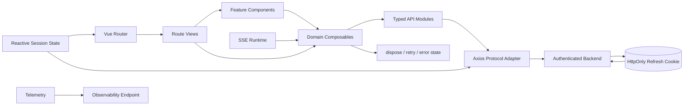

# PenMate 前端架构治理与验收报告

> 日期：2026-07-19
> 结构治理更新：2026-07-20
> 范围：`penmate-frontend`，以及为前端身份边界补齐的后端认证、安全配置和用户资料接口
> 方法：代码走查、静态扫描、单元测试、真实浏览器测试、生产构建、依赖审计、产物预算检查

## 1. 结论

本轮治理后，PenMate 已从“技术方向正确但工程保障不足”的阶段，提升到具备明确质量门禁、安全会话边界、真实业务持久化、浏览器级关键旅程和生产部署基线的状态。

当前实现符合现代 Vue 工程的主流思想：Vue 3 Composition API、严格 TypeScript、路由级懒加载、API 适配层、composable 领域逻辑、最小化全局注册、自动化质量门禁和前后端共同承担的纵深防御。它不需要重写。

两个最高复杂度页面已经完成垂直切片。后续长期工作主要是逐步用明确 DTO 或生成类型替换仍属动态协议的开放字典；这属于网络契约演进，不再由路由页面承担。

### 治理后成熟度

| 维度 | 结论 | 主要证据 |
|---|---|---|
| 技术栈 | 良好 | Vue 3.5、TypeScript、Vite、Vitest、Playwright |
| 架构边界 | 良好 | View / component / composable / API / request 分层，状态所有权和资源释放明确 |
| 类型安全 | 良好 | 独立 `vue-tsc` 门禁；业务 ID 保持字符串；网络边界集中归一化 |
| 测试 | 良好 | 38 个单测文件、174 条用例；桌面和移动浏览器关键旅程 |
| 安全 | 良好 | 纯文本聊天、内存 access token、HttpOnly refresh cookie、CSP、后端默认鉴权和 RBAC |
| 性能 | 良好 | 初始 JS 97 KB gzip；图片约 1.08 MB；生产预算自动阻断回退 |
| 可运维性 | 良好 | traceId、全局错误捕获、可配置 telemetry、初始化失败重试、健康检查 |
| 可访问性 | 中上 | a11y lint、语义按钮、键盘与 Escape 行为；后续可继续补 axe 全页面扫描 |

## 2. 治理后的架构



核心职责如下：

- `views/` 负责路由参数、页面布局和 feature 组合；
- `components/` 负责可复用交互与展示，不直接拥有全局会话；
- `composables/` 负责业务状态机、异步编排、取消和资源生命周期；
- `api/modules/` 负责端点、请求 DTO 和业务 ID 契约；
- `utils/request.ts` 负责 envelope、超大 ID 无损解析、认证、刷新合并和统一错误；
- `stores/session.ts` 是响应式会话事实源，敏感 token 不做持久化；
- 后端 Bearer 过滤器和 Spring Security 才是最终身份与权限边界。

## 3. 已完成治理

### 3.1 会话与身份安全

- access token 只保存在内存；本地存储仅保留非敏感用户展示信息。
- refresh token 由后端写入 HttpOnly、SameSite Cookie，前端 JavaScript 无法读取。
- 受保护路由声明 `requiresAuth`，首次进入时可用 Cookie 恢复会话。
- Profile 与 Workbench 复用唯一 logout 流程：调用服务端撤销会话、清理本地状态、替换到登录页。
- 后端由 `BearerAuthenticationFilter` 建立 Spring Security principal 和 authorities。
- 除登录、刷新、文档和健康检查外，接口默认要求认证；RBAC 管理接口要求 `rbac:admin:access`。
- 原生 EventSource 无法设置 Authorization header，因此仅对精确的 run-stream GET 路径接受短期 access cookie，不向普通接口扩大 Cookie 鉴权范围。

这符合“浏览器只持有最少可读凭据”和“前端权限只改善体验、后端权限才构成安全边界”的原则。

### 3.2 注入防护

- 聊天消息移除 `v-html`，使用 Vue 文本绑定和 `white-space: pre-wrap`。
- 服务端错误、历史消息、SSE 消息和用户输入走同一纯文本展示不变量。
- 回归用例验证恶意 HTML 不会生成可执行 DOM。
- Nginx 增加 CSP、`nosniff`、Referrer Policy、Permissions Policy 和 `frame-ancestors`。

### 3.3 真实业务持久化

- 个人资料、邮箱和密码修改接入真实后端接口，不再返回本地“假成功”。
- 用户 `bio` 增加数据库迁移和 IAM 持久化映射。
- 资料保存后同步刷新认证会话缓存，后续 `/auth/me` 返回一致数据。
- 作品数、总字数、模型密钥和模型偏好来自真实接口。
- 自动保存间隔和字号属于设备级 UI 偏好，明确存入 localStorage。

### 3.4 长连接与异步可靠性

- Workbench SSE runtime 暴露 `dispose()`，页面卸载时统一关闭 EventSource、timer 和监听器。
- 初始化过程具有 loading / ready / error 状态和显式重试入口。
- 401 刷新请求使用单一共享 Promise，避免并发请求触发刷新风暴。
- session-expired 事件统一清理会话并带原路径跳转登录页。
- API 错误被归一化为带 HTTP 状态、错误码、traceId 和 details 的应用错误。

### 3.5 工程质量门禁

- 统一 npm，删除第二套 lockfile；声明 `packageManager` 和 Node 22 engine。
- 增加 ESLint、Vue 规则、Vue accessibility 规则、Prettier 和独立 typecheck。
- CI 顺序执行安装、lint、typecheck、单测、浏览器 smoke、生产构建、包体预算和生产依赖审计。
- Playwright 覆盖首页到登录、匿名访问拦截、Cookie 会话恢复和真实退出，并同时运行 Desktop Chrome 与 Pixel 7 视口。
- 浏览器测试针对生产构建运行，固定并发，避免开发态依赖预打包造成 CI 抖动。

### 3.6 性能与静态资源

- 移除入口处 `app.use(Antd)` 全量注册，组件按需导入。
- PNG 资产转换为 WebP，非首屏图片增加 lazy loading。
- 路由保持动态 import，Workbench、Profile、RBAC 等不会进入首页初始路由包。
- 增加自动包体预算：初始 JS 250 KB gzip、单路由 JS 150 KB gzip、单图 300 KB、图片总计 2 MB。
- Nginx 对 hash 静态资源使用长期缓存，对 HTML 禁止陈旧缓存，并启用 gzip。

治理后生产数据：

```text
Initial JS     97 KB gzip
Largest route  50 KB gzip（Workbench）
Images          1,105 KB
Largest image     208 KB
```

相较治理前约 476 KB 的初始公共 JS 和 7.77 MB 图片，下载体积与解析压力显著下降。

### 3.7 可观测性与部署

- Vue 错误、window error 和 unhandled rejection 进入统一 telemetry 事件。
- 事件包含 route、release、traceId、错误栈和来源；配置 endpoint 后使用 `sendBeacon` 上报。
- Nginx 不向公网暴露 actuator，并修正 Docker healthcheck 的协议与端口。
- CI 对前后端变更分别执行质量验证，镜像只在验证成功后构建或发布。

### 3.8 清洁度与一致性

- 删除脚手架组件、示例图标和模板 README。
- 删除未被使用且会造成双事实源的 `workbenchSession.ts`。
- session store 改为 Vue reactive，避免 setup 时捕获不可更新快照。
- 删除重复包管理元数据、过期生成目录和无效配置。
- 前端 README 现在包含准确的环境要求、命令、目录与部署说明。

### 3.9 复杂页面职责治理

- `AdminRbac/index.vue` 从 1,627 行降至 433 行，路由页 API 依赖由 1 个降为 0。
- RBAC 按用户、角色、菜单拆为三个 workspace view；协议归一化进入 `rbacModel.ts`，状态与命令进入 `useRbacConsole.ts`。
- `Workbench/index.vue` 从 1,008 行降至 336 行，路由页 API 依赖由 7 个降为 0。
- Workbench 分为页面组合、Agent 会话、项目/章节装载、插件/模型集成四个 controller，并继续复用 editor、outline、versions 等领域 composable。
- 新增架构 fitness test，禁止两个路由页重新直接依赖 API，并分别设置 500/400 行的页面规模上限。

这次拆分没有改变 DOM 测试选择器和用户流程。路由页现在只负责页面组件组合和绑定，异步编排由 feature controller 持有，协议细节由 API/composable 层持有。

## 4. 行业思想对照

| 行业原则 | 当前落地 |
|---|---|
| 纵深防御 | Vue 自动转义 + CSP + HttpOnly Cookie + 后端认证/RBAC |
| 最小权限 | access token 短期且仅内存；管理 API 独立 authority |
| 单一事实源 | 响应式 session；Workbench 资源由 composable 拥有并释放 |
| 函数核心、命令外壳 | Workbench 领域逻辑进入可注入、可测试 composable |
| 渐进增强 | 路由懒加载、按需 UI 组件、图片懒加载、Cookie 会话恢复 |
| 快速反馈 | lint、format、typecheck、unit、E2E、build、budget、audit 独立命令 |
| 可发布性优先 | 浏览器测试使用生产构建，Nginx 策略与 Docker 健康检查纳入治理 |
| 可观测而非猜测 | traceId 穿透错误对象，并提供统一错误上报入口 |

## 5. 验收结果

| 检查 | 结果 |
|---|---|
| `npm run lint` | 通过，0 warning |
| `npm run format:check` | 通过 |
| `npm run typecheck` | 通过 |
| `npm run test:run` | 通过，38 files / 174 tests |
| `npm run build` | 通过 |
| `npm run budget` | 通过，初始 JS 97 KB gzip，图片 1,105 KB |
| `npm run audit:prod` | 通过，0 vulnerabilities |
| `npm run test:e2e` | 通过，Desktop Chrome + Pixel 7 共 8 条核心旅程 |
| 后端认证定向测试 | Auth controller / service / filter / security config 通过 |
| `mvn -DskipTests compile` | 通过 |

后端完整集成测试仍要求可用的 PostgreSQL 测试环境。本机未配置仓库测试所需的数据库凭据，因此本轮以编译、无数据库单测和认证定向测试作为本地证据；CI 的 `ci-postgresql-tests` profile 继续承担容器化数据库验证。

## 6. 后续演进边界

以下是继续扩展产品时应坚持的边界，不是本轮遗留的功能缺陷：

1. `AdminRbac` 和 `Workbench` 新增能力必须进入现有 feature controller/component，架构 fitness test 禁止路由 view 重新吸收 API 编排。
2. 现有动态协议字段可以保留 `unknown`，但稳定端点应逐步换成明确 DTO；后端 OpenAPI 稳定后优先生成客户端类型。
3. telemetry endpoint、release ID 和告警采样策略应由部署环境注入，不把供应商 SDK 或密钥写死在源码。
4. 页面级无障碍可继续补 axe smoke 和焦点恢复场景，规则以 WCAG 2.2 AA 为目标。
5. 性能预算应按真实用户数据调整，但只能有证据地修改，不应为让 CI 通过而抬高。

## 7. 最终判断

治理后的 PenMate 前端符合业界成熟工程的主要思想，且关键结论已经由静态门禁、单元测试、真实浏览器和生产构建共同验证。当前最重要的成果不是增加了多少工具，而是把会话、安全、异步资源、业务持久化和发布质量从隐式约定变成了可执行契约。

项目可以继续在现有架构上演进。下一阶段应围绕稳定接口逐步收紧 DTO，并保持已经建立的 feature 边界，而不是重新把业务规则堆回路由页面。
