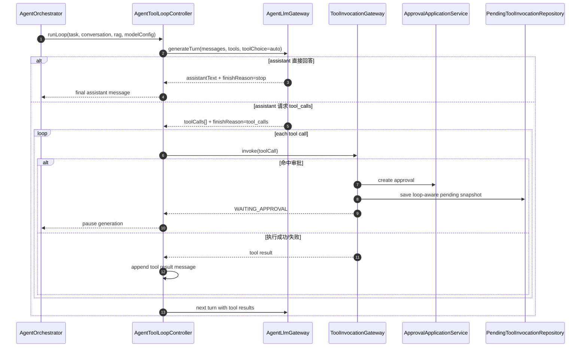

# PenMate Backend Agent Tool Loop & Hutool JSON Unification Implementation Plan

> **For Claude:** REQUIRED SUB-SKILL: Use [executing-plans] mode to implement this plan task-by-task.

**Goal:** 将 [`penmate-backend`](penmate-backend) 从“强制调用 [`context_enhancer`](penmate-backend/src/main/java/com/penmate/backend/application/agent/ContextEnhancerAgentToolHandler.java:21) + 单次 tool 审批恢复”重构为“agent 自主决策工具调用的多步 tool-calling loop”，并把 agent/tool 相关 JSON 处理统一到 Hutool。

**Architecture:** 在 [`AgentOrchestrator.runInternal()`](penmate-backend/src/main/java/com/penmate/backend/application/agent/AgentOrchestrator.java:57) 与 [`AgentLlmGateway.generate()`](penmate-backend/src/main/java/com/penmate/backend/application/agent/llm/AgentLlmGateway.java:25) 之间新增 loop controller，向 LLM 显式提供 tool schema 列表，并接收 `assistant text / tool_calls / finish_reason` 结构化响应。[`ToolInvocationGateway.invoke()`](penmate-backend/src/main/java/com/penmate/backend/application/agent/ToolInvocationGateway.java:79) 继续承担每次工具执行的统一门禁，但 [`PendingToolInvocationSnapshot`](penmate-backend/src/main/java/com/penmate/backend/domain/agent/model/PendingToolInvocationSnapshot.java:23) 必须扩展为“可恢复的 loop 光标快照”，让审批通过后恢复的是 loop 状态，而不是仅恢复一次孤立 tool 执行。

**Tech Stack:** Java 17, Spring Boot, MyBatis, Hutool JSON, WebSocket/SSE, Vue 3, Vitest, JUnit 5, Mockito

---

## 0. 范围与非目标

### 本计划覆盖范围

1. 统一 agent/tool/approval-resume 相关 JSON 处理到 Hutool
2. 为 LLM 引入 tool schema / tool call 响应协议
3. 引入真正的 tool-calling loop controller
4. 将审批挂起/恢复改造成 loop-aware
5. 更新前后端事件与消息/快照持久化契约
6. 给出 TDD 测试矩阵与分阶段上线方案

### 本计划明确不做

1. 不在本轮统一全项目所有 JSON 处理；仅限 agent/tool 相关路径
2. 不在本轮引入插件市场级动态 schema 注册中心
3. 不在本轮做多审批并发分支；同一 generation task 同时仅允许一个待决 approval

### 当前现状摘要

- [`AgentOrchestrator.runInternal()`](penmate-backend/src/main/java/com/penmate/backend/application/agent/AgentOrchestrator.java:57) 当前固定执行 `RAG -> context_enhancer -> generate text`
- [`NativeOpenAiStyleHttpProviderChatClient.generate()`](penmate-backend/src/main/java/com/penmate/backend/infrastructure/llm/langchain4j/provider/NativeOpenAiStyleHttpProviderChatClient.java:28) 当前仅支持纯文本 `messages + content`
- [`ToolInvocationGateway.invoke()`](penmate-backend/src/main/java/com/penmate/backend/application/agent/ToolInvocationGateway.java:79) 已具备单次 tool 审批挂起能力
- [`ApprovalApplicationService.resumeToolInvocationAfterApproved()`](penmate-backend/src/main/java/com/penmate/backend/application/approval/ApprovalApplicationService.java:194) 当前恢复的是单次工具调用，不是 loop 状态
- [`PendingToolInvocationSnapshot`](penmate-backend/src/main/java/com/penmate/backend/domain/agent/model/PendingToolInvocationSnapshot.java:23) 仅存储单次 tool 请求参数，没有 turn/loop 光标
- [`useWorkbenchChat.consumeGenerationStream()`](penmate-frontend/src/composables/workbench/useWorkbenchChat.ts:286) 只识别单个 `generation.waiting_approval` 卡片状态

---

## 1. 目标状态

### 1.1 目标调用链



### 1.2 关键设计决策

1. **JSON 统一策略**：agent/tool 路径统一通过一个 Hutool 门面类，不再在业务代码里直接 `new ObjectMapper()`
2. **LLM 契约升级**：新增 `generateTurn()`，返回结构化 turn response，而不是只返回字符串
3. **loop 作为一等对象**：恢复审批后继续 loop，而不是只恢复某个 handler
4. **消息表复用**：优先复用 [`agent_messages.tool_calls_json`](penmate-backend/src/main/java/com/penmate/backend/infrastructure/persistence/agent/AgentMapper.java:53) 持久化 assistant tool call
5. **单任务单挂起审批**：一次 loop 里命中审批即暂停；审批通过后从该步继续，避免多挂起分叉复杂度

---

## 2. 新增/改造文件总览

### 后端新增文件

- Create: `penmate-backend/src/main/java/com/penmate/backend/application/agent/json/AgentJsons.java`
- Create: `penmate-backend/src/main/java/com/penmate/backend/application/agent/llm/AgentLlmToolSchema.java`
- Create: `penmate-backend/src/main/java/com/penmate/backend/application/agent/llm/AgentLlmToolCall.java`
- Create: `penmate-backend/src/main/java/com/penmate/backend/application/agent/llm/AgentLlmTurnRequest.java`
- Create: `penmate-backend/src/main/java/com/penmate/backend/application/agent/llm/AgentLlmTurnResponse.java`
- Create: `penmate-backend/src/main/java/com/penmate/backend/application/agent/loop/AgentToolLoopController.java`
- Create: `penmate-backend/src/main/java/com/penmate/backend/application/agent/loop/AgentToolLoopIterationResult.java`
- Create: `penmate-backend/src/main/java/com/penmate/backend/application/agent/loop/AgentPendingApprovalContext.java`
- Create: `penmate-backend/src/test/java/com/penmate/backend/application/agent/json/AgentJsonsTest.java`
- Create: `penmate-backend/src/test/java/com/penmate/backend/application/agent/loop/AgentToolLoopControllerTest.java`
- Create: `penmate-backend/src/test/java/com/penmate/backend/infrastructure/llm/langchain4j/provider/NativeOpenAiStyleHttpProviderChatClientToolModeTest.java`
- Create: `penmate-backend/src/test/java/com/penmate/backend/application/approval/ApprovedToolInvocationAsyncResumerTest.java`

### 后端修改文件

- Modify: `penmate-backend/src/main/java/com/penmate/backend/application/agent/AgentOrchestrator.java:41-230`
- Modify: `penmate-backend/src/main/java/com/penmate/backend/application/agent/ToolInvocationGateway.java:79-193`
- Modify: `penmate-backend/src/main/java/com/penmate/backend/application/agent/ContextEnhancerAgentToolHandler.java:12-46`
- Modify: `penmate-backend/src/main/java/com/penmate/backend/application/agent/BookCrudAgentToolHandler.java:32-193`
- Modify: `penmate-backend/src/main/java/com/penmate/backend/application/agent/StaticToolMetadataRegistry.java:12-14`
- Modify: `penmate-backend/src/main/java/com/penmate/backend/application/agent/llm/AgentLlmGateway.java:13-29`
- Modify: `penmate-backend/src/main/java/com/penmate/backend/infrastructure/llm/langchain4j/provider/NativeOpenAiStyleHttpProviderChatClient.java:21-95`
- Modify: `penmate-backend/src/main/java/com/penmate/backend/application/approval/ApprovalApplicationService.java:141-208`
- Modify: `penmate-backend/src/main/java/com/penmate/backend/application/approval/ApprovedToolInvocationAsyncResumer.java:47-120`
- Modify: `penmate-backend/src/main/java/com/penmate/backend/domain/agent/model/PendingToolInvocationSnapshot.java:23-35`
- Modify: `penmate-backend/src/main/java/com/penmate/backend/domain/agent/repository/PendingToolInvocationRepository.java:7-16`
- Modify: `penmate-backend/src/main/java/com/penmate/backend/infrastructure/persistence/agent/PendingToolInvocationMapper.java:15-60`
- Modify: `penmate-backend/src/main/java/com/penmate/backend/infrastructure/persistence/agent/PendingToolInvocationRepositoryImpl.java:18-35`
- Modify: `penmate-backend/src/main/java/com/penmate/backend/domain/shared/service/RealtimeEventService.java:5-24`
- Modify: `penmate-backend/src/main/java/com/penmate/backend/infrastructure/realtime/RealtimeEventServiceImpl.java:40-147`
- Modify: `penmate-backend/src/test/java/com/penmate/backend/application/approval/ApprovalApplicationServiceTest.java`
- Modify: `penmate-backend/src/test/java/com/penmate/backend/infrastructure/persistence/agent/PendingToolInvocationMapperDbCaseTest.java`
- Modify: `penmate-backend/src/test/resources/db/cases/seed_all_domain_base.sql`

### 前端影响文件

- Modify: `penmate-frontend/src/composables/workbench/useWorkbenchChat.ts:262-449`
- Modify: `penmate-frontend/src/composables/workbench/__tests__/useWorkbenchChat.spec.ts`
- Modify: `penmate-frontend/src/api/modules/approval.api.ts:6-18`
- Modify: `penmate-frontend/src/components/workbench/workbenchTypes.ts`

---

## 3. 数据模型目标

### 3.1 `PendingToolInvocationSnapshot` 扩展字段

保留现有字段，新增：

- `loopRunId`：一次 loop 运行实例 ID
- `llmTurnIndex`：当前暂停发生于第几轮 LLM turn
- `toolCallId`：本次待审批工具调用 ID
- `assistantToolCallsJson`：该轮 assistant 输出的完整 tool call 列表
- `conversationMessagesJson`：恢复所需的精简消息快照
- `resumeMode`：`RESUME_LOOP` / `LEGACY_SINGLE_TOOL`
- `approvalSummaryJson`：给前端和审批单展示的精简摘要

### 3.2 `agent_messages` 约定

- `role=assistant` 且 `tool_calls_json != []`：表示 assistant 发起 tool call 的中间消息
- `role=tool`：表示工具结果消息；`content_md` 存人类可读摘要，`tool_calls_json` 可为空
- 最终自然语言回答仍为 `role=assistant`

### 3.3 SSE / WebSocket 事件目标

保留现有事件名，扩充 payload：

- `generation.tool_call`
  - `toolCallId`
  - `toolCode`
  - `toolName`
  - `status` = `requested|running|waiting_approval|succeeded|failed`
  - `approvalId`
  - `approvalType`
  - `iteration`
  - `argumentsPreview`
- `generation.waiting_approval`
  - `toolCallId`
  - `approvalPreview`
  - `resumeMode`

---

## 4. 分阶段落地路径

### Phase A：无行为变化的基础设施铺垫

1. 引入 Hutool JSON 门面
2. 引入结构化 LLM turn DTO
3. 在 provider 层支持 `tools`/`tool_calls` 解析，但默认仍可走纯文本

### Phase B：单工具 loop 化

1. 新增 loop controller
2. 工具清单先只暴露 [`context_enhancer`](penmate-backend/src/main/java/com/penmate/backend/application/agent/ContextEnhancerAgentToolHandler.java:21)
3. 移除 [`AgentOrchestrator`](penmate-backend/src/main/java/com/penmate/backend/application/agent/AgentOrchestrator.java:78) 对 `context_enhancer` 的硬编码调用

### Phase C：审批恢复 loop 化

1. 扩展挂起快照字段
2. 审批通过后恢复到 loop controller，而不是直接 `handler.execute()`
3. 前端展示工具步骤与待审批节点

### Phase D：启用多工具

1. 加入 `book_crud`
2. 增强审批摘要、tool schema、参数预览
3. 删除遗留 `legacy single tool resume` 分支

---

## 5. 实施任务

### Task 1: 引入 Hutool JSON 统一门面

Use [test-driven-development] mode for this task.

**Files:**
- Create: `penmate-backend/src/main/java/com/penmate/backend/application/agent/json/AgentJsons.java`
- Test: `penmate-backend/src/test/java/com/penmate/backend/application/agent/json/AgentJsonsTest.java`

**Step 1: Write the failing test**

```java
package com.penmate.backend.application.agent.json;

import cn.hutool.json.JSONArray;
import cn.hutool.json.JSONObject;
import org.junit.jupiter.api.Test;

import static org.junit.jupiter.api.Assertions.*;

class AgentJsonsTest {

    @Test
    void should_parse_object_array_and_keep_stable_json_string() {
        JSONObject object = AgentJsons.parseObj("{\"tool\":\"context_enhancer\",\"enabled\":true}");
        JSONArray array = AgentJsons.parseArray("[{\"id\":\"call_1\"}]");

        assertEquals("context_enhancer", AgentJsons.getString(object, "tool"));
        assertTrue(AgentJsons.getBool(object, "enabled"));
        assertEquals("call_1", array.getJSONObject(0).getStr("id"));
        assertEquals("{\"tool\":\"context_enhancer\",\"enabled\":true}", AgentJsons.toJson(object));
    }

    @Test
    void should_return_empty_structures_for_blank_json() {
        assertTrue(AgentJsons.parseObj(null).isEmpty());
        assertTrue(AgentJsons.parseObj(" ").isEmpty());
        assertTrue(AgentJsons.parseArray(null).isEmpty());
    }
}
```

**Step 2: Run test to verify it fails**

Run: `mvn -Dtest=AgentJsonsTest test`

Expected: `BUILD FAILURE` with `cannot find symbol: class AgentJsons`

**Step 3: Write minimal implementation**

```java
package com.penmate.backend.application.agent.json;

import cn.hutool.json.JSONArray;
import cn.hutool.json.JSONConfig;
import cn.hutool.json.JSONObject;
import cn.hutool.json.JSONUtil;

public final class AgentJsons {

    private static final JSONConfig CONFIG = JSONConfig.create().setIgnoreNullValue(false);

    private AgentJsons() {
    }

    public static JSONObject parseObj(String raw) {
        if (raw == null || raw.isBlank()) {
            return JSONUtil.parseObj("{}", CONFIG);
        }
        return JSONUtil.parseObj(raw, CONFIG);
    }

    public static JSONArray parseArray(String raw) {
        if (raw == null || raw.isBlank()) {
            return JSONUtil.parseArray("[]", CONFIG);
        }
        return JSONUtil.parseArray(raw, CONFIG);
    }

    public static String toJson(Object value) {
        return JSONUtil.toJsonStr(value);
    }

    public static String getString(JSONObject object, String key) {
        return object == null ? "" : object.getStr(key, "");
    }

    public static boolean getBool(JSONObject object, String key) {
        return object != null && Boolean.TRUE.equals(object.getBool(key, false));
    }
}
```

**Step 4: Run test to verify it passes**

Run: `mvn -Dtest=AgentJsonsTest test`

Expected: `BUILD SUCCESS` and `Tests run: 2, Failures: 0`

**Step 5: Commit**

Run:

```bash
git add penmate-backend/src/main/java/com/penmate/backend/application/agent/json/AgentJsons.java penmate-backend/src/test/java/com/penmate/backend/application/agent/json/AgentJsonsTest.java
git commit -m "test(agent): add hutool json facade for agent flow"
```

### Task 2: 将 agent/tool 现有 JSON 处理迁移到 Hutool

Use [test-driven-development] mode for this task.

**Files:**
- Modify: `penmate-backend/src/main/java/com/penmate/backend/application/agent/ContextEnhancerAgentToolHandler.java:12-46`
- Modify: `penmate-backend/src/main/java/com/penmate/backend/application/agent/BookCrudAgentToolHandler.java:32-193`
- Modify: `penmate-backend/src/main/java/com/penmate/backend/application/agent/AgentApplicationService.java:29-239`
- Modify: `penmate-backend/src/main/java/com/penmate/backend/infrastructure/llm/langchain4j/provider/NativeOpenAiStyleHttpProviderChatClient.java:21-95`
- Test: `penmate-backend/src/test/java/com/penmate/backend/application/agent/BookCrudAgentToolHandlerTest.java`

**Step 1: Write the failing test**

```java
@Test
void validate_should_accept_hutool_generated_args_json() {
    String argsJson = AgentJsons.toJson(Map.of("operation", "delete", "projectId", 9L));
    ToolInvocationRequest request = new ToolInvocationRequest(1L, 2L, 3L, "book_crud", argsJson, 7L, "trace-1", "{}", "idem-1");
    assertDoesNotThrow(() -> handler.validate(request));
}
```

**Step 2: Run test to verify it fails**

Run: `mvn -Dtest=BookCrudAgentToolHandlerTest test`

Expected: `BUILD FAILURE` or assertion failure caused by current parser helper mismatch / missing Hutool migration

**Step 3: Write minimal implementation**

Replace direct Jackson usage with [`AgentJsons`](penmate-backend/src/main/java/com/penmate/backend/application/agent/json/AgentJsons.java) and Hutool objects.

```java
JSONObject root = AgentJsons.parseObj(request.toolArgsJson());
String operation = root.getStr("operation", "");
long projectId = root.getLong("projectId", 0L);
```

For output JSON:

```java
return ToolInvocationGatewayResult.success(AgentJsons.toJson(Map.of(
        "operation", operation,
        "projectId", project.getId(),
        "name", project.getTitle()
)));
```

For [`AgentApplicationService`](penmate-backend/src/main/java/com/penmate/backend/application/agent/AgentApplicationService.java:29-239), replace `ObjectMapper`-based normalization with:

```java
private String normalizeJsonPayload(Object rawValue) {
    if (rawValue == null) {
        return "{}";
    }
    if (rawValue instanceof String raw && !raw.isBlank()) {
        String trimmed = raw.trim();
        if (trimmed.startsWith("{") || trimmed.startsWith("[")) {
            return AgentJsons.toJson(cn.hutool.json.JSONUtil.parse(trimmed));
        }
    }
    return AgentJsons.toJson(rawValue);
}
```

**Step 4: Run targeted tests**

Run: `mvn -Dtest=BookCrudAgentToolHandlerTest,AgentControllerTest,ApprovalControllerTest test`

Expected: `BUILD SUCCESS`

**Step 5: Commit**

```bash
git add penmate-backend/src/main/java/com/penmate/backend/application/agent/ContextEnhancerAgentToolHandler.java penmate-backend/src/main/java/com/penmate/backend/application/agent/BookCrudAgentToolHandler.java penmate-backend/src/main/java/com/penmate/backend/application/agent/AgentApplicationService.java penmate-backend/src/main/java/com/penmate/backend/infrastructure/llm/langchain4j/provider/NativeOpenAiStyleHttpProviderChatClient.java
git commit -m "refactor(agent): migrate agent json handling to hutool"
```

### Task 3: 建立 LLM tool schema 与 turn response 契约

Use [test-driven-development] mode for this task.

**Files:**
- Create: `penmate-backend/src/main/java/com/penmate/backend/application/agent/llm/AgentLlmToolSchema.java`
- Create: `penmate-backend/src/main/java/com/penmate/backend/application/agent/llm/AgentLlmToolCall.java`
- Create: `penmate-backend/src/main/java/com/penmate/backend/application/agent/llm/AgentLlmTurnRequest.java`
- Create: `penmate-backend/src/main/java/com/penmate/backend/application/agent/llm/AgentLlmTurnResponse.java`
- Modify: `penmate-backend/src/main/java/com/penmate/backend/application/agent/llm/AgentLlmGateway.java:13-29`
- Modify: `penmate-backend/src/main/java/com/penmate/backend/infrastructure/llm/langchain4j/provider/NativeOpenAiStyleHttpProviderChatClient.java:27-95`
- Test: `penmate-backend/src/test/java/com/penmate/backend/infrastructure/llm/langchain4j/provider/NativeOpenAiStyleHttpProviderChatClientToolModeTest.java`

**Step 1: Write the failing test**

```java
@Test
void extract_turn_response_should_parse_tool_calls() {
    String responseBody = """
        {
          "choices": [{
            "finish_reason": "tool_calls",
            "message": {
              "content": "",
              "tool_calls": [{
                "id": "call_1",
                "type": "function",
                "function": {
                  "name": "context_enhancer",
                  "arguments": "{\\"prompt\\":\\"hello\\"}"
                }
              }]
            }
          }]
        }
        """;

    AgentLlmTurnResponse response = client.extractTurnResponse(responseBody);

    assertEquals("tool_calls", response.finishReason());
    assertEquals(1, response.toolCalls().size());
    assertEquals("context_enhancer", response.toolCalls().get(0).toolCode());
}
```

**Step 2: Run test to verify it fails**

Run: `mvn -Dtest=NativeOpenAiStyleHttpProviderChatClientToolModeTest test`

Expected: `BUILD FAILURE` with missing `extractTurnResponse` / DTO types

**Step 3: Write minimal implementation**

关键接口改造：

```java
public interface AgentLlmGateway {
    AgentLlmTurnResponse generateTurn(AgentLlmTurnRequest request, AgentLlmExecutionConfig executionConfig);
}
```

关键响应结构：

```java
public record AgentLlmToolCall(
        String id,
        String toolCode,
        String argumentsJson
) {}

public record AgentLlmTurnResponse(
        String finishReason,
        String assistantText,
        java.util.List<AgentLlmToolCall> toolCalls,
        String rawResponseJson
) {
    public boolean requestsToolCalls() {
        return "tool_calls".equalsIgnoreCase(finishReason) && toolCalls != null && !toolCalls.isEmpty();
    }
}
```

Provider 解析逻辑用 Hutool：

```java
public AgentLlmTurnResponse extractTurnResponse(String responseBody) {
    JSONObject root = AgentJsons.parseObj(responseBody);
    JSONObject choice = root.getJSONArray("choices").getJSONObject(0);
    JSONObject message = choice.getJSONObject("message");
    JSONArray toolCalls = message.getJSONArray("tool_calls");
    List<AgentLlmToolCall> calls = new ArrayList<>();
    if (toolCalls != null) {
        for (int i = 0; i < toolCalls.size(); i++) {
            JSONObject item = toolCalls.getJSONObject(i);
            JSONObject function = item.getJSONObject("function");
            calls.add(new AgentLlmToolCall(
                    item.getStr("id"),
                    function.getStr("name"),
                    function.getStr("arguments", "{}")
            ));
        }
    }
    return new AgentLlmTurnResponse(
            choice.getStr("finish_reason", "stop"),
            message.getStr("content", ""),
            calls,
            responseBody
    );
}
```

**Step 4: Run targeted tests**

Run: `mvn -Dtest=NativeOpenAiStyleHttpProviderChatClientToolModeTest test`

Expected: `BUILD SUCCESS`

**Step 5: Commit**

```bash
git add penmate-backend/src/main/java/com/penmate/backend/application/agent/llm penmate-backend/src/main/java/com/penmate/backend/infrastructure/llm/langchain4j/provider/NativeOpenAiStyleHttpProviderChatClient.java penmate-backend/src/test/java/com/penmate/backend/infrastructure/llm/langchain4j/provider/NativeOpenAiStyleHttpProviderChatClientToolModeTest.java
git commit -m "feat(agent): add llm tool schema and turn response contract"
```

### Task 4: 引入真正的 tool-calling loop controller

Use [test-driven-development] mode for this task.

**Files:**
- Create: `penmate-backend/src/main/java/com/penmate/backend/application/agent/loop/AgentToolLoopController.java`
- Create: `penmate-backend/src/main/java/com/penmate/backend/application/agent/loop/AgentToolLoopIterationResult.java`
- Modify: `penmate-backend/src/main/java/com/penmate/backend/application/agent/AgentOrchestrator.java:57-140`
- Modify: `penmate-backend/src/main/java/com/penmate/backend/application/agent/StaticToolMetadataRegistry.java:12-14`
- Test: `penmate-backend/src/test/java/com/penmate/backend/application/agent/loop/AgentToolLoopControllerTest.java`

**Step 1: Write the failing test**

```java
@Test
void should_invoke_tool_requested_by_llm_and_continue_until_final_answer() {
    when(agentLlmGateway.generateTurn(any(), any()))
            .thenReturn(new AgentLlmTurnResponse("tool_calls", "", List.of(new AgentLlmToolCall("call_1", "context_enhancer", "{\"prompt\":\"hi\"}")), "{}"))
            .thenReturn(new AgentLlmTurnResponse("stop", "final answer", List.of(), "{}"));

    when(toolInvocationGateway.invoke(any()))
            .thenReturn(ToolInvocationGatewayResult.success("{\"summary\":\"ctx\"}"));

    AgentToolLoopIterationResult result = controller.run(task, ragChunks, executionConfig, "trace-1");

    assertEquals("COMPLETED", result.status());
    assertEquals("final answer", result.finalAssistantText());
    verify(toolInvocationGateway).invoke(any());
}
```

**Step 2: Run test to verify it fails**

Run: `mvn -Dtest=AgentToolLoopControllerTest test`

Expected: `BUILD FAILURE` because controller does not exist

**Step 3: Write minimal implementation**

```java
@Component
@RequiredArgsConstructor
public class AgentToolLoopController {

    private static final int MAX_TOOL_TURNS = 4;

    private final AgentLlmGateway agentLlmGateway;
    private final ToolInvocationGateway toolInvocationGateway;
    private final AgentRepository agentRepository;

    public AgentToolLoopIterationResult run(AgentGenerationTask task,
                                            List<RagRetrievedChunk> ragChunks,
                                            AgentLlmExecutionConfig executionConfig,
                                            String traceId) {
        List<Map<String, Object>> messages = new ArrayList<>();
        messages.add(Map.of("role", "user", "content", task.getPromptSnapshot()));

        for (int turn = 0; turn < MAX_TOOL_TURNS; turn++) {
            AgentLlmTurnResponse response = agentLlmGateway.generateTurn(
                    AgentLlmTurnRequest.forConversation(messages, buildToolSchemas(), ragChunks, task),
                    executionConfig
            );
            if (!response.requestsToolCalls()) {
                return AgentToolLoopIterationResult.completed(response.assistantText());
            }
            persistAssistantToolCallMessage(task, response);
            for (AgentLlmToolCall toolCall : response.toolCalls()) {
                ToolInvocationGatewayResult toolResult = toolInvocationGateway.invoke(toToolRequest(task, toolCall, traceId));
                if ("WAITING_APPROVAL".equals(toolResult.status())) {
                    return AgentToolLoopIterationResult.waitingApproval(toolResult.approvalId(), toolCall.id(), turn);
                }
                messages.add(Map.of("role", "tool", "tool_call_id", toolCall.id(), "content", toolResult.toolOutput()));
                persistToolResultMessage(task, toolCall, toolResult);
            }
        }
        throw new IllegalStateException("Tool loop exceeded max turns");
    }
}
```

[`AgentOrchestrator.runInternal()`](penmate-backend/src/main/java/com/penmate/backend/application/agent/AgentOrchestrator.java:57) 改成：

1. `RUNNING`
2. RAG
3. `AgentToolLoopController.run(...)`
4. `WAITING_APPROVAL` 则直接返回
5. `COMPLETED` 则发送最终文本

**Step 4: Run targeted tests**

Run: `mvn -Dtest=AgentToolLoopControllerTest test`

Expected: `BUILD SUCCESS`

**Step 5: Commit**

```bash
git add penmate-backend/src/main/java/com/penmate/backend/application/agent/loop penmate-backend/src/main/java/com/penmate/backend/application/agent/AgentOrchestrator.java penmate-backend/src/main/java/com/penmate/backend/application/agent/StaticToolMetadataRegistry.java penmate-backend/src/test/java/com/penmate/backend/application/agent/loop/AgentToolLoopControllerTest.java
git commit -m "feat(agent): replace hardcoded tool path with tool calling loop"
```

### Task 5: 让审批挂起快照适配多步 loop

Use [test-driven-development] mode for this task.

**Files:**
- Modify: `penmate-backend/src/main/java/com/penmate/backend/domain/agent/model/PendingToolInvocationSnapshot.java:23-35`
- Modify: `penmate-backend/src/main/java/com/penmate/backend/domain/agent/repository/PendingToolInvocationRepository.java:7-16`
- Modify: `penmate-backend/src/main/java/com/penmate/backend/infrastructure/persistence/agent/PendingToolInvocationMapper.java:15-60`
- Modify: `penmate-backend/src/main/java/com/penmate/backend/infrastructure/persistence/agent/PendingToolInvocationRepositoryImpl.java:18-35`
- Modify: `penmate-backend/src/test/java/com/penmate/backend/infrastructure/persistence/agent/PendingToolInvocationMapperDbCaseTest.java`
- Modify: `penmate-backend/src/test/resources/db/cases/seed_all_domain_base.sql`

**Step 1: Write the failing DB case test**

```java
@Test
void should_persist_loop_resume_fields() {
    PendingToolInvocationSnapshot snapshot = new PendingToolInvocationSnapshot(
            101L, 1L, 2L, 3L,
            "book_crud", "{\"operation\":\"delete\"}", "{}",
            9L, "trace-1", "idem-1", "pending",
            "loop-1", 2, "call_9", "[{\"id\":\"call_9\"}]", "[{\"role\":\"user\"}]",
            "RESUME_LOOP", "{\"approvalType\":\"BOOK_DELETE\"}"
    );

    mapper.insert(snapshot);
    PendingToolInvocationSnapshot loaded = mapper.findByApprovalId(101L);

    assertEquals("loop-1", loaded.loopRunId());
    assertEquals(2, loaded.llmTurnIndex());
    assertEquals("call_9", loaded.toolCallId());
    assertEquals("RESUME_LOOP", loaded.resumeMode());
}
```

**Step 2: Run test to verify it fails**

Run: `mvn -Dtest=PendingToolInvocationMapperDbCaseTest test`

Expected: `BUILD FAILURE` due to constructor / SQL column mismatch

**Step 3: Write minimal implementation**

将 record 扩展为：

```java
public record PendingToolInvocationSnapshot(
        Long approvalId,
        Long projectId,
        Long taskId,
        Long conversationId,
        String toolCode,
        String toolArgsJson,
        String contextJson,
        Long operatorId,
        String traceId,
        String idempotencyKey,
        String status,
        String loopRunId,
        Integer llmTurnIndex,
        String toolCallId,
        String assistantToolCallsJson,
        String conversationMessagesJson,
        String resumeMode,
        String approvalSummaryJson
) {}
```

Mapper `INSERT/SELECT` 同步新增字段。

**Step 4: Run targeted tests**

Run: `mvn -Dtest=PendingToolInvocationMapperDbCaseTest,PendingToolInvocationRepositoryImplTest test`

Expected: `BUILD SUCCESS`

**Step 5: Commit**

```bash
git add penmate-backend/src/main/java/com/penmate/backend/domain/agent/model/PendingToolInvocationSnapshot.java penmate-backend/src/main/java/com/penmate/backend/domain/agent/repository/PendingToolInvocationRepository.java penmate-backend/src/main/java/com/penmate/backend/infrastructure/persistence/agent/PendingToolInvocationMapper.java penmate-backend/src/main/java/com/penmate/backend/infrastructure/persistence/agent/PendingToolInvocationRepositoryImpl.java penmate-backend/src/test/java/com/penmate/backend/infrastructure/persistence/agent/PendingToolInvocationMapperDbCaseTest.java penmate-backend/src/test/resources/db/cases/seed_all_domain_base.sql
git commit -m "feat(approval): persist loop aware pending tool snapshots"
```

### Task 6: 将审批通过/拒绝改造成恢复 loop，而不是恢复单次 tool

Use [test-driven-development] mode for this task.

**Files:**
- Modify: `penmate-backend/src/main/java/com/penmate/backend/application/approval/ApprovalApplicationService.java:141-208`
- Modify: `penmate-backend/src/main/java/com/penmate/backend/application/approval/ApprovedToolInvocationAsyncResumer.java:47-120`
- Modify: `penmate-backend/src/main/java/com/penmate/backend/application/agent/ToolInvocationGateway.java:109-193`
- Test: `penmate-backend/src/test/java/com/penmate/backend/application/approval/ApprovalApplicationServiceTest.java`
- Test: `penmate-backend/src/test/java/com/penmate/backend/application/approval/ApprovedToolInvocationAsyncResumerTest.java`

**Step 1: Write the failing test**

```java
@Test
void approve_should_resume_loop_when_snapshot_resume_mode_is_resume_loop() {
    PendingToolInvocationSnapshot snapshot = snapshotWithResumeMode("RESUME_LOOP");
    when(pendingToolInvocationRepository.findByApprovalId(99L)).thenReturn(snapshot);
    when(pendingToolInvocationRepository.markStatus(99L, "pending", "executing")).thenReturn(1);

    approvalApplicationService.approve(99L, new ReviewApprovalCommand(7L, "ok"), "trace-1");

    verify(approvedToolInvocationAsyncResumer).resumeApprovedInvocation(any(), eq(snapshot));
    verify(toolInvocationGateway, never()).resume(any());
}
```

**Step 2: Run test to verify it fails**

Run: `mvn -Dtest=ApprovalApplicationServiceTest,ApprovedToolInvocationAsyncResumerTest test`

Expected: assertion failure because current code only resumes single tool

**Step 3: Write minimal implementation**

关键改法：

1. [`ToolInvocationGateway`](penmate-backend/src/main/java/com/penmate/backend/application/agent/ToolInvocationGateway.java:109) 在命中审批时保存 loop 字段
2. [`ApprovedToolInvocationAsyncResumer`](penmate-backend/src/main/java/com/penmate/backend/application/approval/ApprovedToolInvocationAsyncResumer.java:54) 分支判断 `resumeMode`
3. `RESUME_LOOP` 时调用新的 `AgentToolLoopController.resumeFromPending(snapshot, request)`，而不是 `toolInvocationGateway.resume(snapshot)`

示例代码：

```java
if ("RESUME_LOOP".equals(snapshot.resumeMode())) {
    agentToolLoopController.resumeFromPending(request, snapshot);
} else {
    ToolInvocationGatewayResult result = toolInvocationGateway.resume(snapshot);
    if ("FAILED".equals(result.status())) {
        sealSnapshotAndTaskAsFailed(request, snapshot, result.errorCode(), result.errorMessage());
        return;
    }
}
```

拒绝路径保持任务 `FAILED`，但要补发 tool-call 失败事件，标明：

- `status = failed`
- `errorCode = AGENT_APPROVAL_REJECTED`
- `toolCallId`

**Step 4: Run targeted tests**

Run: `mvn -Dtest=ApprovalApplicationServiceTest,ApprovedToolInvocationAsyncResumerTest,PendingToolInvocationTimeoutGuardTest test`

Expected: `BUILD SUCCESS`

**Step 5: Commit**

```bash
git add penmate-backend/src/main/java/com/penmate/backend/application/approval/ApprovalApplicationService.java penmate-backend/src/main/java/com/penmate/backend/application/approval/ApprovedToolInvocationAsyncResumer.java penmate-backend/src/main/java/com/penmate/backend/application/agent/ToolInvocationGateway.java penmate-backend/src/test/java/com/penmate/backend/application/approval/ApprovalApplicationServiceTest.java penmate-backend/src/test/java/com/penmate/backend/application/approval/ApprovedToolInvocationAsyncResumerTest.java
git commit -m "feat(approval): resume agent tool loop after approval"
```

### Task 7: 扩展事件与消息持久化，前后端可见 tool loop 轨迹

Use [test-driven-development] mode for this task.

**Files:**
- Modify: `penmate-backend/src/main/java/com/penmate/backend/domain/shared/service/RealtimeEventService.java:5-24`
- Modify: `penmate-backend/src/main/java/com/penmate/backend/infrastructure/realtime/RealtimeEventServiceImpl.java:84-147`
- Modify: `penmate-frontend/src/composables/workbench/useWorkbenchChat.ts:262-449`
- Modify: `penmate-frontend/src/composables/workbench/__tests__/useWorkbenchChat.spec.ts`
- Modify: `penmate-frontend/src/components/workbench/workbenchTypes.ts`

**Step 1: Write the failing frontend contract test**

```ts
it('attaches_tool_call_metadata_and_waiting_approval_to_assistant_message', async () => {
  const chat = await loadUseWorkbenchChat()
  const assistant = { id: 1, role: 'assistant', text: '' }

  const status = chat.consumeGenerationStream(1, 99, assistant as any)

  listeners.get('generation.tool_call')?.({
    data: JSON.stringify({
      toolCallId: 'call_1',
      toolCode: 'book_crud',
      status: 'waiting_approval',
      approvalId: 42,
      approvalType: 'BOOK_DELETE',
      argumentsPreview: { operation: 'delete' }
    })
  } as MessageEvent<string>)

  listeners.get('generation.waiting_approval')?.({
    data: JSON.stringify({
      toolCallId: 'call_1',
      approvalId: 42,
      approvalType: 'BOOK_DELETE',
      status: 'waiting_approval'
    })
  } as MessageEvent<string>)

  expect(assistant.approval?.id).toBe('42')
  expect(chat.generationPhase.value).toBe('waiting_approval')
  await expect(status).resolves.toBe('waiting_approval')
})
```

**Step 2: Run test to verify it fails**

Run: `npm run test -- src/composables/workbench/__tests__/useWorkbenchChat.spec.ts`

Expected: failing assertion because current chat consumer ignores `generation.tool_call`

**Step 3: Write minimal implementation**

后端事件扩展：

```java
payload.put("toolCallId", toolCallId);
payload.put("toolCode", toolCode);
payload.put("approvalId", approvalId);
payload.put("approvalType", approvalType);
payload.put("iteration", iteration);
payload.put("argumentsPreview", argumentsPreview);
```

前端消费扩展：

```ts
deps.addStreamListener(generationStream, 'generation.tool_call', (event) => {
  const payload = parseSseData(event)
  if (payload.status === 'waiting_approval') {
    const approval = buildApprovalCard(payload)
    if (approval) assistantMsg.approval = approval
    generationPhase.value = 'waiting_approval'
    generationTaskStatus.value = 'waiting_approval'
  }
})
```

注意：前端本轮无需完整可视化每个 tool result 卡片，只要：

1. 不丢失审批节点
2. 可读取 `toolCallId`
3. 为后续 UI 时间线保留字段

**Step 4: Run targeted tests**

Run:

```bash
mvn -Dtest=ApprovalApplicationServiceTest test
npm run test -- src/composables/workbench/__tests__/useWorkbenchChat.spec.ts
```

Expected: backend + frontend tests均通过

**Step 5: Commit**

```bash
git add penmate-backend/src/main/java/com/penmate/backend/domain/shared/service/RealtimeEventService.java penmate-backend/src/main/java/com/penmate/backend/infrastructure/realtime/RealtimeEventServiceImpl.java penmate-frontend/src/composables/workbench/useWorkbenchChat.ts penmate-frontend/src/composables/workbench/__tests__/useWorkbenchChat.spec.ts penmate-frontend/src/components/workbench/workbenchTypes.ts
git commit -m "feat(workbench): expose tool loop approval events"
```

### Task 8: 全链路回归、兼容性清理与分阶段上线开关

Use [verification-before-completion] mode for this task.

**Files:**
- Modify: `penmate-backend/src/main/java/com/penmate/backend/application/agent/AgentOrchestrator.java:57-140`
- Modify: `penmate-backend/src/main/java/com/penmate/backend/application/agent/ToolInvocationGateway.java:79-193`
- Modify: `docs/agent-tool-approval-flow-guide.md`

**Step 1: Write the failing regression tests**

新增或补齐以下断言：

1. `context_enhancer` 不再由 orchestrator 强制调用，而是由 LLM 决策
2. 单轮不请求 tool 时仍能直接完成文本生成
3. 命中审批后 task 进入 `waiting_approval`
4. 审批通过后 generation task 能继续并最终 `done`
5. 审批驳回后 generation task 为 `failed`

**Step 2: Run focused regression suite to verify red**

Run:

```bash
mvn -Dtest=AgentToolLoopControllerTest,ApprovalApplicationServiceTest,ApprovedToolInvocationAsyncResumerTest,PendingToolInvocationMapperDbCaseTest test
npm run test -- src/composables/workbench/__tests__/useWorkbenchChat.spec.ts
```

Expected: 至少一项失败，暴露未接线或旧路径残留

**Step 3: Write minimal implementation / cleanup**

完成最后清理：

1. 删除 [`AgentOrchestrator`](penmate-backend/src/main/java/com/penmate/backend/application/agent/AgentOrchestrator.java:78) 中构造 `context_enhancer` 的硬编码 JSON
2. 更新文档说明：审批恢复已从“恢复单次工具调用”升级为“恢复 loop”
3. 为 loop 设置保守阈值
   - `MAX_TOOL_TURNS = 4`
   - `MAX_TOOL_CALLS_PER_TURN = 3`
   - 同时仅允许 1 个 pending approval

**Step 4: Run full verification**

Run:

```bash
mvn test
npm run test -- src/composables/workbench/__tests__/useWorkbenchChat.spec.ts src/views/Workbench/index.chat-binding.spec.ts
```

Expected:

- Maven: `BUILD SUCCESS`
- Vitest: all selected tests passed

**Step 5: Commit**

```bash
git add penmate-backend docs/agent-tool-approval-flow-guide.md penmate-frontend/src/composables/workbench/__tests__/useWorkbenchChat.spec.ts penmate-frontend/src/views/Workbench/index.chat-binding.spec.ts
git commit -m "feat(agent): finish loop based tool calling and approval resume"
```

---

## 6. 关键实现细节说明

### 6.1 为什么必须先做 Hutool 门面，再做 loop

如果不先把 JSON 处理收口，后续会在以下位置重复维护两套协议：

- tool schema request body
- tool call response parsing
- pending snapshot loop state
- SSE payload preview
- `tool_calls_json` message persistence

先引入 [`AgentJsons`](penmate-backend/src/main/java/com/penmate/backend/application/agent/json/AgentJsons.java) 可以把 Hutool 作为唯一 agent/tool JSON 出入口，避免边改 loop 边清理 Jackson 分叉。

### 6.2 为什么审批恢复必须恢复 loop，而不是直接恢复 handler

因为真正的 LLM tool-calling 对话在审批前后依赖以下上下文：

1. 同一轮 assistant 输出的全部 tool calls
2. 已执行成功的前序 tool result
3. 当前轮 `tool_call_id`
4. 后续再发给 LLM 的对话消息序列

如果只恢复 handler：

- assistant 无法感知已批准的 tool result
- LLM 无法继续推理下一步
- 多工具同轮场景会丢失剩余 tool call 语义

### 6.3 provider 层最小兼容策略

改造 [`NativeOpenAiStyleHttpProviderChatClient`](penmate-backend/src/main/java/com/penmate/backend/infrastructure/llm/langchain4j/provider/NativeOpenAiStyleHttpProviderChatClient.java:19) 时保留两种返回：

1. `finish_reason=stop` -> 直接最终回答
2. `finish_reason=tool_calls` -> 进入工具循环

不要在 provider 中内嵌业务审批逻辑；provider 只负责协议适配。

### 6.4 前端为何只做“可见性增强”，不先做复杂时间线 UI

因为本轮目标是保证：

1. 审批节点正确可见
2. 生成状态不错误回落到 `idle`
3. 审批通过后前端不会误判生成已结束

复杂 timeline UI 可以在 loop 稳定后再补，不应该阻塞后端主链路重构。

---

## 7. 测试策略矩阵

### 7.1 单元测试

- `AgentJsonsTest`：Hutool JSON 门面
- `BookCrudAgentToolHandlerTest`：Hutool args 解析
- `NativeOpenAiStyleHttpProviderChatClientToolModeTest`：provider 解析 `tool_calls`
- `AgentToolLoopControllerTest`：loop 行为、最大轮次、等待审批分支
- `ApprovedToolInvocationAsyncResumerTest`：审批恢复 loop

### 7.2 应用服务测试

- `ApprovalApplicationServiceTest`：approve/reject 分支
- `PendingToolInvocationTimeoutGuardTest`：执行中快照超时兜底

### 7.3 DB Case 测试

- `PendingToolInvocationMapperDbCaseTest`：loop snapshot 字段读写

### 7.4 前端契约测试

- `useWorkbenchChat.spec.ts`：等待审批、tool_call 事件、恢复后状态
- `index.chat-binding.spec.ts`：父子组件绑定状态不回退

### 7.5 最终验收场景

1. LLM 直接回答，不调工具
2. LLM 调 `context_enhancer` 后回答
3. LLM 调 `book_crud.delete`，命中审批，前端出现审批卡
4. 审批通过后 loop 继续，最终回答完成
5. 审批拒绝后任务失败，前端显示失败

---

## 8. 风险清单与缓解

### 风险 1：LLM 返回多个 tool calls，但当前仅支持一个待审批

缓解：同一 turn 内顺序执行；一旦某一 tool 命中审批立即暂停，剩余未执行 tool calls 通过 `assistantToolCallsJson` 持久化，恢复后从当前索引继续。

### 风险 2：旧消息模型不支持 tool role

缓解：不改表结构，先复用 [`agent_messages`](penmate-backend/src/main/java/com/penmate/backend/infrastructure/persistence/agent/AgentMapper.java:50) 的 `role` 与 `tool_calls_json` 字段；列表接口按既有消息格式返回。

### 风险 3：provider 对不同 OpenAI 风格厂商返回格式存在差异

缓解：在 provider 层单独加解析测试，不把差异透传到 loop controller。

### 风险 4：前端收到 `generation.done` 早于审批恢复

缓解：等待审批分支禁止发送 `generation.done`；只有 loop 真正完成时才发送。

---

## 9. 推荐执行顺序

1. Task 1 - Hutool JSON 门面
2. Task 2 - agent/tool JSON 迁移
3. Task 3 - LLM turn/tool schema DTO
4. Task 4 - loop controller 替换硬编码工具调用
5. Task 5 - loop-aware pending snapshot
6. Task 6 - approval resume loop 化
7. Task 7 - 前后端事件契约
8. Task 8 - 全链路回归与清理

---

## 10. 完成判定标准

满足以下条件才算完成：

1. [`AgentOrchestrator`](penmate-backend/src/main/java/com/penmate/backend/application/agent/AgentOrchestrator.java:25) 不再硬编码构造 `context_enhancer`
2. [`AgentLlmGateway`](penmate-backend/src/main/java/com/penmate/backend/application/agent/llm/AgentLlmGateway.java:13) 能返回结构化 `tool_calls`
3. [`PendingToolInvocationSnapshot`](penmate-backend/src/main/java/com/penmate/backend/domain/agent/model/PendingToolInvocationSnapshot.java:23) 能保存 loop 恢复上下文
4. 审批通过恢复的是 loop，不是单次 handler 调用
5. 前端至少能正确展示 `waiting_approval` 与关联 `toolCallId`
6. agent/tool 相关 JSON 处理不再直接依赖 `ObjectMapper/JsonNode`
7. 后端与前端相关测试全部通过

---

## 11. 执行选项

Plan complete. Execute now?

1. Execute in this session ([executing-plans] mode)
2. Execute later (user will run `/execute-plan`)
3. Manual implementation (just use this plan as guide)

