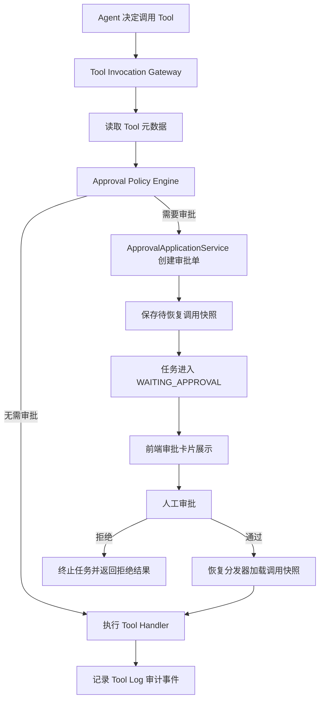
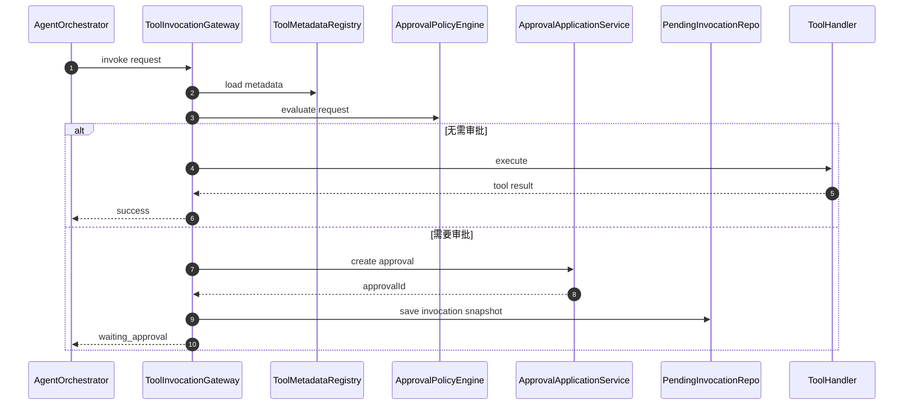
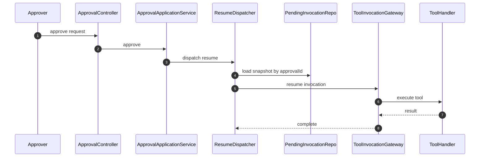

# Tool 接入审批单架构方案与实施计划

## 1. 文档目标

本文用于明确 [`penmate-backend`](penmate-backend) 中 agent loop 后续接入高风险 tool 时，审批单能力的推荐接入方式、调用链设计、模块职责边界、当前实现缺陷与后续改造注意事项。

本文聚焦技术方案，不展开工期估算。

---

## 2. 当前系统现状

### 2.1 已有审批能力

当前项目已经具备基础审批闭环：

- HTTP 接口入口在 [`ApprovalController`](penmate-backend/src/main/java/com/penmate/backend/interfaces/api/approval/ApprovalController.java:26)
- 审批应用服务在 [`ApprovalApplicationService`](penmate-backend/src/main/java/com/penmate/backend/application/approval/ApprovalApplicationService.java:23)
- 审批数据落库仓储为 [`ApprovalRequestRepository`](penmate-backend/src/main/java/com/penmate/backend/domain/approval/repository/ApprovalRequestRepository.java:1)
- 审批持久化表当前为 `agent_approval_requests`
- 审批通过后可由 [`ApprovalApplicationService.resumeTaskAfterApproved()`](penmate-backend/src/main/java/com/penmate/backend/application/approval/ApprovalApplicationService.java:164) 恢复 agent 编排
- 审批拒绝后可由 [`ApprovalApplicationService.markTaskFailedAfterRejected()`](penmate-backend/src/main/java/com/penmate/backend/application/approval/ApprovalApplicationService.java:186) 终止任务

### 2.2 当前 agent 审批门禁位置

当前审批门禁并不在 tool 统一执行入口，而是在 [`AgentOrchestrator.runInternal()`](penmate-backend/src/main/java/com/penmate/backend/application/agent/AgentOrchestrator.java:61) 主流程中提前判断：

- 任务先进入 `running`
- 调用 [`AgentOrchestrator.shouldPauseForApproval()`](penmate-backend/src/main/java/com/penmate/backend/application/agent/AgentOrchestrator.java:148) 判断是否命中审批门禁
- 命中后在 [`AgentOrchestrator.createApprovalRequest()`](penmate-backend/src/main/java/com/penmate/backend/application/agent/AgentOrchestrator.java:157) 中直接创建审批单
- 再将任务状态切为 `waiting_approval`
- 通过 [`RealtimeEventService.publishGenerationWaitingApproval()`](penmate-backend/src/main/java/com/penmate/backend/domain/shared/service/RealtimeEventService.java:19) 推送等待审批事件

### 2.3 当前 tool 执行位置

当前工具增强执行链路位于：

- [`PluginToolCoordinator.execute()`](penmate-backend/src/main/java/com/penmate/backend/application/agent/PluginToolCoordinator.java:40)
- 在 [`AgentOrchestrator.runInternal()`](penmate-backend/src/main/java/com/penmate/backend/application/agent/AgentOrchestrator.java:89) 中被调用
- tool 调用结果以 [`ToolExecutionResult`](penmate-backend/src/main/java/com/penmate/backend/application/agent/ToolExecutionResult.java:1) 承载
- tool 调用日志进入 `plugin_call_logs`

这意味着：**当前审批门禁发生在 tool 执行之前，但并没有沉淀为一个专门面向 tool invocation 的统一审批网关**。

---

## 3. 问题定义

未来数据库变更、批量删除、外部发布、插件安装、执行 SQL 等高风险操作准备作为 tool 接入 agent loop。此时需要解决以下问题：

1. 哪些 tool 需要审批，在哪里声明
2. 哪一层负责真正拦截 tool 调用
3. 审批单里保存哪些上下文，才能在审批通过后恢复执行
4. 审批通过后如何继续原调用链，避免重复审批或重复执行
5. 如何避免每个 tool 内部都散落审批逻辑

---

## 4. 方案结论

**推荐采用 声明式元数据 + 统一 Tool 调用网关 + 审批应用服务 三层组合方案。**

不推荐把审批逻辑直接写进每个 tool 函数内部。

也不推荐仅依赖一层无语义代理或仅依赖 Spring AOP 作为主方案。

### 4.1 一句话架构决策

- 用声明式元数据表达 `tool 是否需要审批`
- 在统一的 tool 调用网关中完成审批判断、审批单创建、挂起与恢复分发
- 审批状态流转继续统一收敛到 [`ApprovalApplicationService`](penmate-backend/src/main/java/com/penmate/backend/application/approval/ApprovalApplicationService.java:23)
- tool handler 本身只保留业务执行职责，不承担审批状态机职责

---

## 5. 推荐目标架构

---

## 6. 核心模块设计

## 6.1 [`ToolInvocationGateway`](penmate-backend/src/main/java/com/penmate/backend/application/agent/ToolInvocationGateway.java)

### 职责

统一承接 agent 发起的 tool 调用请求，负责：

1. 加载 tool 元数据
2. 评估是否需要审批
3. 创建审批单
4. 保存待恢复调用快照
5. 控制任务状态切换为 `waiting_approval`
6. 审批通过后恢复 tool 调用
7. 汇总执行结果并输出日志与事件

### 输入建议

建议定义统一请求对象，例如：

- `projectId`
- `taskId`
- `conversationId`
- `toolCode`
- `toolArgsJson`
- `operatorId`
- `traceId`
- `contextJson`
- `idempotencyKey`

### 输出建议

建议定义统一结果对象，至少包含：

- `status`，如 `SUCCESS`、`WAITING_APPROVAL`、`REJECTED`、`FAILED`
- `approvalId`
- `toolOutput`
- `errorCode`
- `errorMessage`

### 关键原因

tool 审批拦截本质不是一个通用 AOP 切面问题，而是一个**带状态机、可挂起、可恢复、可重放**的领域执行网关问题。

---

## 6.2 [`ToolMetadata`](penmate-backend/src/main/java/com/penmate/backend/application/agent/ToolMetadata.java)

### 建议字段

- `toolCode`
- `displayName`
- `approvalRequired`
- `approvalType`
- `riskLevel`
- `resumeStrategy`
- `payloadBuilder`
- `idempotencyKeyBuilder`
- `argumentSanitizer`
- `resourceScopeResolver`

### 设计建议

元数据可以有两种承载方式：

#### 方式 A：注解

适合本地 Java Bean tool，便于与 handler 紧邻维护。

#### 方式 B：注册表配置

适合后续插件化、远程 tool、动态装配场景，扩展性更强。

### 推荐结论

当前项目可优先采用 **注解 + 注册表扫描**，后续演进为注册中心模型。

---

## 6.3 [`ApprovalPolicyEngine`](penmate-backend/src/main/java/com/penmate/backend/application/approval/ApprovalPolicyEngine.java)

### 职责

对某次 tool invocation 做运行时风险评估，而不是只看静态 tool 名称。

### 规则维度建议

1. 固定高风险 tool
   - 如 `execute_sql`
   - 如 `alter_schema`
   - 如 `delete_records`

2. 参数触发风险
   - 例如 `run_sql` 中检测到 `ALTER`、`DROP`、`TRUNCATE`、`DELETE`
   - 例如批量操作影响条数超过阈值

3. 环境触发风险
   - 生产环境审批，测试环境直通

4. 资源触发风险
   - 访问核心业务表、权限表、配置表时必须审批

5. 操作人触发风险
   - 某些角色直通，某些角色必须审批

### 设计结论

注解只负责静态声明，是否需要审批必须交给策略引擎做最终判定。

---

## 6.4 [`ApprovalApplicationService`](penmate-backend/src/main/java/com/penmate/backend/application/approval/ApprovalApplicationService.java:23)

### 保留职责

该服务继续作为审批领域唯一应用入口，负责：

- 创建审批单
- 查询审批单
- 审批通过
- 审批拒绝
- 推送审批事件
- 触发恢复分发

### 建议扩展职责

后续可增加：

- 审批单与待恢复调用快照的关联查询
- 审批超时处理
- 审批撤销
- 审批通过前版本校验
- 审批通过后恢复幂等控制

### 关键原则

**审批创建逻辑不应继续散落在 [`AgentOrchestrator.createApprovalRequest()`](penmate-backend/src/main/java/com/penmate/backend/application/agent/AgentOrchestrator.java:157) 这类编排器内部。**

---

## 6.5 [`PendingToolInvocationRepository`](penmate-backend/src/main/java/com/penmate/backend/domain/agent/repository/PendingToolInvocationRepository.java)

### 作用

保存审批挂起时的可恢复调用快照。

### 建议持久化字段

- `approvalId`
- `projectId`
- `taskId`
- `conversationId`
- `toolCode`
- `toolArgsJson`
- `contextJson`
- `operatorId`
- `traceId`
- `idempotencyKey`
- `status`
- `createdAt`
- `updatedAt`

### 原则

审批单里可以保留摘要，但**恢复执行所需的完整上下文**最好单独持久化，不要只依赖 [`ApprovalRequest.payloadJson`](penmate-backend/src/main/java/com/penmate/backend/domain/approval/model/ApprovalRequest.java:19)。

---

## 7. 推荐调用链

## 7.1 首次调用链

## 7.2 审批通过恢复链

---

## 8. 模块边界建议

| 模块 | 应负责内容 | 不应负责内容 |
|---|---|---|
| [`AgentOrchestrator`](penmate-backend/src/main/java/com/penmate/backend/application/agent/AgentOrchestrator.java:28) | agent 主链路编排、状态推进、事件通知 | 直接拼审批单、硬编码审批规则 |
| [`ToolInvocationGateway`](penmate-backend/src/main/java/com/penmate/backend/application/agent/ToolInvocationGateway.java) | tool 审批拦截、挂起、恢复、统一执行 | 审批状态持久化细节 |
| [`ApprovalApplicationService`](penmate-backend/src/main/java/com/penmate/backend/application/approval/ApprovalApplicationService.java:23) | 审批单创建、审批流转、恢复分发 | tool 业务执行细节 |
| tool handler | 真正执行数据库变更、SQL、外部调用 | 创建审批单、决定状态流转 |
| [`ApprovalPolicyEngine`](penmate-backend/src/main/java/com/penmate/backend/application/approval/ApprovalPolicyEngine.java) | 风险识别与审批判定 | 执行 tool 或直接写审批单 |
| `PendingToolInvocationRepository` | 持久化待恢复调用快照 | 审批规则判断 |

---

## 9. 当前实现缺陷

## 9.1 审批创建逻辑分散

当前既有：

- [`ApprovalApplicationService.create()`](penmate-backend/src/main/java/com/penmate/backend/application/approval/ApprovalApplicationService.java:52)
- [`AgentOrchestrator.createApprovalRequest()`](penmate-backend/src/main/java/com/penmate/backend/application/agent/AgentOrchestrator.java:157)

这会导致：

- 审批创建规则不一致
- 审批事件发布逻辑重复
- 后续 tool 接入时难以保证统一性

## 9.2 审批门禁规则硬编码在编排器

[`AgentOrchestrator.shouldPauseForApproval()`](penmate-backend/src/main/java/com/penmate/backend/application/agent/AgentOrchestrator.java:148) 目前通过任务类型和 prompt 关键字判断审批。

问题：

- 无法扩展到数据库变更类 tool
- 规则可读性与可维护性差
- 无法表达参数级风控与环境级风控

## 9.3 审批对象粒度仍是任务级，不是 tool invocation 级

当前审批单主要围绕 `taskId` 组织，而未来高风险动作真正需要审批的是一次具体 tool 调用。

缺陷：

- 无法精确表示某个 tool 的调用参数
- 审批通过后恢复粒度偏粗
- 多 tool 串行场景下难以定位审批挂起点

## 9.4 审批 payload 不够结构化

当前 [`AgentOrchestrator.createApprovalRequest()`](penmate-backend/src/main/java/com/penmate/backend/application/agent/AgentOrchestrator.java:164) 中 `payloadJson` 直接使用 prompt 快照。

问题：

- 不足以恢复真实 tool 调用
- 不利于审批人理解风险点
- 不利于审计与回放

## 9.5 缺少独立待恢复调用快照仓储

现在审批通过后恢复依赖任务级调度，没有专门保存 tool 调用快照。

问题：

- 难以做幂等恢复
- 难以防止重复执行
- 难以支持审批通过后的版本校验

## 9.6 审批恢复粒度偏粗

[`ApprovalApplicationService.resumeTaskAfterApproved()`](penmate-backend/src/main/java/com/penmate/backend/application/approval/ApprovalApplicationService.java:164) 当前恢复的是整个 agent 编排流程，而不是精确恢复到被挂起的 tool 调用。

这在未来复杂工具链下会放大问题。

---

## 10. 注意事项

## 10.1 幂等性

所有高风险 tool 必须具备可幂等恢复能力，至少保证：

- 同一审批单不会重复执行相同变更
- 同一恢复事件重复投递不会重复落库
- 同一 tool invocation 有稳定 `idempotencyKey`

## 10.2 审批通过前版本校验

如果审批单创建后，底层资源已经变化，则恢复前应校验：

- 数据库 schema 版本
- 目标记录版本号
- 配置版本号
- 插件安装版本

否则存在审批通过后执行上下文失真的风险。

## 10.3 审批展示可读性

审批人不应只看到原始 JSON。

建议审批单同时保存：

- 可读标题
- 风险摘要
- 目标资源
- 操作类型
- 参数摘要
- 影响范围预估

## 10.4 安全脱敏

审批 payload 与调用快照中可能包含：

- 密钥
- token
- 连接串
- SQL 中敏感字段

应在持久化前做脱敏或分级存储。

## 10.5 拒绝后的主链路语义

需要明确被拒绝后对 agent 的返回策略：

- 整体任务失败
- 返回一条系统消息说明审批被拒绝
- 允许 agent 改写方案后再次申请审批

这需要产品与交互层同步定义。

## 10.6 异步恢复优先

审批通过后不要在审批 API 线程里直接同步执行高风险 tool。

建议继续沿用 [`ApprovalApplicationService.resumeTaskAfterApproved()`](penmate-backend/src/main/java/com/penmate/backend/application/approval/ApprovalApplicationService.java:164) 这种恢复分发模式，保持审批接口短事务。

---

## 11. 推荐实施步骤

### 阶段 1：统一审批创建入口

1. 将 [`AgentOrchestrator.createApprovalRequest()`](penmate-backend/src/main/java/com/penmate/backend/application/agent/AgentOrchestrator.java:157) 的逻辑收敛到 [`ApprovalApplicationService.create()`](penmate-backend/src/main/java/com/penmate/backend/application/approval/ApprovalApplicationService.java:52)
2. 编排器不再直接依赖 [`ApprovalRequestRepository`](penmate-backend/src/main/java/com/penmate/backend/domain/approval/repository/ApprovalRequestRepository.java:1)
3. 审批事件发布统一由审批应用服务负责

### 阶段 2：建立 tool 元数据与审批策略层

1. 定义 `ToolMetadata`
2. 定义 `ToolMetadataRegistry`
3. 定义 [`ApprovalPolicyEngine`](penmate-backend/src/main/java/com/penmate/backend/application/approval/ApprovalPolicyEngine.java)
4. 让审批判断从 prompt 关键字逻辑迁移为面向 tool invocation 的规则评估

### 阶段 3：建立统一 tool 调用网关

1. 引入 [`ToolInvocationGateway`](penmate-backend/src/main/java/com/penmate/backend/application/agent/ToolInvocationGateway.java)
2. 让所有高风险 tool 调用统一经过该入口
3. 将挂起、审批、恢复逻辑从 tool handler 中剥离

### 阶段 4：补齐可恢复调用快照

1. 新增待恢复调用快照表
2. 保存 `approvalId -> tool invocation snapshot` 映射
3. 恢复执行只依赖快照，不依赖 prompt 猜测上下文

### 阶段 5：完善恢复与审计能力

1. 补幂等控制
2. 补版本校验
3. 补审批超时与取消能力
4. 补结构化审计字段

---

## 12. 对当前项目的直接建议

### 推荐做法

- 采用 **声明式元数据 + 统一网关拦截 + 审批服务创建审批单**
- 审批通过后通过恢复分发器继续执行
- 审批数据与待恢复调用快照分离存储

### 不推荐做法

- 不推荐在每个 tool 函数内部直接调用发起审批单函数
- 不推荐仅靠 [`AgentOrchestrator.shouldPauseForApproval()`](penmate-backend/src/main/java/com/penmate/backend/application/agent/AgentOrchestrator.java:148) 这种关键字判断长期扩展
- 不推荐仅靠 Spring AOP 作为审批主链路
- 不推荐将审批 payload 简化为 prompt 文本

---

## 13. 最终结论

当前项目已经具备任务级审批闭环，但未来 tool 化后，高风险操作审批需要从“任务前置门禁”演进为“tool invocation 级审批网关”。

推荐架构是：

- 由 `ToolMetadata` 声明 tool 的审批属性
- 由 [`ToolInvocationGateway`](penmate-backend/src/main/java/com/penmate/backend/application/agent/ToolInvocationGateway.java) 统一拦截执行
- 由 [`ApprovalPolicyEngine`](penmate-backend/src/main/java/com/penmate/backend/application/approval/ApprovalPolicyEngine.java) 决定是否需要审批
- 由 [`ApprovalApplicationService`](penmate-backend/src/main/java/com/penmate/backend/application/approval/ApprovalApplicationService.java:23) 统一创建和流转审批单
- 由待恢复调用快照仓储支撑审批通过后的精确恢复执行

该方案能同时满足统一性、扩展性、审计性、可恢复性与高风险控制要求。