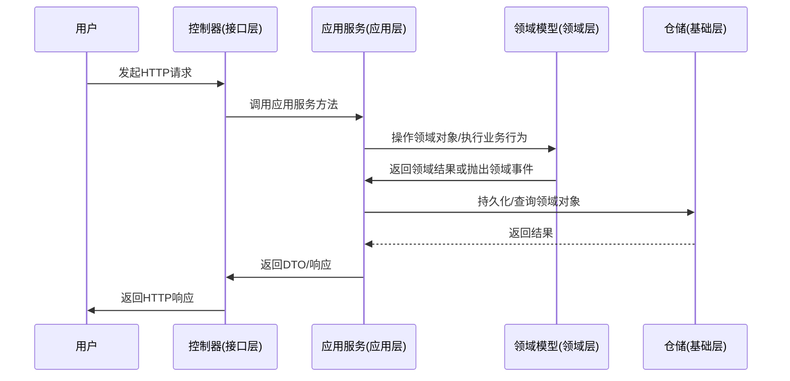
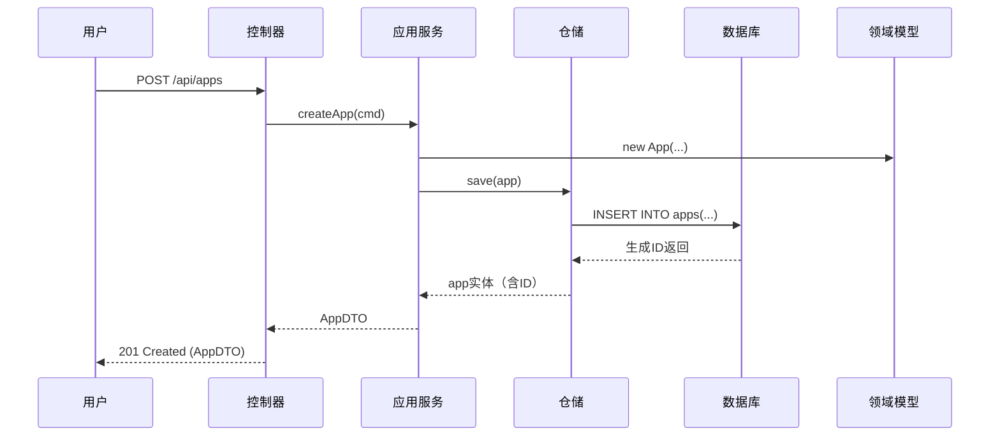

# 通用领域驱动设计(DDD)项目架构规范

**执行摘要：** 本文档提出了一个通用的DDD项目架构规范。我们沿用原文档中的分层思想，依照DDD和清洁架构原则，划分为“入口层（Entry）”、“用户接口层（API/接口层）”、“应用层（Application）”、“领域层（Domain）”、“跨域层（Cross-Domain）”和“基础设施层（Infrastructure）”等模块。核心理念和边界保持不变，将所有示例代码和配置改写为Java实现（以Java11+为基准，推荐SpringBoot环境）。本文包含架构概述、分层说明、关键设计决策，以及大量Java示例代码、目录结构和配置示例，还包括迁移指南和常见实践。最终附上示例UML/时序图（Mermaid格式）以帮助理解，并给出最小可运行的代码片段。

## 架构概述

领域驱动设计(DDD)强调以业务领域为核心，围绕**领域模型**构建系统。
按照清洁架构/六边形架构（Clean Architecture/Hexagonal）原则，系统被划分为多个同心层次，
每层只依赖于比其更中心的层。常见的分层模型包括：**用户接口层**（Interface/API Layer）、**应用层**（Application Layer）、**领域层**（Domain Layer）和**基础设施层**（Infrastructure Layer），以及原文中额外提出的**入口层**（负责应用启动和环境配置）和**跨域层**（负责领域间契约和集成）。DDD并没有严格的标准，但一般会建立`interfaces`（或`api`）、`application`、`domain`和`infrastructure`四大一级目录。下图展示了该架构的核心调用流程和层次关系（使用Mermaid时序图描述）：



该架构满足以下原则：每层只与其下层发生耦合；
依赖倒置原则（Dependecy Inversion）：高层定义抽象接口，低层实现接口；
**避免核心领域模型直接依赖基础设施**。
应用层与领域层间通过定义接口和依赖注入解耦，基础设施层位于较外围，实现这些接口。

## 分层说明

以下分层说明保留了原文架构中的职责和边界，仅将技术实现示例改为Java。

### 入口层 (Entry Layer)

- **职责**：应用程序启动入口，加载环境配置并初始化基础设施。包括读取`.properties`/`.yml`配置文件、设置日志和监控、初始化数据库或消息队列连接等，并启动HTTP服务器或Spring容器。
- **Java示例**：通常使用SpringBoot的主类作为入口点，例如：
  ```java
  @SpringBootApplication
  public class Application {
      public static void main(String[] args) {
          SpringApplication.run(Application.class, args);
      }
  }
  ```
- **环境配置**：使用`application.yml`管理不同环境（dev/stage/prod）的配置，通过Spring Profile切换。例如：
  ```yaml
  spring:
    profiles:
      active: dev
    datasource:
      url: jdbc:postgresql://localhost:5432/db
      username: root
      password: pass
  ```
- **关键点**：应用启动后负责注入应用所需的Bean和依赖，保证**基础设施组件（数据库连接、缓存、搜索引擎、外部服务客户端等）**在应用上下文中可用。如原文所示的`AppDependencies`结构在Java中可通过Spring的`@Configuration`类和@Bean定义来实现依赖注入。

### 用户接口层 (API/接口层)

- **职责**：接收和处理外部请求（HTTP、RPC等），进行参数校验/转换，调用应用层完成业务逻辑，并组装DTO返回结果。该层不应包含核心业务逻辑，只负责适配和转换，通常包括Controller、DTO和组装器(Assembler)等。
- **技术选型**：推荐使用Spring MVC（`@RestController`）或Spring WebFlux等。例如：
  ```java
  @RestController
  @RequestMapping("/api/apps")
  public class AppController {
      private final AppService appService;
      // 构造注入
      public AppController(AppService appService) { this.appService = appService; }

      @PostMapping
      public ResponseEntity<AppDTO> createApp(@Valid @RequestBody CreateAppCommand cmd) {
          AppDTO result = appService.createApp(cmd);
          return ResponseEntity.status(HttpStatus.CREATED).body(result);
      }
  }
  ```
- **校验与DTO**：使用Spring的校验（Jakarta Validation）在Controller层对输入进行基本校验；内部传递使用命令对象（Command）或DTO与领域对象解耦。可参考对DTO和Facade的定义和使用。
- **权限与安全**：接口层通常配置身份认证和授权机制，如Spring Security的JWT/Bearer Token、Session认证等。可通过拦截器或过滤器实现一次性鉴权。
- **示例**：在用户接口层定义DTO/VO类（无需业务逻辑）和接口适配器（Facade）等，如上所示的`AppDTO`、`CreateAppCommand`等。

### 应用层 (Application Layer)

- **职责**：编排业务用例流程，协调领域对象完成具体用例。应用层定义用例（Use Case）服务，处理事务、权限检查、DTO<->领域对象转换等工作。业务规则的组合在这里处理，但核心规则在领域层实现。
- **结构**：通常包括服务接口/实现（`*Service`）、命令（Command）或查询（Query）对象、DTO与实体的映射器（MapStruct或手动）等。
- **事务管理**：在应用层方法上使用Spring的`@Transactional`注解控制事务边界，确保多个领域操作的原子性。
- **异常处理**：捕获和转换业务异常，返回合适的响应代码。
- **示例**：基于原架构中的“APP实体创建”场景，可定义如下应用服务：
  ```java
  @Service
  @RequiredArgsConstructor
  public class AppService {
      private final AppRepository appRepo;
      private final AppMapper appMapper; // 命令DTO转换
      @Transactional
      public AppDTO createApp(CreateAppCommand cmd) {
          App entity = appMapper.toDomain(cmd);
          App saved = appRepo.save(entity);
          return appMapper.toDTO(saved);
      }
  }
  ```
  上述示例中，`AppRepository`是领域层定义的接口（见下一层），由基础设施层实现；`AppMapper`使用MapStruct或其他方式将命令对象转换成领域实体。
- **设计说明**：应用层不应直接操作数据库，而是通过领域层的仓储接口完成数据持久化，实现领域与基础设施解耦。在应用层中发布领域事件并使用Spring事件或消息队列异步处理，提高可扩展性。

### 领域层 (Domain Layer)

- **职责**：系统的核心，包含所有业务规则和领域模型。**聚合根（Aggregate）**维护聚合内部一致性，**实体（Entity）**代表具有生命周期的对象，**值对象（Value Object）**表示不可变的属性组合，**领域服务（Domain Service）**封装无法归入单个实体的业务逻辑，。仓储接口（Repository）也在此层定义，遵循依赖倒置原则。
- **聚合与实体**：每个聚合根对应一组相关实体和值对象。原文的“APP实体”示例可转换为Java实体。例如：
  ```java
  @Entity
  @Table(name = "apps")
  @Data
  @NoArgsConstructor
  public class App {
      @Id @GeneratedValue(strategy = GenerationType.IDENTITY)
      private Long id;
      private Long spaceId;
      private String name;
      private String description;
      private Long ownerId;
      // ...其他字段...

      // 领域行为示例
      public boolean isPublished() { return /*根据状态判断*/; }
  }
  ```
  值对象可以用`@Embeddable`嵌入实体。
- **领域服务**：对于需要跨聚合或涉及多个实体的复杂业务，可定义领域服务接口。例如：
  ```java
  public interface AppDomainService {
      boolean checkResourceAvailability(App app);
  }
  @Service
  @RequiredArgsConstructor
  public class AppDomainServiceImpl implements AppDomainService {
      private final ExternalServiceClient client;
      public boolean checkResourceAvailability(App app) {
          // 调用外部服务逻辑
      }
  }
  ```
  领域服务应专注于领域逻辑，不持有状态。
- **领域事件**：当聚合发生重要变化时，可发布领域事件（如`AppCreatedEvent`），由监听器或消息系统异步处理，以解耦后续流程。
- **仓储接口**：在领域层定义仓储接口用于持久化聚合根，如：
  ```java
  public interface AppRepository {
      App save(App app);
      Optional<App> findById(Long id);
      // 其他查询方法
  }
  ```
  这些接口由基础设施层实现（见下一层）。
- **原则**：领域层不依赖任何技术细节，只关心业务本身。领域模型的核心逻辑必须在此层实现，避免被应用层或基础层侵入。

### 跨域层 (Cross-Domain Layer)

- **职责**：处理不同领域上下文之间的调用和契约。相当于“**接口适配器**”或“**防腐层**”(Anti-Corruption Layer)，将一个子系统的模型或协议与另一个隔离开来，防止直接依赖。
- **结构**：通常划分为`contract`（接口定义）和`impl`（实现适配）。例如，原文将跨域调用的接口定义为契约，启动时注入默认实现。
- **Java实践**：可以定义服务契约（接口），如`ConnectorContract`，再提供Spring Bean实现（适配器）。在应用层或领域服务中通过注入契约接口使用功能，而实际的跨域调用逻辑在适配层完成（使用RestTemplate、Feign、消息队列等）。
- **示例**：如果需要跨域调用“Connector”服务，可设计：
  ```java
  public interface ConnectorServiceContract { List<Data> getData(Request r); }
  @Service
  public class ConnectorServiceAdapter implements ConnectorServiceContract {
      public List<Data> getData(Request r) {
          // 通过HTTP或RPC调用真正的Connector微服务
      }
  }
  ```
  在应用启动时由Spring DI自动注入，无需在业务代码中手动注册（原文中Go示例通过SetDefaultSVC来注册服务实例，在Java/Spring中通常通过组件扫描完成）。
- **设计优势**：这种跨域分层保持领域层清晰，对其他子系统仅依赖抽象契约，有利于独立演进和微服务拆分。

### 基础设施层 (Infrastructure Layer)

- **职责**：提供技术实现和外部集成，包括数据库访问、缓存、消息中间件、对象存储、搜索引擎、日志、监控等。实现领域层和跨域层定义的所有接口，管理事务和消息。
- **持久化实现**：常用Spring Data JPA、MyBatis或其他ORM框架。实现领域层的仓储接口。例如：
  ```java
  @Repository
  public interface JpaAppRepository extends AppRepository, JpaRepository<App, Long> {
      // 可以定义自定义查询
      Optional<App> findByName(String name);
  }
  ```
  这样，`JpaAppRepository`既是Spring Bean，又实现了我们的领域接口。对于复杂查询可使用`@Query`或自定义实现。
- **外部服务**：对外部系统（如认证服务、第三方API）调用的实现。可封装RestTemplate、WebClient、Feign等。如原文示例中的`InventoryServiceImpl`：。
- **消息与事件**：集成消息队列（Kafka、RabbitMQ等）用于异步处理。可在基础层定义消息生产者和消费者Bean，领域事件可发布到消息队列（或Spring事件总线）。
- **配置与公共库**：在基础层维护各种公共配置类和工具。例如，用Spring `@Configuration`定义DB连接池、Redis客户端、跨域支持、安全配置等。
- **事务处理**：如果使用Spring Data，事务可由Service层的`@Transactional`自动管理；也可在基础层细粒度控制。
- **原文对比**：原文在基础设施层定义了`AppDependencies`结构用于收集所有资源。在Java中可通过Spring的自动装配(@Autowired)或构造器注入的方式达到同样效果，无需显式的初始化代码。

## 关键设计决策

1. **使用Spring Framework（可选）**：建议采用Spring Boot构建微服务项目，它提供了自动配置、依赖注入、Web层、数据层和安全等模块。也可考虑Spring Cloud微服务组件。非Spring方案（如纯Java EE、Quarkus等）也可实现DDD分层，关键在于通过接口+实现分离、DI管理依赖。  
2. **分层隔离与接口分离**：领域层定义所有业务接口，基础设施层实现。这遵循依赖倒置原则，“细节依赖于抽象”。例如，`AppRepository`在领域层定义，基础层通过Spring Data JPA类实现。这样可随时切换实现（如从PostgreSQL切换到MongoDB只需更换实现类）。
3. **聚合设计**：每个聚合由一个根实体和值对象组成，聚合内的一致性规则由根实体负责维护。所有对聚合的修改都应通过聚合根的方法完成。领域事件可在聚合根方法中创建，用于通知系统其他组件。  
4. **领域事件**：系统内部通过领域事件（Domain Events）解耦复杂业务流程。可使用Spring的事件机制或消息中间件来分发事件。例如，订单创建后发布`OrderCreatedEvent`，消费者异步发送通知。  
5. **事务管理**：在应用服务层使用`@Transactional`管理事务，确保多个仓储操作的一致性。避免在领域层使用事务注解，保持领域层纯粹。  
6. **异常处理**：业务异常(如验证失败)在应用层捕获并转换为HTTP状态码，领域层抛出自定义异常。可统一定义异常体系，比如`BusinessException`。  
7. **配置管理**：使用YAML或Properties文件集中管理配置。推荐Spring Boot的`application.yml`结合`@ConfigurationProperties`类；并利用Profile区分不同环境。使用容器化部署时，可通过环境变量或外部配置中心动态注入配置。  
8. **包命名与模块划分**：参考常见DDD实践，按功能模块和层次分包。一个典型模块结构如下：  

   | 目录/模块                     | 说明                                |
   | :------------------------ | :-------------------------------- |
   | `interfaces/api`          | 用户接口层（REST 控制器、DTO、Assembler） |
   | `application/service`     | 应用层（应用服务、命令/查询对象、DTO Mapper） |
   | `domain/model`            | 领域层（实体Entity、值对象VO、聚合根、领域服务接口） |
   | `domain/repository`       | 领域仓储接口                          |
   | `infrastructure/persistence` | 基础设施层（持久化实现，如JPA 实体管理）  |
   | `infrastructure/messaging`   | 基础设施层（消息发布/订阅实现）         |
   | `infrastructure/config`      | 配置层（数据库、缓存、消息队列配置等）   |
   | `crossdomain/contract`      | 跨域契约接口（与其他领域或微服务的接口）   |
   | `crossdomain/impl`          | 跨域适配器实现                         |
   | `tests`                   | 单元测试和集成测试                     |

   例如，腾讯云的DDD实战指南展示了类似结构。

## Java代码示例

以下示例突出核心概念，左侧为原文档（Go）示例，右侧为相应的Java实现对比：

| 原文 Go 示例                                     | 对应 Java 示例                                                   |
| --------------------------------------------- | ------------------------------------------------------------ |
| ```go<br>type APP struct {<br>    ID   int64<br>    Name *string<br>}<br>``` (领域实体) | ```java<br>@Entity<br>@Table(name="apps")<br>public class App {<br>    @Id @GeneratedValue<br>    private Long id;<br>    private String name;<br>}<br>``` (实体) |
| ```go<br>// 订单仓储接口<br>type OrderRepository interface {<br>    Save(order *Order) error<br>}<br>``` | ```java<br>public interface OrderRepository {<br>    Order save(Order order);<br>}<br>``` (仓储接口)      |
| ```go<br>func main() {<br>    // 初始化服务<br>}<br>``` (入口)         | ```java<br>@SpringBootApplication<br>public class Main {<br>    public static void main(String[] args) {<br>        SpringApplication.run(Main.class, args);<br>    }<br>}<br>``` |

此外，示例领域行为和服务（原文中省略）可以类似转换。例如，一个领域值对象与聚合在Java中可能是：

```java
// 值对象: Money
@Value
public class Money {
    @NonNull private BigDecimal amount;
    @NonNull private Currency currency;
    public Money(BigDecimal amount, Currency currency) {
        if (amount.compareTo(BigDecimal.ZERO) < 0) throw new IllegalArgumentException("金额不能为负");
        this.amount = amount; this.currency = currency;
    }
    public Money add(Money other) {
        if (!this.currency.equals(other.currency)) throw new IllegalArgumentException("货币类型不匹配");
        return new Money(this.amount.add(other.amount), this.currency);
    }
}

// 聚合根: Order
@Entity @Table(name="orders")
@Data @NoArgsConstructor
public class Order {
    @Id @GeneratedValue private Long id;
    private String orderNumber;
    @Embedded private Money totalAmount;
    @OneToMany(cascade=CascadeType.ALL, orphanRemoval=true)
    private List<OrderItem> items = new ArrayList<>();
    public void addItem(OrderItem item) {
        items.add(item);
        // 更新聚合总额
    }
}
```

以上Java示例演示了如何用Spring Data/JPA和Java语言特性实现领域模型，与原文Go架构思想一致。  

### 项目目录示例

以下是一个典型的Java DDD项目目录结构示例（按模块划分，结合Spring Boot）：

```
order-service/
├─ src/main/java/com/example/order/
│  ├─ interfaces/api/           // 用户接口层（Controller、DTO、Assembler）
│  ├─ application/              // 应用层（Service、Command/Query、Mapper）
│  ├─ domain/                   // 领域层
│  │   ├─ model/                // 领域模型（Entity、Value Object、Aggregate）
│  │   ├─ repository/           // 仓储接口
│  │   └─ service/              // 领域服务接口
│  ├─ infrastructure/           // 基础设施层
│  │   ├─ persistence/          // 持久化实现（JPA仓库、MyBatis映射等）
│  │   ├─ messaging/            // 消息组件（事件发布/订阅）
│  │   └─ config/               // 配置类（数据库、缓存、消息等）
│  └─ crossdomain/              // 跨域层（契约与适配器）
│      ├─ contract/             // 契约接口
│      └─ impl/                 // 契约实现
└─ src/main/resources/
   ├─ application.yml           // 基础配置
   ├─ application-dev.yml       // 开发环境配置
   └─ application-prod.yml      // 生产环境配置
```

该示例结构借鉴了领域驱动设计最佳实践，根据功能上下文划分包，分层清晰。接口层与应用层通过`interfaces/api`分开；领域层拆分为`model`（实体/值对象）、`repository`和`service`；基础设施层包含持久化、消息和配置等；跨域契约独立于领域。目录与模块的命名请遵循Java包命名规范。

### 配置与构建示例

- **构建工具**：推荐使用Maven或Gradle。示例Maven依赖片段：
  ```xml
  <dependency>
      <groupId>org.springframework.boot</groupId>
      <artifactId>spring-boot-starter-web</artifactId>
  </dependency>
  <dependency>
      <groupId>org.springframework.boot</groupId>
      <artifactId>spring-boot-starter-data-jpa</artifactId>
  </dependency>
  <dependency>
      <groupId>com.h2database</groupId>
      <artifactId>h2</artifactId>
      <scope>runtime</scope>
  </dependency>
  <!-- Lombok, MapStruct 等 -->
  ```
- **配置管理**：使用Spring Boot的配置文件（YAML/Properties）。通过`@ConfigurationProperties`加载自定义配置，例如数据库、缓存、外部API。可为不同环境创建不同的配置文件并使用`spring.profiles.active`切换。
- **示例application.yml**：
  ```yaml
  spring:
    datasource:
      url: jdbc:postgresql://${DB_HOST:localhost}:5432/mydb
      username: ${DB_USER:root}
      password: ${DB_PASS:pass}
    jpa:
      hibernate:
        ddl-auto: update
      show-sql: true
  server:
    port: 8080
  myapp:
    api-key: ${MYAPP_API_KEY}
  ```
- **容器化**：建议使用Docker构建无状态服务镜像。Dockerfile示例：
  ```dockerfile
  FROM openjdk:11-jre-slim
  WORKDIR /app
  COPY target/myapp.jar myapp.jar
  ENTRYPOINT ["java","-jar","myapp.jar"]
  ```
  通过环境变量传递配置或在Kubernetes等平台上使用ConfigMap/Secrets管理配置。
- **公共库/工具**：可引入常用库，如MapStruct（DTO映射）、Lombok（简化代码）、Redis客户端(Jedis/Lettuce)等。抽象工具类尽量放在独立公共模块（如`common`）。

### 测试与CI/CD建议

- **测试**：使用JUnit 5和Spring Test进行单元和集成测试。领域层和应用层逻辑可编写纯单元测试，基础设施和接口层建议使用`@SpringBootTest`或`@DataJpaTest`等进行集成测试。使用Mock或测试容器模拟外部资源（数据库、消息队列等）。
- **代码质量**：配置Checkstyle/PMD/SpotBugs等工具保证代码风格和质量。编写测试覆盖关键业务逻辑。
- **CI/CD流程**：通常包括代码静态检查、单元测试、构建镜像、部署到测试环境。可借助GitHub Actions、Jenkins或GitLab CI：
  - 触发：PR/Master分支推送。
  - 步骤：拉取代码 -> 编译/测试 -> 构建Docker镜像 -> 推送镜像至镜像仓库 -> 部署（可选自动化脚本）。
  - 示例GitHub Action（简化）：
    ```yaml
    name: CI
    on: [push]
    jobs:
      build:
        runs-on: ubuntu-latest
        steps:
          - uses: actions/checkout@v2
          - name: Set up JDK
            uses: actions/setup-java@v3
            with: {java-version: '11'}
          - name: Build with Maven
            run: mvn clean package --no-transfer-progress
          - name: Build Docker image
            run: docker build -t myapp:${{ github.sha }} .
          - name: Push to Registry
            run: docker push myapp:${{ github.sha }}
    ```
- **环境分层**：建议区分开发(dev)、测试(stage)、生产(prod)环境，每个环境使用独立配置和资源。可在CI/CD中添加部署到不同环境的任务，实现灰度发布和回滚。

## 图示示例

下图采用Mermaid示例说明一个简单用例的时序流程：用户通过HTTP请求创建`App`实体的整个调用链，包括Controller->Service->Repository->数据库。


