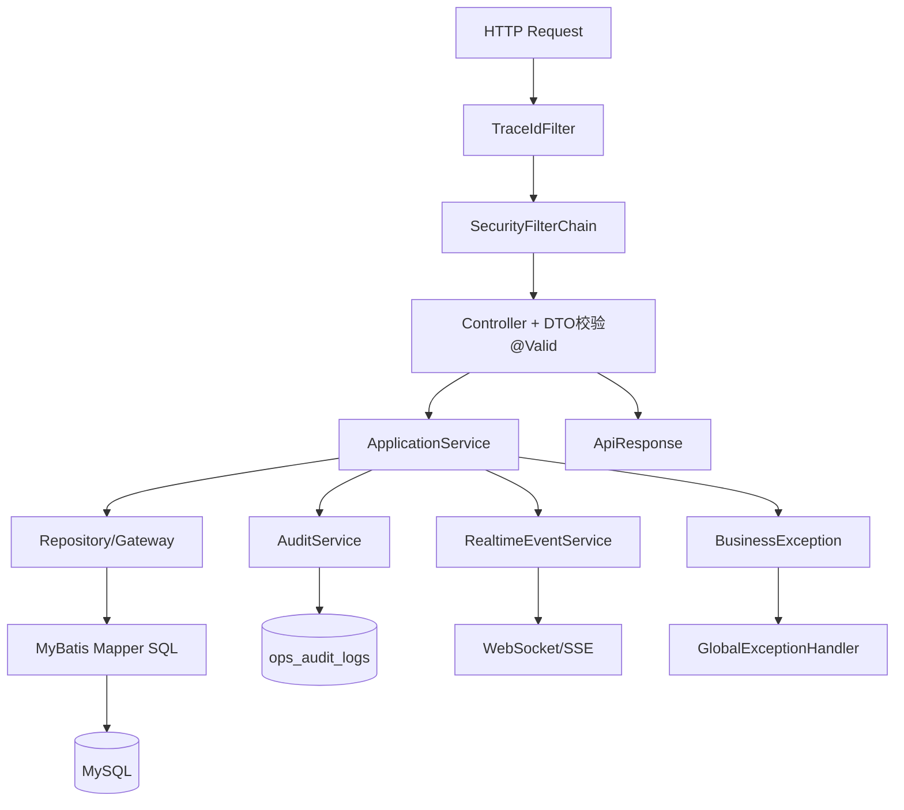
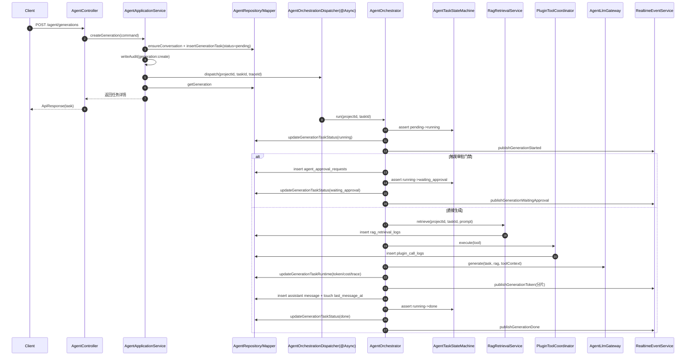
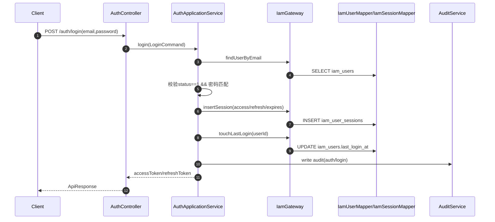

# PenMate 后端业务流程梳理（全链路）v1.0

> 范围：基于当前 `penmate-backend` 代码与迁移脚本，重点梳理 `agent` 模块与登录（`auth`）模块。

## 1. 统一请求处理链路（所有模块）

### 1.1 入口与链路追踪

- `TraceId` 注入：`penmate-backend/src/main/java/com/penmate/backend/interfaces/config/TraceIdFilter.java`
  - 读取请求头 `X-Trace-Id`，为空则生成 UUID。
  - 写入 MDC、`request attribute(traceId)`、响应头。
- 统一返回：`penmate-backend/src/main/java/com/penmate/backend/interfaces/api/common/ApiResponse.java`
  - `data + meta(traceId, timestamp)`。

### 1.2 鉴权与安全边界

- 安全配置：`penmate-backend/src/main/java/com/penmate/backend/interfaces/config/SecurityConfig.java`
  - `STATELESS`，禁用 formLogin/httpBasic/csrf。
  - 当前 `anyRequest().permitAll()`，即框架层不拦截业务接口。
  - 认证主要由业务层自行解析 Bearer Token（如 `AuthApplicationService#extractBearer`）。

### 1.3 参数校验与异常治理

- DTO 层通过 `@Valid` + `jakarta.validation` 校验。
- 异常兜底：`penmate-backend/src/main/java/com/penmate/backend/interfaces/api/common/GlobalExceptionHandler.java`
  - `MethodArgumentNotValidException` -> 400
  - `BusinessException` -> 指定状态码（常见 422）
  - 其他异常 -> 500

### 1.4 审计与实时事件

- 审计接口：`penmate-backend/src/main/java/com/penmate/backend/domain/shared/service/AuditService.java`
- 审计实现：`penmate-backend/src/main/java/com/penmate/backend/infrastructure/persistence/audit/AuditServiceImpl.java`
  - 统一写入 `ops_audit_logs`。
- 实时事件：`penmate-backend/src/main/java/com/penmate/backend/infrastructure/realtime/RealtimeEventServiceImpl.java`
  - 同时广播 WebSocket（项目维度）与 SSE（任务维度）。

---

## 2. 全模块业务总览

| 模块 | 请求入口（Controller） | 应用层（ApplicationService） | 核心落库表 |
|---|---|---|---|
| Auth/IAM | `interfaces/api/auth/AuthController.java` | `application/auth/AuthApplicationService.java` | `iam_users`、`iam_user_sessions`、`iam_user_roles`、`iam_roles`、`iam_permissions` |
| RBAC 管理 | `interfaces/api/rbac/RbacQueryController.java` | `application/iam/IamQueryApplicationService.java` | `iam_*` |
| Novel | `interfaces/api/novel/NovelController.java` | `application/novel/NovelApplicationService.java` | `novel_projects`、`novel_volumes`、`novel_chapters`、`novel_members`、`novel_chapter_versions`、`novel_outline_nodes`、`novel_cards`、`novel_card_relations` |
| Agent | `interfaces/api/agent/AgentController.java` | `application/agent/AgentApplicationService.java`、`application/agent/AgentOrchestrator.java` | `agent_conversations`、`agent_messages`、`agent_generation_tasks` |
| Approval | `interfaces/api/approval/ApprovalController.java` | `application/approval/ApprovalApplicationService.java` | `agent_approval_requests` |
| RAG | `interfaces/api/rag/RagController.java` | `application/rag/RagApplicationService.java`、`application/rag/RagRetrievalService.java` | `rag_documents`、`rag_chunks`、`rag_retrieval_logs` |
| Style | `interfaces/api/style/StyleController.java` | `application/style/StyleApplicationService.java` | `style_profiles`、`style_switch_logs` |
| Plugin | `interfaces/api/plugin/PluginController.java` | `application/plugin/PluginApplicationService.java` | `plugin_catalog`、`plugin_project_installs`、`plugin_call_logs` |
| Model | `interfaces/api/model/ModelController.java` | `application/model/ModelApplicationService.java` | `model_providers`、`model_provider_models`、`model_user_api_keys`、`model_user_configurations` |
| Ops | `interfaces/api/ops/OpsController.java` | `application/ops/OpsApplicationService.java` | `ops_async_jobs`、`ops_migrations` |

---

## 3. Agent 模块详细业务流程（重点）

### 3.1 接口清单

入口文件：`penmate-backend/src/main/java/com/penmate/backend/interfaces/api/agent/AgentController.java`

- `GET /api/v1/novels/{projectId}/agent/conversations`
- `POST /api/v1/novels/{projectId}/agent/conversations`
- `GET /api/v1/novels/{projectId}/agent/conversations/{conversationId}/messages`
- `POST /api/v1/novels/{projectId}/agent/conversations/{conversationId}/messages`
- `POST /api/v1/novels/{projectId}/agent/generations`
- `GET /api/v1/novels/{projectId}/agent/generations/{taskId}`
- `POST /api/v1/novels/{projectId}/agent/generations/{taskId}/apply`
- `GET /api/v1/novels/{projectId}/agent/generations/{taskId}/stream`（SSE）

### 3.2 会话与消息流程

#### A. 创建会话

1. Controller 接收 `CreateAgentConversationDto`，校验 `userId`。
2. 转 `CreateConversationCommand` 调用 `AgentApplicationService#createConversation`。
3. 构造 `AgentConversation` 并调用 `AgentRepository#insertConversation`。
4. MyBatis `AgentMapper#insertConversation` 写入 `agent_conversations`。
5. 写审计：`module=agent`、`action=conversation:create` 到 `ops_audit_logs`。
6. 返回会话对象。

#### B. 创建消息

1. 先 `ensureConversation(projectId, conversationId)`，不存在则抛 `BusinessException`。
2. 取 `nextMessageSeq = max(seq_no) + 1`。
3. `insertMessage` 写入 `agent_messages`。
4. `touchConversationLastMessage` 更新 `agent_conversations.last_message_at`。
5. 写审计 `action=message:create`。

### 3.3 生成任务主链路（异步）

### 3.4 Agent 编排调用链（类级别）

> 这一节补充“谁调用谁、调用顺序、跨模块依赖”，对应你提到的“调用链和其他模块关系”。

1. 请求入口：`AgentController#createGeneration`
2. 应用编排起点：`AgentApplicationService#createGeneration`
   - 校验会话：`ensureConversation`
   - 写任务：`AgentRepository#insertGenerationTask` -> `AgentMapper#insertGenerationTask` -> `agent_generation_tasks`
   - 写审计：`AuditService#write` -> `AuditLogMapper#insert` -> `ops_audit_logs`
   - 异步调度：`AgentOrchestrationDispatcher#dispatch`
3. 异步编排执行：`AgentOrchestrator#runInternal`
   - 状态守卫：`AgentTaskStateMachine#assertTransition`
   - 状态落库：`AgentRepository#updateGenerationTaskStatus`
   - 实时事件：`RealtimeEventService#publishGenerationStarted`
4. 审批分支（可选）
   - 创建审批：`ApprovalRequestRepository#insert` -> `agent_approval_requests`
   - 推送审批事件：`RealtimeEventService#publishGenerationWaitingApproval`
5. 直接生成分支
   - RAG：`RagRetrievalService#retrieve` -> `rag_retrieval_logs`
   - Tool：`PluginToolCoordinator#execute` -> `PluginApplicationService#recordToolCall` -> `plugin_call_logs`
   - LLM：`AgentLlmGateway#generate`
   - 回写运行时：`updateGenerationTaskRuntime`（token/cost/trace）
   - 推送 token：`publishGenerationToken`
   - 持久化回复：`insertMessage` -> `agent_messages`
   - 任务完成：状态 `running -> done` + `publishGenerationDone`
6. 审批恢复/驳回分支（由 `ApprovalApplicationService` 触发）
   - 通过：`resumeTaskAfterApproved` -> `dispatchAfterApproval(skipApprovalGate=true)`
   - 驳回：`markTaskFailedAfterRejected` -> 任务置 `failed` + `publishGenerationFailed`

### 3.5 Agent 与其他模块交互矩阵

| Agent 编排阶段 | 调用模块 | 关键类/方法 | 产物/副作用 |
|---|---|---|---|
| 创建任务 | 审计模块 | `AuditService#write` | `ops_audit_logs` 记录 `generation:create` |
| 进入 running | 实时模块 | `RealtimeEventService#publishGenerationStarted` | WebSocket + SSE `generation.started` |
| 命中审批门禁 | 审批模块 | `ApprovalRequestRepository#insert` | `agent_approval_requests` 新增待审批单 |
| 等待审批通知 | 实时模块 | `publishGenerationWaitingApproval` | 推送 `generation.waiting_approval` |
| 检索增强 | RAG 模块 | `RagRetrievalService#retrieve` | 检索片段 + `rag_retrieval_logs` |
| 工具增强 | 插件模块 | `PluginToolCoordinator#execute` | `plugin_call_logs` + `generation.tool_call` |
| 模型生成 | LLM 网关 | `AgentLlmGateway#generate` | 生成文本（mock/真实模型） |
| 运行时回写 | Agent 仓储 | `updateGenerationTaskRuntime` | `token_usage_json/cost_json/trace_id` |
| 结果流式下发 | 实时模块 | `publishGenerationToken` | `generation.token` |
| 审批通过恢复 | 审批模块 -> Agent 调度 | `ApprovalApplicationService#resumeTaskAfterApproved` | 再次进入编排主链路 |
| 审批驳回终止 | 审批模块 | `markTaskFailedAfterRejected` | 任务 `failed` + `generation.failed` |

### 3.6 审批回路（与 Agent 串联）

来源：`penmate-backend/src/main/java/com/penmate/backend/application/approval/ApprovalApplicationService.java`

- 通过审批：
  1. `agent_approval_requests.status: pending -> approved`
  2. 若任务仍为 `waiting_approval`，先回写 `running`
  3. `dispatchAfterApproval(..., skipApprovalGate=true)` 继续编排
- 驳回审批：
  1. 审批单改 `rejected`
  2. 若任务 `waiting_approval`，状态置 `failed`，`error_msg=Approval rejected`
  3. 推送 `generation.failed`

### 3.7 Agent 状态机

文件：`penmate-backend/src/main/java/com/penmate/backend/application/agent/AgentTaskStateMachine.java`

- `pending -> running|cancelled|failed`
- `running -> waiting_approval|done|failed|cancelled`
- `waiting_approval -> running|done|failed|cancelled`
- `done -> applied`
- `applied/failed/cancelled` 为终态

### 3.8 Agent 模块落库明细

| 业务动作 | Service 方法 | Mapper SQL | 表 |
|---|---|---|---|
| 创建会话 | `AgentApplicationService#createConversation` | `AgentMapper#insertConversation` | `agent_conversations` |
| 查询会话 | `listConversations/findConversation` | `listConversations/findConversation` | `agent_conversations` |
| 创建消息 | `createMessage` | `insertMessage` | `agent_messages` |
| 更新会话最新消息时间 | `touchConversationLastMessage` | `touchConversationLastMessage` | `agent_conversations` |
| 创建生成任务 | `createGeneration` | `insertGenerationTask` | `agent_generation_tasks` |
| 状态迁移 | `transitionStatus` | `updateGenerationTaskStatus` | `agent_generation_tasks` |
| 运行时统计 | `updateGenerationTaskRuntime` | `updateGenerationTaskRuntime` | `agent_generation_tasks` |
| 审批创建 | `createApprovalRequest` | `ApprovalRequestMapper#insert` | `agent_approval_requests` |
| 审计日志 | `writeAudit` | `AuditLogMapper#insert` | `ops_audit_logs` |

---

## 4. 登录模块详细业务流程（重点）

入口文件：`penmate-backend/src/main/java/com/penmate/backend/interfaces/api/auth/AuthController.java`

- `POST /api/v1/auth/login`
- `POST /api/v1/auth/logout`
- `POST /api/v1/auth/refresh`
- `GET /api/v1/auth/me`

核心服务：`penmate-backend/src/main/java/com/penmate/backend/application/auth/AuthApplicationService.java`

### 4.1 login 流程

### 4.2 logout 流程

1. 从 `Authorization` 提取 Bearer Token。
2. `findSessionByAccessToken` 查 `iam_user_sessions`（仅未撤销）。
3. 若存在则 `revokeByAccessToken`，写 `revoked_at`。
4. 写审计 `auth/logout`。
5. 若会话不存在，直接返回（幂等）。

### 4.3 refresh 流程

1. 用 refreshToken 查会话。
2. 校验 `refresh_expires_at` 未过期。
3. 同一会话执行 rotate：新 accessToken、新 refreshToken、新过期时间。
4. 写审计 `auth/refresh`。
5. 返回新 token 对。

### 4.4 me 流程

1. 提取 Bearer token。
2. 查 access 会话且验证 `access_expires_at`。
3. 按 `user_id` 查 `iam_users`。
4. 查用户角色 `iam_roles`（`iam_user_roles`）。
5. 查用户权限 `iam_permissions`（`iam_role_permissions` + `iam_user_roles`）。
6. 返回用户基本信息 + roles + permissions。

### 4.5 Auth 模块落库明细

| 业务动作 | Service 方法 | 表 |
|---|---|---|
| 用户查找 | `login` | `iam_users` |
| 创建会话 | `login` | `iam_user_sessions` |
| 更新时间 | `login` | `iam_users.last_login_at` |
| 撤销会话 | `logout` | `iam_user_sessions.revoked_at` |
| 会话轮换 | `refresh` | `iam_user_sessions` |
| 用户角色权限聚合 | `me` | `iam_users`、`iam_user_roles`、`iam_roles`、`iam_role_permissions`、`iam_permissions` |
| 审计 | `login/logout/refresh` | `ops_audit_logs` |

---

## 5. 关键迁移脚本与表结构来源

- IAM/RBAC：`penmate-backend/src/main/resources/db/migration/V1__init_iam_and_rbac.sql`
- 审批与审计：`penmate-backend/src/main/resources/db/migration/V2__init_novel_and_approval_minimal.sql`
- 会话表：`penmate-backend/src/main/resources/db/migration/V6__init_auth_sessions.sql`
- Agent 主表：`penmate-backend/src/main/resources/db/migration/V11__init_agent_and_ops_domains.sql`
- RAG 检索日志/插件 task_id：`penmate-backend/src/main/resources/db/migration/V12__agent_w2_rag_and_plugin_logs.sql`
- Agent 运行时字段：`penmate-backend/src/main/resources/db/migration/V13__agent_task_runtime_and_trace.sql`

---

## 6. 异常处理、幂等与一致性说明

### 6.1 异常到响应

- 参数错误：`MethodArgumentNotValidException` -> 400
- 业务错误：`BusinessException` -> 对应状态码（默认常见 422）
- 系统错误：500

### 6.2 幂等行为

- `logout`：会话不存在时直接返回 `ok`，具备幂等特征。
- `applyGeneration`：若已 `applied` 直接返回任务。

### 6.3 事务与一致性

- 当前主要依赖单条 SQL 原子性；未在关键编排流程中看到显式 `@Transactional`。
- Agent 异步链路中，状态、消息、事件写入存在“最终一致”特征。

---

## 7. 风险与改进建议（按优先级）

### P0

1. 鉴权边界偏弱：`SecurityConfig` 中 `anyRequest().permitAll()`，建议逐步收口到白名单放行 + 鉴权拦截。
2. 密码校验方式：`login` 当前为明文等值比较，建议改为强哈希（如 BCrypt）并补充迁移策略。

### P1

1. 消息序号并发风险：`max(seq_no)+1` 在高并发可能冲突，建议唯一约束 + 重试或数据库序列化方案。
2. 异步编排一致性：任务状态、消息落库、事件推送建议补偿机制（失败重试/死信/幂等键）。
3. 审批与编排重入：继续执行时建议增加幂等校验，避免重复恢复。

### P2

1. 审计内容标准化：`request_json` 建议统一字段结构，便于检索分析。
2. 可观测性：建议为核心动作补 `trace_id + task_id + project_id` 的统一日志模板。

---

## 8. 一句话总结

`agent` 模块是“同步建任务 + 异步编排 + 可选审批 + 实时推送 + 状态机驱动”的流程中枢；`auth` 模块是“会话令牌驱动”的业务鉴权基础设施，两者都通过 `ops_audit_logs` 和 `traceId` 完成关键动作留痕。

