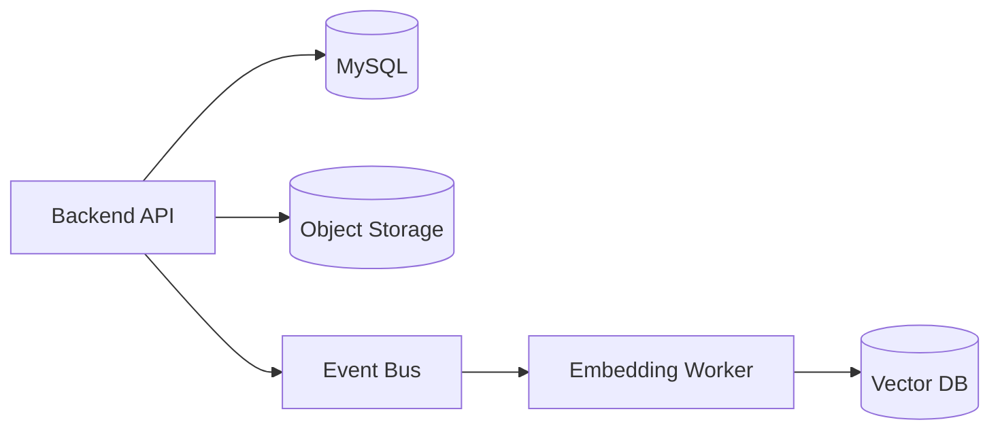

# PenMate 统一全量后台表结构设计 v1.1

> 依据 [`prd-v0.2`](docs/project-specifications/prd/prd-v0.2.md)、[`DDD架构规范`](docs/project-specifications/backend/DDD架构规范.md)、[`RBAC接口与表结构设计`](docs/project-specifications/backend/RBAC接口与表结构设计.md) 整合输出。

## 1. 设计范围与默认约束

### 1.1 推荐默认值
- 数据库：MySQL 8.0
- 字符集：`utf8mb4` + `utf8mb4_0900_ai_ci`
- 接口版本：`/api/v1`
- 删除策略：业务主表软删除、关系表硬删除、日志表追加写
- 时间字段：统一 `datetime(3)` UTC
- 主键策略：`bigint unsigned` 自增

### 1.2 存储架构
- 关系型：事务元数据、索引字段、权限与审计
- 对象存储：章节全文、版本快照、附件、RAG原文
- 向量库：RAG embedding 与检索



---

## 2. 领域与聚合边界

- IAM聚合：用户、角色、权限、菜单、会话
- 小说聚合：项目、成员、卷、章、版本、大纲、设定卡
- AI协作聚合：会话、消息、生成任务、审批单
- 能力聚合：文风、插件、模型策略、RAG知识库
- 运维聚合：审计日志、异步作业、Outbox事件

---

## 3. 全量表清单

## 3.1 IAM 与安全域

### `iam_users`
- `id,email,password_hash,display_name,status,auth_method,last_login_at,created_at,updated_at,deleted_at`
- 索引：`uk_iam_users_email`、`idx_iam_users_status_deleted`

### `iam_roles`
- `id,name,code,description,is_system,created_at,updated_at,deleted_at`
- 索引：`uk_iam_roles_code`

### `iam_permissions`
- `id,name,code,module,description,created_at`
- 索引：`uk_iam_permissions_code`

### `iam_user_roles`
- `user_id,role_id,created_at`
- PK：`(user_id,role_id)`
- 反向索引：`idx_user_roles_role_user(role_id,user_id)`

### `iam_role_permissions`
- `role_id,permission_id,created_at`
- PK：`(role_id,permission_id)`
- 反向索引：`idx_role_perm_perm_role(permission_id,role_id)`

### `iam_menus`
- `id,name,icon,path,parent_id,sort_order,lft,rgt,required_permission_code,created_at,updated_at`
- 索引：`idx_menus_parent_sort`、`idx_menus_lft_rgt`

### `iam_user_sessions`
- `id,user_id,jti,expires_at,revoked_at,ip,user_agent,created_at`
- 索引：`uk_sessions_jti`、`idx_sessions_user_expire`

### `ops_audit_logs`
- `id,trace_id,user_id,module,action,resource_type,resource_id,request_json,response_code,created_at`
- 索引：`idx_audit_user_created`、`idx_audit_module_created`

---

## 3.2 小说核心域

### `novel_projects`
- `id,owner_user_id,title,summary,status,current_style_profile_id,default_model_policy_id,total_word_count,created_by,updated_by,created_at,updated_at,deleted_at,version`
- 索引：`idx_novel_owner_status`、`idx_novel_updated_at`

### `novel_members`
- `project_id,user_id,member_role,joined_at`
- PK：`(project_id,user_id)`

### `novel_volumes`
- `id,project_id,title,sort_order,description,created_at,updated_at,deleted_at`
- 唯一：`uk_volume_project_sort(project_id,sort_order,deleted_at)`

### `novel_chapters`
- `id,project_id,volume_id,outline_node_id,title,chapter_no,status,word_count,excerpt,last_generated_at`
- 对象化字段：`content_object_key,content_etag,content_size,content_checksum,storage_provider`
- 索引：`idx_chapter_project_volume_no`、`idx_chapter_outline`、`idx_chapter_content_object`

### `novel_chapter_versions`
- `id,chapter_id,version_no,change_type,change_reason,created_by,created_at`
- 对象化字段：`snapshot_object_key,snapshot_etag,snapshot_size,diff_summary_json`
- 唯一：`uk_chapter_version(chapter_id,version_no)`

### `novel_outline_nodes`
- `id,project_id,parent_id,node_type,title,summary,plot_goal,sort_order,depth,path,created_at,updated_at,deleted_at`
- 索引：`idx_outline_project_parent_sort`、`idx_outline_project_path`

### `novel_entity_cards`
- `id,project_id,card_type,name,attributes_json,source,status,created_at,updated_at,deleted_at`
- 索引：`idx_card_project_type_status`、`idx_card_project_name`

### `novel_entity_relations`
- `id,project_id,source_card_id,target_card_id,relation_type,strength,remark,created_at`
- 索引：`idx_relation_source`、`idx_relation_target`

---

## 3.3 文风域

### `style_profiles`
- `id,project_id,name,is_default,pace,tone,narrative_focus,lexicon_rules_json,prompt_template,sample_text,created_at,updated_at,deleted_at`

### `style_switch_logs`
- `id,project_id,from_style_id,to_style_id,switched_by,warning_confirmed,reason,created_at`

---

## 3.4 插件域

### `plugin_catalog`
- `id,code,name,category,provider,status,latest_version,created_at,updated_at`

### `plugin_versions`
- `id,plugin_id,version,manifest_json,tool_schema_json,release_notes,status,created_at`
- 唯一：`uk_plugin_version(plugin_id,version)`

### `plugin_project_installs`
- `id,project_id,plugin_id,version,config_json,enabled,installed_by,installed_at,updated_at`
- 唯一：`uk_project_plugin(project_id,plugin_id)`

### `plugin_call_logs`
- `id,project_id,plugin_code,tool_name,request_json,response_json,latency_ms,status,error_msg,created_at`

---

## 3.5 模型与BYOK域

### `model_providers`
- `id,code,name,base_url,auth_type,status,created_at,updated_at`

### `model_provider_models`
- `id,provider_id,model_code,model_name,context_window,max_output,pricing_json,status,created_at`

### `model_user_api_keys`
- `id,user_id,provider_id,key_name,encrypted_api_key,masked_api_key,is_default,last_used_at,status,created_at,updated_at,deleted_at`

### `model_project_policies`
- `id,project_id,policy_name,scene,provider_model_id,user_key_id,temperature,top_p,max_tokens,fallback_policy_json,is_default,created_at,updated_at,deleted_at`

### `model_invocation_logs`
- `id,project_id,conversation_id,provider_model_id,input_tokens,output_tokens,latency_ms,status,error_code,created_at`

---

## 3.6 Agent协作与审批域

### `agent_conversations`
- `id,project_id,user_id,title,context_scope_json,last_message_at,status,created_at,updated_at,deleted_at`

### `agent_messages`
- `id,conversation_id,role,user_message_type,content_md,attachments_json,tool_calls_json,seq_no,created_at`

### `agent_generation_tasks`
- `id,project_id,conversation_id,chapter_id,task_type,prompt_snapshot,style_profile_snapshot,plugin_snapshot,status,started_at,finished_at,error_msg,created_at`

### `agent_approval_requests`
- `id,project_id,task_id,approval_type,payload_json,risk_level,status,requested_by,reviewed_by,reviewed_at,review_comment,created_at,updated_at`

### `agent_approval_actions`
- `id,request_id,action,operator_id,comment,created_at`

---

## 3.7 RAG域

### `rag_documents`
- `id,project_id,doc_type,title,source_ref,status,indexed_at,created_at,updated_at,deleted_at`
- 对象化字段：`origin_object_key,origin_etag,mime_type,parse_status,index_status`

### `rag_chunks`
- `id,project_id,document_id,chunk_no,content_text,token_count,metadata_json,created_at`
- 向量字段：`vector_id,vector_store,embedding_provider,embedding_model,embedding_dim,embedding_version`
- 索引：`idx_chunks_doc_no`、`idx_chunks_project_doc`、`uk_chunks_vector`

### `rag_retrieval_logs`
- `id,project_id,conversation_id,query_text,top_k,retrieved_chunk_ids,latency_ms,created_at`

---

## 3.8 对象存储与异步保障

### `storage_objects`
- `id,object_key,bucket,provider,region,etag,size,storage_class,ref_type,ref_id,created_at`
- 唯一：`uk_storage_object_key`
- 索引：`idx_storage_ref(ref_type,ref_id)`

### `ops_outbox_events`
- `id,event_type,aggregate_type,aggregate_id,payload_json,status,retry_count,next_retry_at,created_at,updated_at`

### `ops_async_jobs`
- `id,job_type,biz_key,status,error_msg,started_at,finished_at,created_at,updated_at`

---

## 4. DDL示例

```sql
CREATE TABLE novel_chapters (
  id BIGINT UNSIGNED PRIMARY KEY AUTO_INCREMENT,
  project_id BIGINT UNSIGNED NOT NULL,
  volume_id BIGINT UNSIGNED NULL,
  outline_node_id BIGINT UNSIGNED NULL,
  title VARCHAR(200) NOT NULL,
  chapter_no INT UNSIGNED NOT NULL,
  status TINYINT UNSIGNED NOT NULL DEFAULT 1,
  word_count INT UNSIGNED NOT NULL DEFAULT 0,
  excerpt TEXT NULL,
  content_object_key VARCHAR(500) NOT NULL,
  content_etag VARCHAR(128) NULL,
  content_size BIGINT UNSIGNED NULL,
  content_checksum VARCHAR(128) NULL,
  storage_provider VARCHAR(32) NOT NULL DEFAULT 's3',
  last_generated_at DATETIME(3) NULL,
  created_at DATETIME(3) NOT NULL DEFAULT CURRENT_TIMESTAMP(3),
  updated_at DATETIME(3) NOT NULL DEFAULT CURRENT_TIMESTAMP(3) ON UPDATE CURRENT_TIMESTAMP(3),
  deleted_at DATETIME(3) NULL,
  KEY idx_chapter_project_volume_no (project_id, volume_id, chapter_no),
  KEY idx_chapter_outline (outline_node_id),
  KEY idx_chapter_content_object (content_object_key(191))
) ENGINE=InnoDB DEFAULT CHARSET=utf8mb4;

CREATE TABLE storage_objects (
  id BIGINT UNSIGNED PRIMARY KEY AUTO_INCREMENT,
  object_key VARCHAR(500) NOT NULL,
  bucket VARCHAR(100) NOT NULL,
  provider VARCHAR(32) NOT NULL,
  region VARCHAR(64) NULL,
  etag VARCHAR(128) NULL,
  size BIGINT UNSIGNED NULL,
  storage_class VARCHAR(32) NULL,
  ref_type VARCHAR(50) NOT NULL,
  ref_id BIGINT UNSIGNED NOT NULL,
  created_at DATETIME(3) NOT NULL DEFAULT CURRENT_TIMESTAMP(3),
  UNIQUE KEY uk_storage_object_key (object_key),
  KEY idx_storage_ref (ref_type, ref_id)
) ENGINE=InnoDB DEFAULT CHARSET=utf8mb4;
```

---

## 5. 索引与一致性策略

- 高频列表复合索引：`project_id,status,updated_at`
- 大字段不落主库正文列，统一对象化
- 使用 `ops_outbox_events` 保障DB与对象存储/向量库最终一致
- 失败重试走 `ops_async_jobs`

---

## 6. 安全与合规

- `model_user_api_keys.encrypted_api_key` 使用KMS/信封加密
- 对象存储采用预签名URL短时授权
- 向量检索必须强制 `project_id` 过滤
- 全写操作落 `ops_audit_logs`

