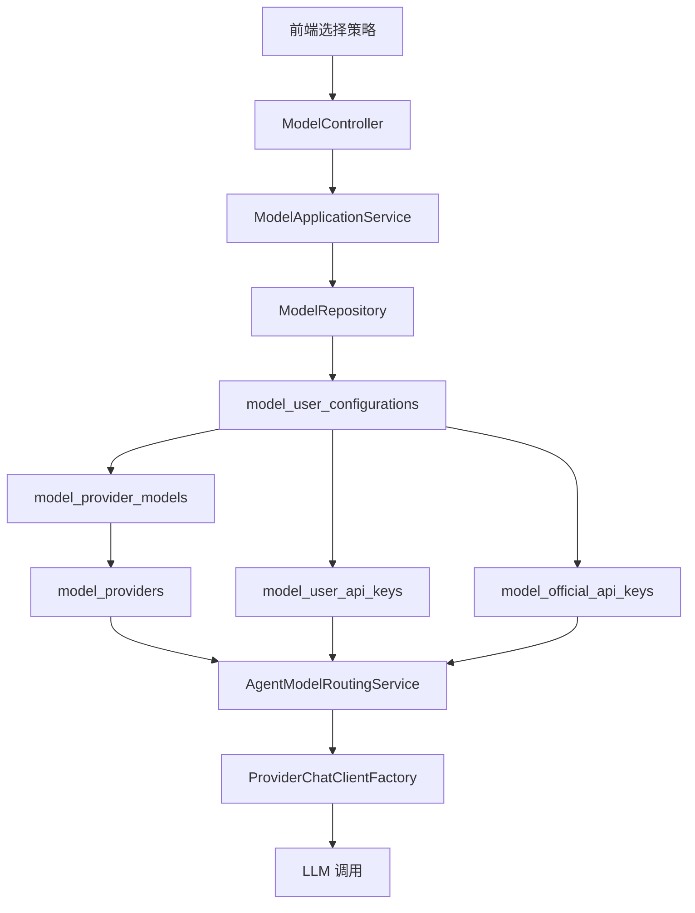
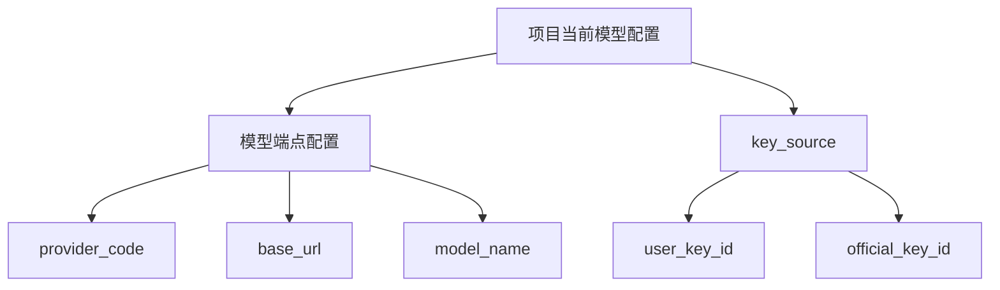

# 模型配置架构评审 v1

## 1. 目标与边界

- 目标1：回答是否应该移除顶级策略模块
- 目标2：评估 `model_provider_models` 是否有必要保留
- 目标3：给出业界常见做法与本项目建议路线
- 边界：本文件仅做架构与迁移方案评审，不涉及代码改动

---

## 2. 当前实现概览

### 2.1 当前核心表

- `model_providers`：供应商目录，包含供应商编码、展示名、默认 `base_url`
- `model_provider_models`：供应商可选模型目录，记录 `model_code` 与展示元信息
- `model_user_api_keys`：用户自管 key 池
- `model_official_api_keys`：平台托管 key 池

### 2.2 当前调用链

### 2.3 现状特点

- 优点
  - model 与 key 解耦，复用性强
  - 支持同项目多策略与默认策略
  - 支持 USER_KEY 与 OFFICIAL_KEY 双来源
- 痛点
  - 策略概念偏重，若业务只要单一当前配置，学习成本高
  - `model_provider_models` 需维护 seed，运维成本增加
  - 对小规模项目看起来有设计过度风险

---

## 3. 业界常见模式

## 3.1 模式A 目录表 + 配置实例表

- 目录表维护 provider 与 model
- 用户/组织保存配置实例，引用目录表
- 典型于多租户 SaaS，优势是治理与统计能力强

## 3.2 模式B 纯配置实例化

- 不维护统一 model 目录
- 每条配置直接写 provider_code、base_url、model_name、api_key_ref
- 典型于内部工具或快速迭代项目，优势是简单，缺点是标准化弱

## 3.3 模式C 混合模式

- 官方托管配置走目录化治理
- 用户自定义配置允许覆盖 base_url 与 model_name
- 在平台化产品中较常见，平衡治理与灵活性

---

## 4. 对你提出三点的评估

## 4.1 关于移除顶级策略模块

- 结论：可以弱化策略概念，但不建议完全移除策略实体
- 原因
  - Agent 任务执行天然需要一次快照配置
  - 后续若引入按场景路由、灰度、fallback，没有策略层会回退到硬编码
  - 可将策略改名为 当前配置，降低认知负担

建议做法

- 保留表实体，前端隐藏复杂字段
- 每项目默认仅展示一条活动配置
- 可选高级模式再展示多策略能力

## 4.2 关于 `model_provider_models` 是否保留

- 结论：短期可弱依赖，长期建议保留轻量目录能力

两种可落地方向

- 方向1 保留目录
  - 优点：便于统一下拉、能力标签、价格信息、审计
  - 缺点：需要维护 seed 或同步任务
- 方向2 去目录
  - 在用户配置表与官方配置表直接保存 provider_code、base_url、model_name
  - 优点：简单直接
  - 缺点：相同模型字符串分散，统计与治理变难

建议折中

- 保留 `model_providers`
- 将 `model_provider_models` 从强外键改为推荐目录
- 配置实例允许直接覆写 model_name 与 base_url

## 4.3 关于 用户配置表 + 官方配置表

- 结论：这是业界主流可行方案，但字段要完整

实例字段建议

- 公共字段
  - provider_code
  - base_url
  - model_name
  - temperature
  - top_p
  - max_tokens
  - status
- 密钥字段
  - user_key_id 或 official_key_id
  - 不建议明文落表，保持加密存储

---

## 5. 推荐目标架构

## 5.1 逻辑模型

## 5.2 表设计建议

- 保留
  - `model_providers`
  - `model_user_api_keys`
  - `model_official_api_keys`
- 调整
  - `model_user_configurations` 统一承载用户模型配置
  - 保留多条能力，但按用户显式选择生效
- 降级为可选
  - `model_provider_models` 作为推荐模型库

---

## 6. 渐进迁移计划

1. 第一阶段 接口语义调整
   - 将 前端策略文案 改为 当前模型配置
   - 默认仅暴露一条配置
2. 第二阶段 数据收敛
   - 统一以 `model_user_configurations` 保存 provider/base_url/model_name
   - 读路径仅按用户模型配置解析，不再保留策略回退
3. 第三阶段 解除强依赖
   - `model_provider_models` 改为推荐来源
   - 新增配置时可自由输入 model_name
4. 第四阶段 清理与固化
   - 观察期后决定是否保留 `provider_model_id`
   - 补齐审计与监控指标

---

## 7. 风险与控制

- 风险1 配置碎片化
  - 控制：保留 provider_code 枚举校验，增加 model_name 规范提示
- 风险2 旧数据兼容
  - 控制：双读策略，先读新字段，后读旧外键
- 风险3 运维排障难度上升
  - 控制：执行配置落日志快照，保留 traceId 贯通

---

## 8. 结论

- 你的方向是合理的：以 用户配置 与 官方配置 为主，策略层降复杂度
- 不建议一次性硬删策略与模型目录，建议采用 兼容迁移
- 推荐落地方案：
  - 短期 保留表，语义轻量化
  - 中期 让项目配置支持直存 provider 与 model
  - 长期 将 `model_provider_models` 定位为推荐目录而非强依赖

