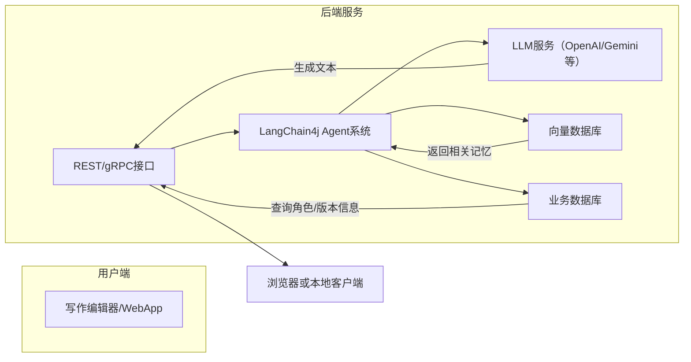

# AI小说Copilot产品需求文档（PRD）

## 执行摘要  
本产品旨在为小说作者提供AI辅助写作工具，将AI作为“副驾驶”，作者仍掌握创作主导权。核心目标是**提高写作效率和质量**：通过保持文风一致、塑造鲜明角色、确保长篇故事连贯性等功能，帮助用户更快地完成小说创作。成功指标包括用户写作速度提升、故事连贯性评分、用户满意度等。例如，有研究指出互动式创作工具可使用户参与度提升近2倍。本项目使用Java生态的LangChain4j框架作为后端，引入RAG（检索增强生成）和长期记忆模块，支持大规模文本处理和多轮对话保持一致性。性能方面，系统需低延迟响应（实时补全建议），支持并发写作会话；安全方面，所有用户数据静态和传输加密，且不用于模型训练。成本估算包括云端按需付费（LLM调用、向量库等）和本地部署（GPU硬件）两种方案。

## 用户画像与使用场景  
- **业余写作者（爱好者）**：一般对AI技术不精通，主要在业余时间创作。使用场景包括：从零开始撰写故事大纲、快速生成灵感片段或对话；或边写边让AI建议补全、润色。对成本敏感，更倾向免费或低成本方案（如本地开源模型）。  
- **专业作者（出版作家、编剧等）**：创作速度快、质量要求高，需保证作品逻辑严谨、风格统一。使用场景包括：构思情节大纲、深度打磨草稿、校对语言风格，或者多人协作下对同一作品进行多角度润色。可接受云服务订阅费用，注重安全性和版权。  
- **使用场景示例**：作者在早晨打开编辑器，撰写新的章节时AI实时提供后文建议和错别字纠正；编辑场景下，一位作者让AI检查前文信息一致性（如角色姓名、事件细节），避免内容冲突；多人协作时，作者可邀请伙伴共同编写，AI作为“临时作者”帮助填充剧情空白。无论在线协作或离线写作，系统支持对故事版本的管理和最终导出（如ePub、PDF）用于出版或投稿。

## 核心功能清单与优先级  
1. **写作辅助**（高）：包括自动续写、改写和校对。利用LLM根据上下文生成文本（句段补全、同义句重写等），并提供语法/拼写检查功能。优先采用Prompt提示工程来适配用户风格。  
2. **角色管理**（高）：维护人物档案（姓名、性格、背景、动机等），保证角色言行一致。提供可编辑的**角色数据库**（如JSON或关系型结构），并在生成文本时向LLM注入角色属性以辅导对话和行为。  
3. **长期记忆**（高）：将重要剧情、世界观、角色关系等信息持续保存并检索。使用向量数据库存储**记忆片段**，结合LangChain4j的ChatMemory等模块，实现跨会话的信息检索与注入。  
4. **风格控制**（中）：支持按照指定文风（例如第一人称、古典言语、欢快/悲伤语调）生成内容。方案包括提示中加入风格说明、微调模型（如果有足够样本）或后处理风格校正。可通过多轮Prompt配合风格标签控制输出风格。  
5. **情节规划与回填**（中）：提供大纲/梗概功能，引导用户提前规划主线和伏笔。AI根据用户大纲提示生成各章节内容；支持“挖坑”标记（如未来悬念），后续自动回填细节。技术上可设计一个“故事规划Agent”，先进行链式思考分解，再通过RAG检索先前设定的梗概内容进行对比，确保填坑合理。  
6. **版本管理**（中）：记录故事历史版本，支持撤销/分支创作。可借鉴Git或数据库版本方案，存储每次修改记录。接口示例：`POST /story/{id}/version`创建新版本，`GET /story/{id}/version/{ver}/content`获取指定版本内容。版本间的差异可作为测试用例核查一致性。  
7. **协作与导出**（低）：多用户同时在线协作编辑时，使用锁或实时同步方案保障一致性。完成故事后可导出为TXT、Markdown、PDF、ePub等格式。接口示例：`POST /export`上传故事ID和格式（JSON Schema 示例见下），返回下载链接或文件流。  

## 功能实现方案  

### 写作辅助  
- **实现思路**：构建一个“写作助手Agent”（基于LangChain4j），通过注释`@Agent`和`@Tool`接口定义写作相关工具。例如，一个`proofread(text)`工具调用专用语法检查模型；一个`continueWriting(context)`工具使用LLM生成后续文本。前端用户每段写作请求触发这些工具，生成结果返回给用户。  
- **LangChain4j集成**：使用`AiServices`构建接口（如Elastic示例），将OpenAI/GPT-4o等模型接入。利用`ChatMemory`模块保存当前会话历史。例如：  
  ```java
  ChatLanguageModel chatModel = OpenAiChatModel.builder()
      .apiKey("...")
      .modelName(GPT_4O)
      .build();
  Assistant assistant = AiServices.builder(Assistant.class)
      .chatLanguageModel(chatModel)
      .chatMemory(MessageWindowChatMemory.withMaxMessages(20))
      .build();
  ```  
  用户提交新段落时，通过`assistant.chat(userPrompt)`得到AI续写。  
- **提示工程**：设计Prompt模板注入上下文和需求，如“请以温暖风格续写以下段落”，并包含必要记忆（见长期记忆部分）。  
- **RAG增强**：对于需要**事实检索**或长文本提示时，调用预检索工具。可以在助手创建时配置`contentRetriever`：  
  ```java
  assistant = AiServices.builder(Assistant.class)
      .chatLanguageModel(chatModel)
      .chatMemory(MessageWindowChatMemory.withMaxMessages(10))
      .contentRetriever(EmbeddingStoreContentRetriever.from(embeddingStore))
      .build();
  ```  
  如此在`assistant.chat()`时，系统会自动检索相关文档片段补充提示。  
- **替代方案**：除使用GPT系列，团队可选用其他大模型（如Gemini、Claude）或开源模型（Llama、Mixtral等）进行API调用；本地部署时可使用LLM容器平台（例如Ollama）以降低响应延迟。

### 角色管理  
- **角色档案与属性**：设计角色对象JSON Schema，例如：  
  ```json
  {
    "id": "char123",
    "name": "Alice",
    "age": 25,
    "traits": ["勇敢", "好奇"],
    "background": "童年在森林中长大，师承猎人父亲。",
    "currentRole": "主角",
    "relationships": {"兄弟": "Bob", "朋友": "龙女"}
  }
  ```  
  将这些信息存储于数据库（如关系型DB或NoSQL）。前端可提供角色编辑界面。  
- **LLM交互**：在生成文本时，将相关角色信息拼入提示。例如构造对话场景：  
  > “角色信息：Alice，性格勇敢直率；Bob，性格谨慎内向。在下面对话中，保证Alice表现出她的勇敢品质，Bob表现谨慎。对话开始：\nAlice: ...”  
  Prompt工程插入角色履历和性格标签，引导模型输出符合角色特点的文本。  
- **工具设计**：LangChain4j中可为角色管理编写工具函数：  
  ```java
  @Tool(description = "查询角色属性")
  public String queryCharacter(String name) { ... }
  @Tool(description = "更新角色背景")
  public String updateBackground(String name, String background) { ... }
  ```  
  Agent在需要时调用，保证角色数据库与对话内容同步。  
- **一致性维护**：系统定期或按需使用LLM生成简短的角色总结（摘要记忆），存入长期记忆库。生成时输入角色历史信息，输出精简描述，供后续检索时快速引用。  
- **行业案例**：诸多对话系统和游戏AI（如Jenova Roleplay Game Master）注重角色记忆与一致性，采用类似方法储存NPC特质并实时查询。  

### 长期记忆与一致性维护  
- **记忆存储设计**：分为**短期会话记忆**和**长期存储**。短期使用LangChain4j的`ChatMemory`（如最近10条交流）；长期记忆则存储已验证的重要信息。技术选项包括：向量数据库（用于语义检索）、结构化知识库（数据库表）和摘要存储。  
- **信息抽取与索引**：自动或用户指定将对话/章节内容**拆分**成逻辑片段（chunk），如每300字为一段，带少量重叠。对每个片段使用嵌入模型生成向量，并存入向量库（如Pinecone、Milvus、Weaviate等）。同时可提取实体或关键事实存入结构化表。  
- **检索策略**：生成新内容前，先对当前提示做“记忆查询”。将对话内容或问题**嵌入**向量空间，在向量库中查找相似片段，将检索到的相关故事片段、角色数据注入提示。LangChain4j的`EmbeddingStoreContentRetriever`可简化此流程。  
- **一致性验证**：生成后对输出进行自动校验，如使用规则或训练的小型模型检查实体一致性（如所有角色名称统一）、故事逻辑前后一致。可用提示让Agent自我检查并修改：例如让模型列出当前已建立的角色属性列表，并与生成内容核对。  
- **行业实践**：AWS建议的Agent记忆模块强调**长期记忆**的必要性，将摘要记忆、知识库和向量存储结合使用。Jenova等游戏型AI已实现“无限记忆”，可跨数十轮会话保持角色和世界状态。我们的设计借鉴这些经验，用周期性摘要和检索保证多回合创作中信息不会遗忘。

### 风格控制  
- **控制方法**：可通过**提示调控**或**模型微调**实现文风一致性。提示调控即在Prompt中明确要求（如“请用优美浪漫的古典文风”）；微调则是在开源模型上用目标风格语料重新训练。  
- **实现方案**：为了简单起见，优先采用提示法。为每个作品设定一个“风格描述”模块，如著名作家文风样本或自定义文风设定。每次生成内容时，将风格说明合并进系统提示。必要时，可对模型输出进行后处理，如用小模型修改语句结构，强化指定语气。  
- **示例接口**：可以设计一个API接口调整风格：`POST /story/{id}/setStyle`，Body含`"tone":"忧郁,诗意","voice":"第一人称"}`。LLM调用时自动附加风格标签。返回结果也可验证是否符合预期风格，比如用嵌入度量与目标文风文本的距离。  
- **备选方案**：若条件允许，可针对特定风格(如儿童文学、侦探小说)微调基础模型，并在LangChain4j中新建微调后的`ChatLanguageModel`实例使用。但需评估微调成本和样本需求。

### 情节规划与回填  
- **大纲生成与梳理**：提供**故事大纲编辑器**，作者输入关键词或阶段性目标，AI生成详细场景建议。实现时可先让一个Agent执行“故事规划”任务，将情节拆分为多步子任务（可参考“链式思考”或“思维树”方法）。例如：“请为一个奇幻冒险故事制定十个关键章节标题”。然后，根据每个标题由“写作Agent”生成内容。  
- **伏笔与回填**：对于标记为“待完善”的情节点，系统记录一个任务列表。随着创作推进，每当AI生成内容或作者输入后，扫描是否触及先前标记的伏笔，如果达到回填时机，自动唤起Agent补充相应细节。可以用RAG检索之前的大纲片段确保呼应。  
- **流程示例（Mermaid）**：  
  ```mermaid
  graph LR
    A[用户输入大纲] --> B(情节规划Agent)
    B --> C{生成章节列表}
    C -->|逐章| D(写作助手Agent)
    D --> E[生成章节内容]
    E --> F(检测是否回填伏笔)
    F -->|需要回填| B
    F -->|完成| G[输出当前版本]
  ```  
  该流程展示用户定义章节大纲，经规划Agent细化后由写作助手生成内容，并在有伏笔时自动递归进行回填。  
- **行业案例**：诸如Storique评论显示，能产出“结构完整、角色连贯、节奏得当”的叙事工具正成为市场趋势。系统设计参考这些思路，确保在每个章节间插入适量伏笔并最终合理回补，达成长文本一致性。

### 版本管理  
- **数据结构与接口**：故事以文档形式存储，每次修改记录为一个新版本。示例JSON Schema：  
  ```json
  {
    "version": 5,
    "author": "alice",
    "timestamp": "2026-04-01T09:30:00Z",
    "content": "完整或增量文本"
  }
  ```  
  接口示例：`POST /story/{id}/version`上传新版本；`GET /story/{id}/version/{v}`获取历史内容。可实现分支策略，如`/branch`创建并行创作线。  
- **自动化测试**：为版本管理可编写自动验证：对比连续版本差异，检查功能（写作辅助、角色管理等）是否正常迁移；记录在案作为验收标准。  
- **集成建议**：可集成Git-like工具（如JGit）保存版本，或在数据库中存储富文本历史。多版本方案便于用户恢复任意历史状态，提高协作容错性。

### 协作与导出  
- **协作机制**：系统支持多用户权限，如“阅读者/作者/管理员”角色。可采用WebSocket或实时协作框架（如ShareDB）实现多人协同编辑。锁机制或自动合并冲突策略保证数据一致。用户登录后与自己账户绑定的内容可实现共享编辑。  
- **导出功能**：允许作者导出作品到常用格式。接口示例：`POST /story/{id}/export`，请求体指定`format=pdf/epub/docx`，返回生成文件下载链接。实现方式可调用第三方库（如Pandoc）或在线API进行转换。确保导出时将记忆和元数据适当清理，仅保留最终文本。  

## 技术架构设计  
整体架构分为前端写作界面、后端服务、LLM模型与工具链、存储层等部分：  



- **组件说明**：前端提供富文本编辑与交互界面。后端由Spring Boot等构建REST/gRPC API，集成LangChain4j负责组织Agent调用。LLM服务可使用OpenAI云API或自建模型容器（如Ollama）。向量数据库（如Pinecone/AWS OpenSearch/Milvus）存储嵌入向量及记忆片段；业务数据库保存角色档案、故事版本等结构化数据。  
- **数据流**：用户输入文本/命令经API传给LangChain4j Agent，该Agent根据功能模块（写作、检索、记忆等）调用工具和存储。若需外部知识，Agent先在向量库中检索相关片段，再将结果和用户上下文一起交给LLM生成下文。生成结果回传前端。所有核心接口（如`/chat`、`/memory/query`等）采用JSON Schema定义，示例：  
  ```json
  {
    "userId": "u123",
    "storyId": "s456",
    "prompt": "请写下节内容：…",
    "style": {"tone":"幽默","language":"简体中文"}
  }
  ```  
  返回示例：  
  ```json
  {
    "text": "AI生成的文本…",
    "sources": ["记忆片段ID1","角色Bob背景"],
    "contextWindow": {"assistant":[...]},
    "version": 7
  }
  ```  

## 非功能需求  
- **性能与可扩展性**：系统需支持**并发写作会话**，如数十甚至数百用户同时编辑。后端服务可部署在云端Kubernetes集群，通过负载均衡水平扩展。LLM调用为关键瓶颈，可采用**批量处理**或**异步流式生成**（如LangChain4j的TokenStream接口）减少延迟。检索阶段使用高性能向量DB（如Milvus支持分布式大规模向量查询）确保在千人并发时仍能快速检索。缓存热门检索结果也可提升并发查询性能。  
- **安全与隐私**：所有用户数据加密存储和传输；敏感信息（如用户个人资料）只在授权范围内访问。系统默认不使用用户创作文本来再训练模型。考虑接入企业身份验证（OAuth、SSO），日志记录操作审计。此外，应配置内容审核工具（关键词过滤、毒性检测）以防生成违规内容。  
- **成本估算**：  
  - *云端部署*：主要费用为LLM API调用和向量DB服务。以GPT-4o为例，每100万输入token约2.5美元，输出10美元。假设一本小说500页≈200万字（约400万token），成本≈(4000×$0.0025+$4000×$0.01)≈$50+$400=$450，仅GPT使用成本。向量库（Pinecone等）另需支付存储和查询费用（视服务商而定）。加上服务器实例（计算、存储），小规模团队月成本约几千元人民币。  
  - *本地部署*：需要GPU服务器（如4块A100，约30万人民币）和维护成本，长期来看对高频创作更经济（不受API调用限制）。开源嵌入模型和LLM（如Llama3-70B）可部署在自有集群，通过LangChain4j-OpenAI Adapter调用，避免API费用，但需额外考虑模型更新维护成本。  
- **可靠性**：采用微服务架构，关键组件（Agent系统、向量DB）应设置高可用配置。考虑使用消息队列和任务重试机制，应对第三方API调用超时。开发自动化测试覆盖各功能：对话流测试、记忆检索准确性测试、风格一致性测试等，保证迭代中功能稳定。  

## 里程碑与开发计划  
1. **原型阶段（1个月）**：实现核心写作助手Agent，集成至少一种LLM（如GPT-4o）和简单ChatMemory。完成基础对话流和文本生成，初步UI。**验收标准**：能自动续写输入段落，基本上下文连贯。  
2. **记忆与RAG阶段（1-2个月）**：加入向量库，完成文本分块、嵌入和检索功能；Agent支持检索上下文记忆并注入提示。**验收标准**：对50轮以上的对话或数万字情节，系统能够正确回忆前期信息（经设计测试用例验证）。  
3. **角色与风格阶段（1个月）**：实现角色属性管理界面与接口，将角色信息融入生成过程；实现风格选择功能。**验收标准**：验证AI输出符合指定角色个性和文体（通过人工评审或自动分类）。  
4. **情节规划与版本管理（2个月）**：开发故事大纲编辑器、章节规划Agent；实现版本保存与查看功能。**验收标准**：能够生成符合预设大纲的章节，故事版本可成功回滚、对比。  
5. **协作与导出（1个月）**：支持多用户并行编辑和跨终端同步；实现文档导出（ePub/PDF）。**验收标准**：多人同时编辑无冲突，导出文档正确无格式丢失。  
6. **上线准备**：完善安全测试和性能优化，编写文档和帮助。**风险与缓解**：模型幻觉可能产生错误情节→使用RAG和验证机制减少误导；用户隐私泄露风险→加强加密和访问控制；模型依赖单一供应商→预留多模型切换接口（如Jenova支持多模型）应对突发情况。  

## 第三方依赖与参考资料  
- **技术框架**：LangChain4j官方文档；相关学术与业界最佳实践，如生成式AI与LangChain第二版（Packt 出版）、Controllable Text Generation综述（风格控制）。  
- **开源项目**：可参考Jenova等AI创作工具的理念；以及Milvus/Pinecone/Weaviate等向量库介绍。  
- **组件选型**：下表比较了几类可选组件：

  | 类别       | 选项              | 优点                                     | 缺点/备注                             |
  |:----------|:----------------|:---------------------------------------|:-------------------------------------|
  | 向量数据库  | Pinecone（云托管）| 零运维、API简易、服务稳定    | 费用按量计、无法深度定制               |
  |            | Milvus（开源）   | 高性能、可扩展、自定义索引支持| 需自行运维配置、部署复杂               |
  |            | Weaviate（开源） | 内置模型自动嵌入、支持混合检索| 图查询功能门槛高、社区相对较新         |
  | 模型托管    | OpenAI/GPT（云） | 模型质量顶尖、易用（云API）、支持多模型切换 | 成本高（按Token）、数据隐私依赖云服务 |
  |            | Llama3/Mixtral（本地）| 可本地化部署、按需扩展、不依赖外网          | 硬件需求高、需要微调或适配            |
  | 检索工具    | OpenAI 文件检索   | 简单集成RAG（如先将文档嵌入后问答）        | 不支持细粒度控制、依赖外部API         |
  |            | Elastic/Opensearch | 支持全文和向量混合搜索   | 部署和维护成本高                      |

以上选型建议团队根据项目规模、预算和运维能力进行决策。总之，我们通过结合业内验证的架构设计和多种方案备选，确保AI小说Copilot既满足创作需求，又具有灵活可控的实现路径。所有设计在后续迭代中将依据实际测试结果和用户反馈持续优化。  

**参考文献：** 详情请参阅等资料。