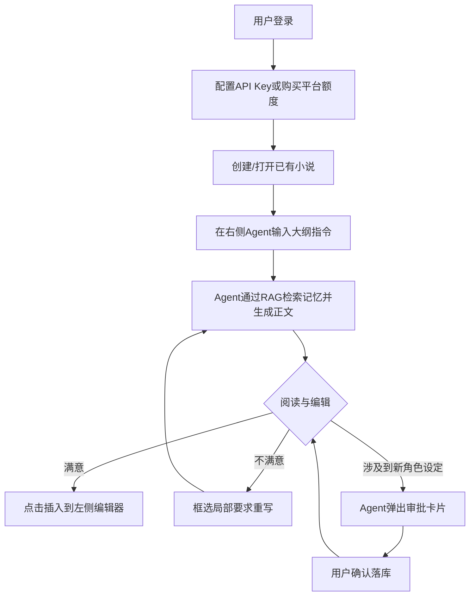
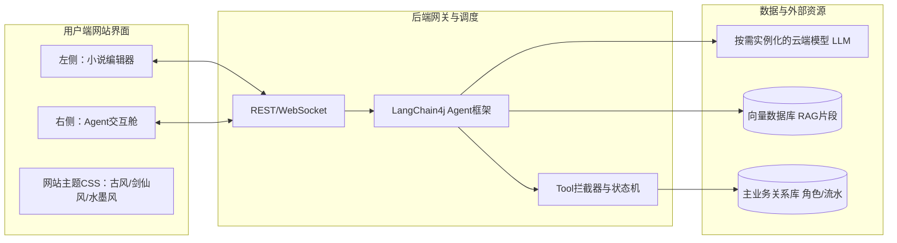

# AI小说Copilot产品需求文档（PRD） v0.1

## 一、概述（为什么做）

### 1.1 背景介绍
当前的辅助写作工具大多基于传统的“你一句我一句”或是简单的实时纠错模式，这往往会打断作者的心流。而在代码领域，AI Coding IDE（如Cursor、GitHub Copilot）通过侧边栏Agent深度统筹项目上下文、通过审批流修改代码，极大提升了开发效率。本产品旨在将这一成功的交互理念引入网络小说创作领域，打造一个专为小说设计的AI写作平台。

### 1.2 产品概述
本产品是一个专业的**AI自动写作Web平台（网站）**。核心理念由“AI作为副驾驶”转变为：**AI是主力写手，作者充当导演与编辑**。通过Web编辑器与侧栏Agent的双向联动，作者下达大纲与局部修改指令，AI负责大段文本生成；Agent还可以自主操作小说数据库（角色档案、剧情设定）并通过弹窗请求用户确认审批（Human-in-the-loop）。此外，网站提供深度的“古风、水墨风、剑仙风”等特色视觉主题风格，增强沉浸式创作体验。

### 1.3 目标用户
- **业余写作者（爱好者）**：创意丰富但时间和笔力有限，希望由AI承包大部分文字产出，自己只做设定和审核。
- **专业作者/网文工作室**：追求日更效率和文风稳定，自带高级API（如GPT-4o），利用IDE式的高效协作与审批流进行规模化生产。

### 1.4 名词说明
- **Agent（智能体）**：侧边栏的AI对话核心，具备调用系统界口（Tool）的能力。
- **Human-in-the-loop（人在回路）**：AI执行关键操作（如修改数据库）时不直接执行，而是变为前端组件等待用户点击确认。
- **BYOK（Bring Your Own Key）**：用户在系统内配置自己购买的第三方大模型API Key。
- **RAG（检索增强生成）**：在生成正文前，自动检索并注入向量数据库中保存的小说原有记忆与角色设定。

### 1.5 角色及权限
- **普通用户（作者）**：拥有自己名下小说的创建、编写、导出及个人API池管理权限。
- **系统管理员**：管理系统默认提供的API额度和全局内置主题库。

---

## 二、产品描述（做什么）

### 2.1 产品需求描述
平台由左侧富文本编辑器和右侧Agent交互面板组成。主要需求包括：支持AI基于大纲流式生成长篇章节；支持用户框选文本命令AI重构；Agent自动提取文本中的新角色或伏笔，触发CRUD审批卡片；支持用户自定义模型API；支持网站全局UI风格（古风、水墨风、剑仙风）切换。

### 2.2 产品整体流程

#### 2.2.1 主流程


#### 2.2.2 核心子流程（审批拦截CRUD子流程）
1. AI在生成过程中识别出新实体。
2. 后端拦截落库，返回需要审批的JSON结构至前端。
3. 前端将JSON渲染为卡片（含实体属性、[确认]/[拒绝]按钮）。
4. 用户审核修改属性后点击确认。
5. 前端发起真实CRUD请求进入数据库。

### 2.3 全局说明
#### 2.3.1 全局异常处理
- **API调用超时/失败**：在右侧对话框输出如“您的模型响应超时，请检查API Key设置或稍后重试”。
- **未登录/越权访问**：统一拦截至登录页面或提示无权限。

#### 2.3.2 全局交互
- **审批卡片响应**：所有Agent发起的卡片，在用户操作后卡片变为“已处理”置灰状态。
- **网站视觉风格**：提供【古风】、【水墨风】、【剑仙风】三种网站皮肤，切换时改变全局CSS（如背景纹理、字体材质、侧边栏边框特效等）。

### 2.4 功能清单
- 核心工作区及双向联动
- Agent长文生成与局部重构
- Human-in-the-loop 设定操作审批（数据库CRUD）
- BYOK自定义模型与API池管理
- RAG长期记忆与角色、大纲维护
- 网站主题皮肤系统（古风、水墨风、剑仙风）

---

## 三、功能需求（怎么做）

### 3.1 核心Agent交互与写作体系

#### 3.1.1 描述
这是工具的核心区域。左侧编辑器负责呈现和辅助修改，右侧对话框供用户发布指令。

#### 3.1.2 用户故事
作为作者，我希望输入简短剧情指令，AI不仅能直接写出几千字正文，还能在文中遇到新角色时主动提示我添加设定，以便我以“导演”视角高效把控产出。

#### 3.1.3 核心交互与业务流程
1. **指令撰写**：用户在右侧输入如“根据第三章大纲生成内容”。
2. **AI主导生成**：后端将当前章节、向量库检索到的上下文打包发送给LLM。AI以流式（Streaming）返回完整内容至对话框。
3. **内容重构**：用户在左侧光标选中一段“缺乏张力”的文字，在右侧输入“改激烈点”，AI仅对该部分给出修订版，提供[替换]按钮。
4. **审批流程卡片化（Human-in-the-loop）**：
   - 流程：AI运行到带`@Tool`注释的方法（如`createCharacter`）时停止，后端将参数打包返回给前端。
   - 前端将工具调用变为一张交互卡片（例：“发现新角色：李掌柜，性格：怯懦。是否加入？”）。用户点击[确认]，前端执行最终的API提交。

#### 3.1.4 数据字典
| 字段名 | 数据类型 | 约束 | 备注 |
| :--- | :--- | :--- | :--- |
| `story_id` | String | 唯一 | 小说ID |
| `chunk_text` | String | - | 小说分块文本，用于向量化 |
| `tool_call_status` | Enum | PENDING, APPROVED, REJECTED | 审批流状态 |

### 3.2 网站主题风格切换（UI设定）

#### 3.2.1 描述
作者可在设置内切换整个网站的主题样式，包括背景、字体与边框，以获得更好的沉浸感。**注意：这是网站前端UI风格，而非小说生硬预设语料。**

#### 3.2.2 界面及交互
1. 设置菜单具有“主题风格”选项卡。
2. 可选项：
   - **默认风格**：极简现代IDE风。
   - **古风**：木质面板色彩，暖色调UI，宋体/楷体适配。
   - **水墨风**：纯黑白灰阶，带少许水墨晕染动画，极高对比度。
   - **剑仙风**：冷色调（冰蓝/青色），凌厉的切角卡片设计和剑光般的Hover特效。

### 3.3 模型与API池管理（BYOK）

#### 3.3.1 描述
支持用户灵活配置外部API或使用平台官方代币额度。

#### 3.3.2 业务流程
1. 用户在“模型设置”内选择“使用平台模型”或“自定义API”。
2. 若选择前者，扣除用户账户中的Token余额。
3. 若选择后者，输入如`BaseURL: https://api.openai.com` 与 `API_KEY: sk-xxxx`。
4. 所有用户设置的Key存入数据库时均需AES非对称加密。系统调度LangChain4j引擎时，动态构筑对应提供商的`ChatLanguageModel`。

### 3.4 角色管理与长期记忆检索

#### 3.4.1 描述
系统利用向量数据库和结构化数据库保存记忆，突破大模型长度限制。

#### 3.4.2 后台拆解与业务逻辑
1. **拆解**：自动将写好的章节拆分为300字逻辑段（Chunk），生成嵌入向量。
2. **角色库同步**：角色JSON档案（姓名、背景、性格）同时保留在关系型DB中供用户修改。
3. **检索增强(RAG)**：生成时利用`EmbeddingStoreContentRetriever`，通过将用户当前输入嵌入后，在向量数据库中计算余弦相似度，将最相关的3-5条记忆强行拼接在System Prompt中。

---

## 四、非功能需求（注意事项）

1. **安全性**：加密存储用户API密钥；保证独立用户之间的向量库完全隔离，不泄露私有数据。
2. **并发响应**：长文流式返回对资源消耗极大，需配合SSE/WebSocket保持长连接，同时在网关层级做好限流（Rate Limit）策略。
3. **可靠性**：考虑到外部大模型API偶尔抽风或无响应，前端和后端需有明显的重试和状态保护机制。

---

## 五、技术实现方案（历史架构传承）

为指导后续开发，本部分详细记录系统核心底层的技术与架构设计。

### 5.1 LangChain4j与审批拦截架构
系统整体核心底层依托**LangChain4j**框架。在定义小说协作Agent时，将业务接口标注为`@Tool`暴露给模型：
```java
@Tool(description = "创建新的角色档案")
public ToolResponse createCharacter(String name, String background, String traits) { 
    // 后端不直接操作DB，而是抛出特殊Exception或中断流序列化给前端
}
```
结合`MessageWindowChatMemory`来维持短期上下文档案。遇到上述Tool被触发时，拦截器捕获并暂停会话流，将动作转为JSON响应到前端，完成**Human-in-the-loop**控制。

### 5.2 RAG记忆检索体系实现
底层以Redis、MySQL配搭Pinecone/Milvus向量数据库：
```java
// Langchain4j 记忆检索器配置示例
Assistant assistant = AiServices.builder(Assistant.class)
    .chatLanguageModel(dynamicChatModel) // 根据API路由决定的模型
    .contentRetriever(EmbeddingStoreContentRetriever.from(userSpecificEmbeddingStore))
    .build();
```

### 5.3 结构化角色数据 Schema 示例
底层关系库角色档案维护使用标准Schema规范，也为Agent自我验证保证前后一致性提供锚点：
```json
{
  "id": "char_1001",
  "name": "李掌柜",
  "traits": ["势利", "胆小"],
  "relations": {"主角": "看不起但不敢得罪"},
  "first_appearance_chapter": 2
}
```

### 5.4 总体技术流向架构图

