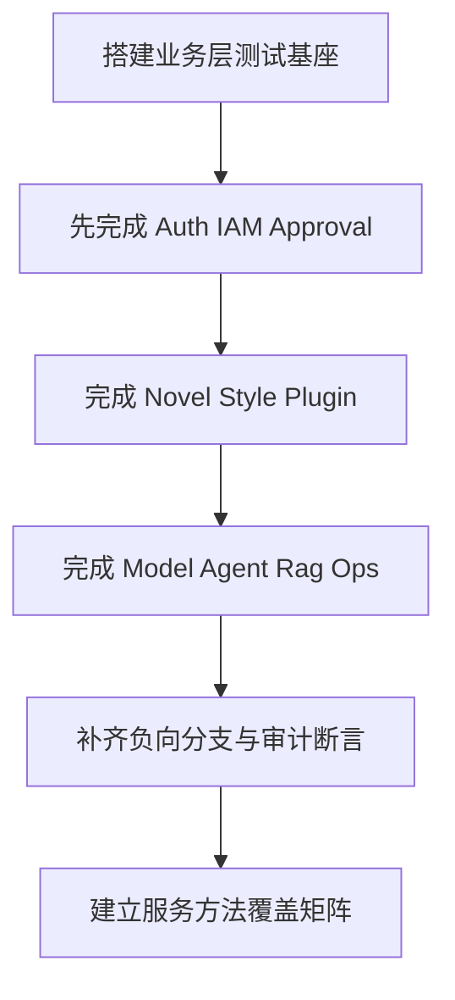

# PenMate 后端业务层单测全覆盖计划 v1.0

## 1. 计划目标与边界

- 目标：为现有 10 个 `ApplicationService` 建立可执行的业务层单测基线，覆盖核心业务规则、负向分支、幂等语义与审计副作用。
- 边界：
  - 本计划仅覆盖业务层单测，不替代控制器契约测试与全链路集成测试。
  - 外部系统调用采用测试替身，不直接依赖真实对象存储、向量库、消息系统。
  - 以当前代码主干为准，后续新增服务方法按本计划增量补齐。

依据文档：
- `docs/project-specifications/backend/统一全量后台-后端技术方案-v1.0.md`
- `docs/project-specifications/backend/统一全量后台-接口设计-v1.1.md`
- `docs/project-specifications/backend/统一全量后台-表结构设计-v1.1.md`
- `docs/project-specifications/prd/prd-v0.2.md`

---

## 2. 覆盖对象清单

与当前控制器一一对应的业务服务：

1. `AuthApplicationService`
2. `IamQueryApplicationService`
3. `NovelApplicationService`
4. `StyleApplicationService`
5. `PluginApplicationService`
6. `ModelApplicationService`
7. `AgentApplicationService`
8. `ApprovalApplicationService`
9. `RagApplicationService`
10. `OpsApplicationService`

---

## 3. 业务层单测方法学

### 3.1 测试类型

- 正向流程：业务可执行路径。
- 负向流程：资源不存在、状态不合法、规则冲突。
- 边界流程：空值、重复操作、最小最大边界。
- 副作用流程：审计记录、默认值切换、状态推进。

### 3.2 统一断言维度

- 返回值语义：字段完整、默认值、状态值。
- 依赖调用语义：关键仓储方法是否被调用、调用参数是否正确。
- 异常语义：异常类型与消息是否符合接口错误码映射预期。
- 审计语义：写操作是否触发 `AuditService` 记录。

### 3.3 Mock 策略

- 业务层单测中，`Repository Gateway` 与外部服务使用 mock。
- 不 mock 被测 `ApplicationService` 本身。
- 每个写方法至少覆盖一次审计调用断言。

---

## 4. 用例最小集合模板

每个业务公开方法最小覆盖集合：

1. 成功路径
2. 关键参数非法
3. 目标资源不存在
4. 业务规则冲突或不可执行
5. 幂等或重复操作语义
6. 审计副作用

命名建议：

- `UT_APP_<域>_<方法>_SUCCESS`
- `UT_APP_<域>_<方法>_NOT_FOUND`
- `UT_APP_<域>_<方法>_BUSINESS_CONFLICT`
- `UT_APP_<域>_<方法>_REPEAT_IDEMPOTENT`

---

## 5. 分域覆盖重点

## 5.1 Auth

- `login`：账号不存在、密码错误、用户禁用、登录成功会话写入。
- `logout`：Bearer 解析失败、会话撤销、重复登出幂等。
- `refresh`：refresh token 无效或过期、刷新成功。
- `me`：令牌非法与身份回显。

## 5.2 IAM

- 用户角色权限的存在性校验。
- 系统角色删除保护。
- 分配与移除关系的重复操作语义。

## 5.3 Novel

- 项目 卷 章 版本全链路状态规则。
- 发布 恢复 对象化提交等关键写操作。
- 大纲树移动 卡片关系去重 软删除可见性。

## 5.4 Style

- 文风创建与更新。
- 默认文风切换唯一性。
- 中途切换确认语义与日志审计。

## 5.5 Plugin

- 插件安装前置校验。
- 重复安装冲突。
- 启停 卸载与调用日志查询。

## 5.6 Model

- Key 与 Policy 的默认项唯一性。
- 默认切换先清后设语义。
- 删除后不可见与错误分支。

## 5.7 Agent

- 会话存在性校验。
- 生成任务创建 查询 应用的状态流。
- 审批前置约束与审计。

## 5.8 Approval

- 审批单创建 列表 详情。
- approve reject 状态流转互斥。
- 重复审批拦截。

## 5.9 RAG

- 文档创建 删除。
- parse embed 状态推进。
- index-status 返回语义。

## 5.10 Ops

- 任务查询与重试。
- 迁移任务启动冲突保护。
- 迁移详情不存在分支。

---

## 6. 测试结构与文件规划

建议目录：

```text
penmate-backend/src/test/java/com/penmate/backend/application/
  auth/AuthApplicationServiceTest.java
  iam/IamQueryApplicationServiceTest.java
  novel/NovelApplicationServiceTest.java
  style/StyleApplicationServiceTest.java
  plugin/PluginApplicationServiceTest.java
  model/ModelApplicationServiceTest.java
  agent/AgentApplicationServiceTest.java
  approval/ApprovalApplicationServiceTest.java
  rag/RagApplicationServiceTest.java
  ops/OpsApplicationServiceTest.java
  support/BaseApplicationServiceTest.java
```

---

## 7. 执行顺序



---

## 8. 验收标准

- 10 个 `ApplicationService` 均有独立测试类。
- 每个公开业务方法至少覆盖 1 条成功 + 1 条负向。
- 所有写操作均覆盖审计调用断言。
- 高风险方法补齐重复操作与状态冲突场景。
- 形成 服务方法-测试用例 映射表，避免遗漏。

---

## 9. 风险与防漏机制

- 防漏规则 1：新增业务方法必须同步新增单测。
- 防漏规则 2：写方法缺少审计断言视为未完成。
- 防漏规则 3：涉及状态流转的方法缺少负向分支视为未完成。
- 防漏规则 4：涉及默认项切换的方法缺少唯一性断言视为未完成。

---

## 10. 交付物

1. 10 个业务层测试类
2. 公共测试基座与夹具
3. 服务方法覆盖矩阵
4. 高风险分支补齐清单

