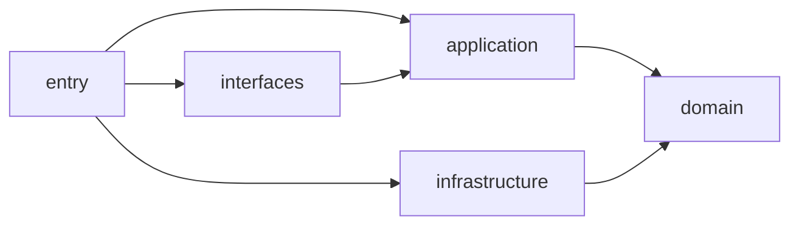

# 依赖方向治理方案

## 1. 背景与目标

当前后端代码虽已具备分层目录，但在实现上存在两类典型越界：

- 应用层直接依赖基础设施实现类（Mapper）
- 接口层 DTO 直接进入应用层核心用例

本方案目标：

- 建立可执行的依赖方向规则，覆盖 `auth/iam/novel/rag/approval` 全域
- 给出分阶段迁移步骤，先稳态治理再结构演进
- 提供 package 级约束与自动化检查规则，防止回归

---

## 2. 现状问题盘点

### 2.1 应用层直接依赖基础设施

在以下应用服务中可见 `application -> infrastructure` 直接 import：

- `approval`：`ApprovalApplicationService`
- `auth`：`AuthApplicationService`
- `iam`：`IamQueryApplicationService`
- `novel`：`NovelApplicationService`
- `rag`：`RagApplicationService`

### 2.2 应用层直接依赖接口层 DTO

在以下应用服务中可见 `application -> interfaces.api.*.dto` 直接 import：

- `approval`：`CreateApprovalRequestDto`、`ReviewApprovalRequestDto`
- `auth`：`LoginDto`、`RefreshDto`
- `novel`：多组 `Create/Update/*Dto`
- `rag`：`CreateRagDocumentDto`

> 结论：当前依赖方向以“可运行”为主，尚未达成“边界可验证”的 DDD 依赖治理目标。

---

## 3. 目标依赖方向

### 3.1 分层依赖规则

仅允许如下方向：

- `interfaces` -> `application`
- `application` -> `domain`
- `infrastructure` -> `domain`
- `entry` -> `interfaces`、`application`、`infrastructure`

明确禁止：

- `application` -> `infrastructure`
- `application` -> `interfaces`
- `domain` -> `application|interfaces|infrastructure`

### 3.2 Mermaid 目标图

---

## 4. package 级依赖约束建议

基于当前项目根包：`com.penmate.backend`

### 4.1 允许依赖矩阵

- `com.penmate.backend.domain..`
  - 可依赖：JDK、通用库
  - 禁止依赖：`application..`、`interfaces..`、`infrastructure..`

- `com.penmate.backend.application..`
  - 可依赖：`domain..`、`application..`
  - 禁止依赖：`interfaces..`、`infrastructure..`

- `com.penmate.backend.interfaces..`
  - 可依赖：`application..`、`domain..`（仅只读 VO/枚举时建议最小化）
  - 禁止依赖：`infrastructure..`

- `com.penmate.backend.infrastructure..`
  - 可依赖：`domain..`、`infrastructure..`
  - 禁止依赖：`interfaces..`

---

## 5. 统一治理设计

### 5.1 应用层入参与出参改造

原则：

- 应用层只接受 `application.command` 与 `application.query`
- 接口层 DTO 在 Controller 内完成映射

建议结构：

- `application/<bounded-context>/command/*`
- `application/<bounded-context>/query/*`
- `interfaces/api/<bounded-context>/assembler/*`

示意：

- `CreateApprovalRequestDto -> CreateApprovalCommand`
- `LoginDto -> LoginCommand`
- `CreateNovelProjectDto -> CreateNovelProjectCommand`
- `CreateRagDocumentDto -> CreateRagDocumentCommand`

### 5.2 持久化依赖改造

原则：

- 应用层依赖领域仓储接口（Port）
- 基础设施层实现仓储接口（Adapter）

建议结构：

- `domain/<context>/repository/*Repository`
- `infrastructure/persistence/<context>/*RepositoryImpl`
- `infrastructure/persistence/<context>/*Mapper`

示意：

- `ApprovalRequestMapper` 不再被应用层直接引用
- 新增 `ApprovalRequestRepository`，由 `ApprovalRequestRepositoryImpl` 内部调用 Mapper

### 5.3 审计与外部能力抽象

`AuditLogMapper` 属于技术细节，建议抽象到领域服务接口或应用端口：

- `domain/shared/service/AuditService`
- `infrastructure/audit/AuditServiceImpl`

应用层仅调用 `AuditService`。

---

## 6. 分域迁移清单

按风险与依赖密度排序：

1. `approval`
2. `auth`
3. `rag`
4. `iam`
5. `novel`

每个域统一执行 6 步：

1. 新增 `application.command/query`
2. Controller 内 DTO -> Command 映射
3. 新增 `domain.repository` 接口
4. 新增 `infrastructure.repository.impl` 适配实现
5. 应用服务替换为仓储接口依赖
6. 删除应用层对 Mapper 与 DTO 的 import

---

## 7. 落地检查规则

### 7.1 静态检查规则

在 CI 增加依赖方向检查，至少覆盖：

- 禁止 `application..` import `infrastructure..`
- 禁止 `application..` import `interfaces.api..dto..`
- 禁止 `domain..` import 外层分层包

可选方案：

- ArchUnit 测试
- Checkstyle ImportControl
- 自定义正则扫描脚本

### 7.2 规则示例（描述级）

- Rule A：`classes in ..application.. should only depend on ..application.. or ..domain..`
- Rule B：`classes in ..application.. should not depend on ..interfaces..`
- Rule C：`classes in ..application.. should not depend on ..infrastructure..`
- Rule D：`classes in ..domain.. should only depend on JDK or ..domain..`

### 7.3 回归验证清单

- 编译通过
- 现有 API 契约不变（路径与字段保持兼容）
- 关键链路回归：
  - approval create/list/approve/reject
  - auth login/refresh
  - novel 核心 CRUD 与版本提交
  - rag 文档创建与读取
- Flyway 迁移不受影响

---

## 8. 守护机制

### 8.1 PR 门禁

- 必须通过依赖方向检查任务
- 新增应用服务时必须同时提交 command/query 对象
- 禁止在应用层新增 Mapper import

### 8.2 Code Review 关注点

- Controller 是否只做协议适配
- Application 是否只编排用例
- Domain 是否只承载业务规则
- Infrastructure 是否只承载技术实现

### 8.3 目录约定守护

统一约定并固定模板：

- `interfaces/api/<context>/dto`
- `interfaces/api/<context>/assembler`
- `application/<context>/command`
- `application/<context>/query`
- `domain/<context>/repository`
- `infrastructure/persistence/<context>`

---

## 9. 执行节奏建议

先治理依赖方向，再决定是否拆 Maven 多模块。

推荐顺序：

1. 单模块内完成依赖治理与 CI 守护
2. 稳定后再拆多模块（domain/application/infrastructure/interfaces）
3. 最后按 `iam/novel/approval/rag/auth` 细化上下文子模块

此顺序可在最小变更下快速获得收益，并控制改造风险。

---

## 10. 交付物定义

治理完成的判定标准：

- `application` 包内 0 个 `infrastructure` import
- `application` 包内 0 个 `interfaces.api.*.dto` import
- CI 启用并通过依赖方向门禁
- 核心业务回归通过

达到以上标准后，再进入结构性优化阶段。
