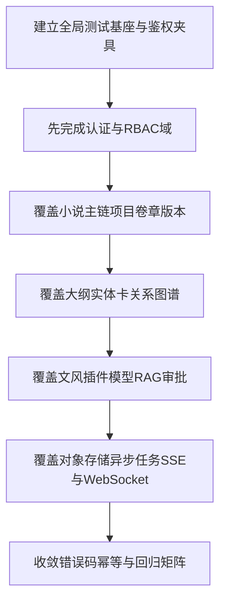

# PenMate 后端接口单测全覆盖计划

## 1. 文档目标与范围

### 1.1 目标
- 基于接口清单建立可执行、可追踪、可复用的单测计划。
- 保证接口覆盖率达到全量范围，且关键风险点具备负向与边界测试。
- 为后续集成测试与回归测试提供统一测试基线。

### 1.2 依据文档
- `docs/project-specifications/prd/prd-v0.2.md`
- `docs/project-specifications/backend/统一全量后台-接口设计-v1.1.md`
- `docs/project-specifications/discard/统一全量后台-表结构设计-v1.0.md`

### 1.3 范围边界
- 仅覆盖后端接口单测计划。
- 不包含前后端联调、UI自动化、性能压测实施细节。
- 涵盖 REST + SSE + WebSocket 事件契约的测试点设计。

---

## 2. 测试分层与职责

## 2.1 分层策略
- 控制器层：参数绑定、校验、响应结构、状态码、鉴权入口。
- 应用服务层：业务编排、权限语义、幂等、事务边界。
- 领域层：状态机流转、规则校验、异常抛出。
- 持久层网关：查询条件、分页、软删除过滤、乐观锁条件。

### 2.2 通过标准
- 所有公开接口均有至少 1 个成功用例。
- 所有写接口均覆盖：参数错误、权限不足、资源不存在、业务冲突、幂等重放。
- 所有列表接口均覆盖：分页参数与排序稳定性。
- 所有错误响应覆盖统一错误结构。

---

## 3. 全局测试维度矩阵

| 维度 | 说明 | 必测对象 |
|---|---|---|
| 鉴权认证 | JWT缺失/失效/过期 | 全部受保护接口 |
| 权限控制 | RBAC权限码缺失/角色不匹配 | 管理域与项目域写接口 |
| 参数校验 | 必填、类型、长度、枚举、格式 | 全部POST/PUT/PATCH |
| 业务规则 | 状态流转、跨资源约束 | 发布、审批、切换文风、安装插件 |
| 幂等性 | `Idempotency-Key` 首次/重复/冲突 | 全部写接口 |
| 一致性 | 软删除可见性、版本冲突、事务回滚 | 删除/恢复/版本化相关接口 |
| 可观测性 | `X-Trace-Id`、错误码映射 | 全部接口 |
| 对象存储 | 上传URL、提交、etag/checksum异常 | 内容对象化与RAG上传接口 |
| 异步任务 | 任务状态、重试、冲突保护 | jobs/migrations 相关接口 |
| 实时事件 | SSE分片、WebSocket事件类型与顺序 | agent生成、审批、文风切换 |

---

## 4. 按接口域覆盖清单

## 4.1 认证与会话
- `POST /auth/login`：成功登录、密码错误、禁用用户、审计字段。
- `POST /auth/logout`：撤销会话、重复登出。
- `POST /auth/refresh`：刷新成功、refresh token 无效。
- `GET /auth/me`：身份回显与权限集合。

## 4.2 RBAC与后台管理
- 用户：CRUD、角色分配/移除、唯一约束冲突。
- 角色权限：角色CRUD、权限绑定幂等。
- 菜单：树形结构校验、移动排序、非法父节点。

## 4.3 小说项目域
- 项目：创建、更新、删除、软删除后不可见。
- 成员：添加重复成员冲突、角色更新、移除。
- 卷/章/版本：排序、章节发布状态机、版本恢复。

## 4.4 大纲与设定
- 大纲树：创建节点、移动节点、路径与层级校验。
- 实体卡：类型枚举、来源标记、状态流转。
- 关系图谱：关系创建去重、删除幂等。

## 4.5 文风管理
- 文风CRUD、默认文风切换。
- `styles/switch`：切换警告确认逻辑、切换日志。
- `styles/analyze-sample`：样文解析参数校验。

## 4.6 插件工坊
- 插件目录查询。
- 项目插件安装/启停/卸载。
- 重复安装冲突、插件调用日志分页。

## 4.7 BYOK与模型路由
- 供应商与模型查询。
- API Key 新增/更新/删除，掩码字段校验。
- 项目模型策略CRUD与默认策略切换。

## 4.8 Agent协作
- 会话创建与消息发送。
- 生成任务创建、查询、应用。
- SSE流读取：连接建立、token分片、结束事件。

## 4.9 Human-in-the-loop审批
- 审批列表/详情。
- 审批通过/拒绝状态流转。
- 重复审批拦截与审计动作落库。

## 4.10 RAG知识库
- 文档CRUD。
- parse/embed/index-status 状态推进。
- 向量化失败错误码映射。

## 4.11 对象存储增强
- 章节正文URL获取、上传URL、commit闭环。
- 版本快照URL读取。
- RAG upload-url + parse + embed 全流程接口。

## 4.12 异步任务与迁移运维
- `jobs/{jobId}` 状态读取。
- `jobs/{jobId}/retry` 可重试性约束。
- 迁移任务启动冲突保护（重复运行）。

## 4.13 WebSocket事件契约
- 事件名白名单：outline/card/generation/approval/style。
- 事件载荷最小字段集与顺序约束。
- 非项目成员订阅拒绝。

---

## 5. 用例设计规范

### 5.1 命名规范
- `UT_{域}_{接口}_{场景}`
- 示例：`UT_STYLE_SWITCH_WARN_CONFIRMED_SUCCESS`

### 5.2 单接口最小用例集合
- 成功路径 1 条
- 参数校验失败 1 条
- 权限失败 1 条
- 资源不存在 1 条
- 业务冲突/不可执行 1 条
- 幂等重放 1 条（写接口）

### 5.3 断言规范
- 状态码、错误码、message、traceId。
- 数据库副作用（是否写入/是否回滚）。
- 事件副作用（SSE/WebSocket是否发送）。

---

## 6. 测试数据与依赖策略

### 6.1 数据准备层次
- 基础身份数据：用户、角色、权限。
- 项目主链数据：项目、卷、章、版本、大纲、卡片。
- 扩展域数据：文风、插件、模型、RAG、审批、任务。

### 6.2 Mock与替身
- 外部模型调用：固定响应桩。
- 对象存储：预签名URL与回调模拟器。
- 向量库：索引成功/失败双桩。

---

## 7. 覆盖率与出门标准

### 7.1 覆盖目标
- 接口覆盖率：100%（按 `统一全量后台-接口设计-v1.1` 清单）。
- 核心业务分支覆盖：发布、审批、文风切换、插件安装、迁移任务达到全分支。
- 错误码覆盖：文档列出的状态码与扩展异常码全部至少一条测试。

### 7.2 交付清单
- 接口-用例映射矩阵。
- 可执行测试套件目录结构。
- 失败用例分类与修复优先级规则。

---

## 8. 执行顺序计划



---

## 9. 风险与防漏机制

- 防漏规则1：接口清单逐条挂接测试ID，禁止“未映射接口”进入完成态。
- 防漏规则2：写接口若缺幂等与权限用例，视为未完成。
- 防漏规则3：涉及状态流转接口若缺负向用例，视为未完成。
- 防漏规则4：每次新增接口需同步补充映射矩阵与最小用例集合。

---

## 10. 基于当前代码仓的落地实施方案（可执行）

> 本节将计划从“原则”细化为“仓库可直接执行”的测试建设任务，覆盖当前 `penmate-backend` 已实现接口。

### 10.1 当前测试基线与差距
- 当前测试现状：仅存在架构规则测试 `penmate-backend/src/test/java/com/penmate/backend/architecture/DependencyRulesTest.java`。
- 依赖基线已具备：`spring-boot-starter-test`、`spring-security-test`、`testcontainers-mysql`、`testcontainers-rabbitmq`。
- 差距结论：
  - 缺少控制器层 API 契约测试。
  - 缺少应用服务层业务规则测试。
  - 缺少持久层网关（Mapper/Repository）测试。
  - 缺少 SSE/WebSocket 契约断言测试。

### 10.2 测试目录与分层结构（建议直接创建）

```text
penmate-backend/src/test/java/com/penmate/backend/
  interfaces/api/
    auth/
    rbac/
    novel/
    style/
    plugin/
    model/
    agent/
    approval/
    rag/
    ops/
  application/
    auth/
    novel/
    style/
    plugin/
    model/
    agent/
    approval/
    rag/
    ops/
  infrastructure/persistence/
    novel/
    style/
    plugin/
    model/
    rag/
    ops/
  infrastructure/realtime/
    sse/
    websocket/
  support/
    fixture/
    container/
    assertion/
```

### 10.3 通用测试夹具与约定
- 基础类：`BaseWebMvcTest`、`BaseApplicationServiceTest`、`BaseMybatisRepositoryTest`。
- 固定测试头：
  - `Authorization: Bearer <token>`
  - `X-Trace-Id: UT-TRACE-<场景>`
  - `Idempotency-Key: UT-IDEMPOTENCY-<场景>`（写接口必测）
- 统一断言助手：
  - `assertSuccessEnvelope(...)`
  - `assertErrorEnvelope(status, errorCode, traceId)`
  - `assertPagination(...)`

### 10.4 分批实施顺序（与第8章一致，细化到迭代）
- 迭代1（认证+RBAC）：`AuthController`、`RbacQueryController`。
- 迭代2（小说主链）：`NovelController` 的 project/member/volume/chapter/version。
- 迭代3（设定扩展）：`NovelController` 的 outline/card/relation。
- 迭代4（文风+插件+模型+RAG+审批）：`StyleController`、`PluginController`、`ModelController`、`RagController`、`ApprovalController`。
- 迭代5（Agent+Ops+实时契约）：`AgentController`、`OpsController`、SSE/WebSocket。
- 迭代6（收敛）：错误码全量、幂等全量、分页排序稳定性、回归矩阵。

---

## 11. 接口-测试ID映射矩阵（当前实现）

> 命名遵循第5章：`UT_{域}_{接口}_{场景}`。每个接口默认至少包含：成功/参数错误/权限失败/资源不存在/业务冲突/幂等重放（写接口）。

### 11.1 Auth（`AuthController`）
| 接口 | 最小测试ID集合 |
|---|---|
| `POST /api/v1/auth/login` | `UT_AUTH_LOGIN_SUCCESS` `UT_AUTH_LOGIN_BAD_CREDENTIAL` `UT_AUTH_LOGIN_DISABLED_USER` `UT_AUTH_LOGIN_INVALID_PARAM` |
| `POST /api/v1/auth/logout` | `UT_AUTH_LOGOUT_SUCCESS` `UT_AUTH_LOGOUT_REPEAT` `UT_AUTH_LOGOUT_INVALID_TOKEN` |
| `POST /api/v1/auth/refresh` | `UT_AUTH_REFRESH_SUCCESS` `UT_AUTH_REFRESH_INVALID_TOKEN` `UT_AUTH_REFRESH_EXPIRED` |
| `GET /api/v1/auth/me` | `UT_AUTH_ME_SUCCESS` `UT_AUTH_ME_UNAUTHORIZED` |

### 11.2 RBAC（`RbacQueryController`）
| 接口域 | 最小测试ID集合 |
|---|---|
| users（list/get/create/update/delete） | `UT_RBAC_USERS_LIST_SUCCESS` `UT_RBAC_USERS_CREATE_CONFLICT_EMAIL` `UT_RBAC_USERS_UPDATE_NOT_FOUND` `UT_RBAC_USERS_DELETE_SUCCESS` |
| roles（list/create/update/delete） | `UT_RBAC_ROLES_LIST_SUCCESS` `UT_RBAC_ROLES_CREATE_CONFLICT_CODE` `UT_RBAC_ROLES_UPDATE_NOT_FOUND` |
| users-roles（assign/remove） | `UT_RBAC_ASSIGN_ROLE_SUCCESS` `UT_RBAC_ASSIGN_ROLE_IDEMPOTENT` `UT_RBAC_REMOVE_ROLE_SUCCESS` |
| roles-permissions（assign/remove） | `UT_RBAC_ASSIGN_PERMISSION_SUCCESS` `UT_RBAC_ASSIGN_PERMISSION_IDEMPOTENT` |
| menus/profile-menus | `UT_RBAC_MENUS_LIST_SUCCESS` `UT_RBAC_PROFILE_MENUS_SUCCESS` |

### 11.3 Novel（`NovelController`）
| 子域 | 接口范围 | 最小测试ID集合 |
|---|---|---|
| 项目 | project CRUD | `UT_NOVEL_PROJECT_CREATE_SUCCESS` `UT_NOVEL_PROJECT_UPDATE_SUCCESS` `UT_NOVEL_PROJECT_DELETE_SOFT_DELETE_VISIBILITY` |
| 成员 | members list/add/update/remove | `UT_NOVEL_MEMBER_ADD_SUCCESS` `UT_NOVEL_MEMBER_ADD_CONFLICT` `UT_NOVEL_MEMBER_UPDATE_SUCCESS` |
| 卷 | volumes list/create/update/delete | `UT_NOVEL_VOLUME_CREATE_SUCCESS` `UT_NOVEL_VOLUME_SORT_CONFLICT` |
| 章 | chapters list/create/get/update/delete/publish | `UT_NOVEL_CHAPTER_PUBLISH_SUCCESS` `UT_NOVEL_CHAPTER_PUBLISH_INVALID_STATE` |
| 版本 | versions list/create/get/restore | `UT_NOVEL_VERSION_CREATE_SUCCESS` `UT_NOVEL_VERSION_UNIQUE_CONFLICT` `UT_NOVEL_VERSION_RESTORE_SUCCESS` |
| 对象存储 | content-url/upload-url/commit/snapshot-url | `UT_NOVEL_CONTENT_UPLOAD_URL_SUCCESS` `UT_NOVEL_CONTENT_COMMIT_ETAG_MISMATCH` `UT_NOVEL_SNAPSHOT_URL_SUCCESS` |
| 大纲 | outline tree/create/update/move/delete | `UT_NOVEL_OUTLINE_MOVE_SUCCESS` `UT_NOVEL_OUTLINE_MOVE_INVALID_PARENT` |
| 设定卡 | cards list/create/get/update/delete | `UT_NOVEL_CARD_CREATE_SUCCESS` `UT_NOVEL_CARD_TYPE_INVALID` |
| 关系图谱 | relations list/create/delete | `UT_NOVEL_RELATION_CREATE_SUCCESS` `UT_NOVEL_RELATION_DUPLICATED_CONFLICT` `UT_NOVEL_RELATION_DELETE_IDEMPOTENT` |

### 11.4 Style（`StyleController`）
| 接口 | 最小测试ID集合 |
|---|---|
| `GET/POST/GET{id}/PUT{id}/DELETE{id}` | `UT_STYLE_LIST_SUCCESS` `UT_STYLE_CREATE_SUCCESS` `UT_STYLE_UPDATE_SUCCESS` `UT_STYLE_DELETE_SUCCESS` |
| `POST /switch` | `UT_STYLE_SWITCH_SUCCESS` `UT_STYLE_SWITCH_WARN_NOT_CONFIRMED_422` `UT_STYLE_SWITCH_NOT_FOUND` |
| `POST /analyze-sample` | `UT_STYLE_ANALYZE_SUCCESS` `UT_STYLE_ANALYZE_INVALID_PARAM` |

### 11.5 Plugin（`PluginController`）
| 接口 | 最小测试ID集合 |
|---|---|
| catalog / catalog/{pluginCode} | `UT_PLUGIN_CATALOG_LIST_SUCCESS` `UT_PLUGIN_CATALOG_DETAIL_NOT_FOUND` |
| project plugins list/install/update/delete | `UT_PLUGIN_INSTALL_SUCCESS` `UT_PLUGIN_INSTALL_DUPLICATE_409` `UT_PLUGIN_UPDATE_ENABLE_DISABLE_SUCCESS` `UT_PLUGIN_DELETE_SUCCESS` |
| call-logs | `UT_PLUGIN_CALL_LOGS_PAGINATION_SUCCESS` |

### 11.6 Model（`ModelController`）
| 接口 | 最小测试ID集合 |
|---|---|
| providers / provider-models | `UT_MODEL_PROVIDER_LIST_SUCCESS` `UT_MODEL_PROVIDER_MODELS_SUCCESS` |
| keys list/create/update/delete | `UT_MODEL_KEY_CREATE_SUCCESS` `UT_MODEL_KEY_MASKED_FIELD_ASSERT` `UT_MODEL_KEY_UPDATE_SUCCESS` `UT_MODEL_KEY_DELETE_SUCCESS` |
| model-policies CRUD + set-default | `UT_MODEL_POLICY_CREATE_SUCCESS` `UT_MODEL_POLICY_SET_DEFAULT_SUCCESS` `UT_MODEL_POLICY_SET_DEFAULT_CONFLICT` |

### 11.7 Agent（`AgentController`）
| 接口 | 最小测试ID集合 |
|---|---|
| conversations list/create | `UT_AGENT_CONVERSATION_LIST_SUCCESS` `UT_AGENT_CONVERSATION_CREATE_SUCCESS` |
| messages list/create | `UT_AGENT_MESSAGE_CREATE_SUCCESS` `UT_AGENT_MESSAGE_PARAM_INVALID` |
| generations create/get/apply | `UT_AGENT_GENERATION_CREATE_SUCCESS` `UT_AGENT_GENERATION_APPLY_SUCCESS` `UT_AGENT_GENERATION_APPLY_CONFLICT` |
| generations stream (SSE) | `UT_AGENT_SSE_STREAM_CONNECT_SUCCESS` `UT_AGENT_SSE_STREAM_TOKEN_ORDER` `UT_AGENT_SSE_STREAM_DONE_EVENT` |

### 11.8 Approval（`ApprovalController`）
| 接口 | 最小测试ID集合 |
|---|---|
| approvals create/list/detail | `UT_APPROVAL_CREATE_SUCCESS` `UT_APPROVAL_LIST_FILTER_STATUS` `UT_APPROVAL_DETAIL_NOT_FOUND` |
| approve/reject | `UT_APPROVAL_APPROVE_SUCCESS` `UT_APPROVAL_REJECT_SUCCESS` `UT_APPROVAL_REVIEW_REPEAT_BLOCKED` |

### 11.9 RAG（`RagController`）
| 接口 | 最小测试ID集合 |
|---|---|
| documents list/create/get/delete | `UT_RAG_DOCUMENT_CREATE_SUCCESS` `UT_RAG_DOCUMENT_DELETE_SUCCESS` |
| upload-url/parse/embed/index-status | `UT_RAG_UPLOAD_URL_SUCCESS` `UT_RAG_PARSE_SUCCESS` `UT_RAG_EMBED_SUCCESS` `UT_RAG_INDEX_STATUS_SUCCESS` `UT_RAG_EMBED_ERROR_CODE_MAPPING` |
| retrieval-logs | `UT_RAG_RETRIEVAL_LOGS_PAGINATION_SUCCESS` |

### 11.10 Ops（`OpsController`）
| 接口 | 最小测试ID集合 |
|---|---|
| jobs/{jobId}、jobs list | `UT_OPS_JOB_GET_SUCCESS` `UT_OPS_JOB_LIST_SUCCESS` |
| jobs/{jobId}/retry | `UT_OPS_JOB_RETRY_SUCCESS` `UT_OPS_JOB_RETRY_NOT_RETRYABLE` |
| migrations run/get | `UT_OPS_MIGRATION_RUN_SUCCESS` `UT_OPS_MIGRATION_RUN_CONFLICT` `UT_OPS_MIGRATION_GET_SUCCESS` |

---

## 12. 实施验收与度量

### 12.1 阶段性验收门禁
- P1：认证+RBAC 用例可运行，失败率=0。
- P2：小说主链（项目/卷/章/版本）写接口全部具备幂等重放测试。
- P3：文风/插件/模型/RAG/审批完成全部负向场景。
- P4：SSE/WebSocket 事件顺序与最小字段集断言通过。
- P5：接口映射矩阵覆盖率达到 100%，无“未挂接测试ID”接口。

### 12.2 覆盖率指标（建议阈值）
- Controller 行覆盖率 >= 90%。
- ApplicationService 分支覆盖率 >= 90%。
- 核心状态机（publish/approve/switch/install/retry）分支覆盖率 = 100%。

### 12.3 CI 集成建议
- PR 门禁执行：`mvn -q -DskipITs=false test`。
- 将“接口-测试ID矩阵”作为检查项：新增接口必须同步新增至少 1 条成功 + 1 条负向用例。
- 失败报告按三类输出：参数类、权限类、业务冲突类，便于快速定位责任域。

---

## 13. 已落地进度（2026-04-14）

### 13.1 新增测试文件
- `penmate-backend/src/test/java/com/penmate/backend/interfaces/api/auth/AuthControllerTest.java`
- `penmate-backend/src/test/java/com/penmate/backend/interfaces/api/approval/ApprovalControllerTest.java`
- `penmate-backend/src/test/java/com/penmate/backend/interfaces/api/rbac/RbacQueryControllerTest.java`
- `penmate-backend/src/test/java/com/penmate/backend/interfaces/api/style/StyleControllerTest.java`
- `penmate-backend/src/test/java/com/penmate/backend/interfaces/api/plugin/PluginControllerTest.java`
- `penmate-backend/src/test/java/com/penmate/backend/interfaces/api/model/ModelControllerTest.java`
- `penmate-backend/src/test/java/com/penmate/backend/interfaces/api/rag/RagControllerTest.java`
- `penmate-backend/src/test/java/com/penmate/backend/interfaces/api/ops/OpsControllerTest.java`
- `penmate-backend/src/test/java/com/penmate/backend/interfaces/api/agent/AgentControllerTest.java`
- `penmate-backend/src/test/java/com/penmate/backend/interfaces/api/novel/NovelControllerTest.java`
- `penmate-backend/src/test/java/com/penmate/backend/interfaces/api/support/ApiResponseAssertions.java`

### 13.2 已落地测试ID
- 覆盖状态：已与第11章接口-测试ID矩阵完全对齐（`105/105`）。
- 补齐结果：本次新增并落地原缺失 `48` 个测试ID，当前无缺失项。
- 明细来源：以各测试类为准（`AuthControllerTest`/`RbacQueryControllerTest`/`StyleControllerTest`/`PluginControllerTest`/`ModelControllerTest`/`RagControllerTest`/`OpsControllerTest`/`AgentControllerTest`/`NovelControllerTest`）。

### 13.3 执行结果
- 执行命令：
  - `mvn -Dtest=AuthControllerTest,ApprovalControllerTest,RbacQueryControllerTest,StyleControllerTest,PluginControllerTest,ModelControllerTest,RagControllerTest,OpsControllerTest,AgentControllerTest,NovelControllerTest test`
- 结果：`Tests run: 112, Failures: 0, Errors: 0, Skipped: 0`
- 可视化结果（Surefire 报告）：
  - 控制台汇总：`BUILD SUCCESS` + 各测试类统计。
  - 明细文件：`penmate-backend/target/surefire-reports/*.txt`
  - 结构化报告：`penmate-backend/target/surefire-reports/*.xml`

### 13.4 下一个迭代建议
- 将“权限失败（401/403）夹具”统一沉淀到基础测试类并批量挂接到全部受保护接口。
- 将分页接口统一补充 `pagination` 与排序稳定性断言（包括空页、越界页、重复排序键场景）。
- 引入 WebSocket 事件顺序与最小字段集断言，补齐实时契约自动化门禁。

