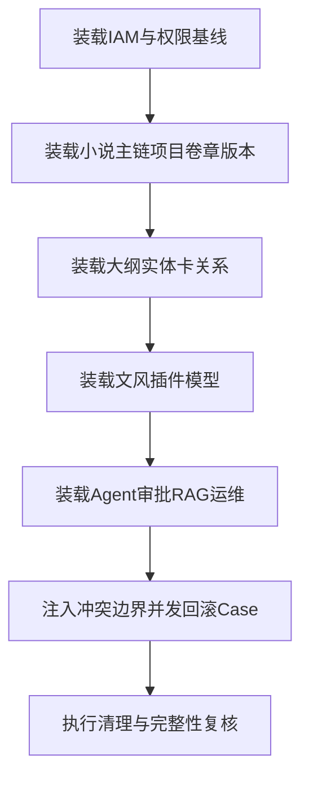

# PenMate 数据库造数Case全覆盖计划

## 1. 文档目标与范围

### 1.1 目标
- 建立覆盖全域表结构的标准化造数计划，支持单测、集成测试、回归测试复用。
- 通过主数据、边界数据、异常数据、并发数据四层Case，验证约束与业务规则。
- 为接口单测提供稳定可重放的数据工装与清理策略。

### 1.2 依据文档
- `docs/project-specifications/prd/prd-v0.2.md`
- `docs/project-specifications/backend/统一全量后台-接口设计-v1.1.md`
- `docs/project-specifications/discard/统一全量后台-表结构设计-v1.0.md`

### 1.3 范围边界
- 仅覆盖数据库造数Case计划。
- 不包含联调脚本、压测压数、生产脱敏抽样流程。
- 默认以 MySQL 8 + Flyway 迁移后结构为基线。

---

## 2. 造数分层策略

## 2.1 四层造数模型
- L1 主路径最小集：驱动核心业务流程的最小可运行数据。
- L2 完整业务集：覆盖所有领域对象与状态分支。
- L3 边界与异常集：唯一键冲突、外键缺失、长度越界、枚举非法。
- L4 并发与恢复集：幂等重放、乐观锁冲突、事务回滚与重试。

### 2.2 用例粒度标准
- 每张主业务表至少包含：正常、边界、冲突、清理四类Case。
- 每个聚合根至少包含：创建、更新、删除、跨表关联完整链路。

---

## 3. 全域造数覆盖矩阵

| 域 | 关键表 | 造数重点 | 复用场景 |
|---|---|---|---|
| IAM与安全 | iam_users iam_roles iam_permissions iam_user_roles iam_role_permissions iam_menus iam_user_sessions ops_audit_logs | 账号状态、权限绑定、菜单树、会话撤销 | 认证与RBAC接口单测 |
| 小说核心 | novel_projects novel_members novel_volumes novel_chapters novel_chapter_versions novel_outline_nodes novel_entity_cards novel_entity_relations | 项目主链、章节状态、版本恢复、树结构、实体关系 | 项目大纲卡片全域单测 |
| 文风 | style_profiles style_switch_logs | 默认文风、切换审计、警告确认 | style接口与切换规则单测 |
| 插件 | plugin_catalog plugin_versions plugin_project_installs plugin_call_logs | 安装唯一性、版本兼容、调用日志分页 | plugin接口与调用日志单测 |
| 模型BYOK | model_providers model_provider_models model_user_api_keys model_user_configurations model_invocation_logs | 密钥掩码、配置切换、调用记录 | model接口与模型配置单测 |
| Agent审批 | agent_conversations agent_messages agent_generation_tasks agent_approval_requests agent_approval_actions | 生成任务状态机、审批流与动作流水 | agent与approval接口单测 |
| RAG | rag_documents rag_chunks rag_retrieval_logs | 文档生命周期、分块索引、检索日志 | rag接口与索引任务单测 |
| 运维任务 | ops_async_jobs ops_migration_tasks | 任务重试、迁移互斥、状态推进 | jobs与migration接口单测 |

---

## 4. 关键Case模板库

## 4.1 主数据Case模板
- CASE-MAIN-001：平台管理员 + 作者 + 项目所有者最小身份集。
- CASE-MAIN-002：单项目完整链路（项目→卷→章→版本→大纲→实体卡）。
- CASE-MAIN-003：单项目AI链路（会话→消息→生成任务→审批单→审批动作）。

## 4.2 约束冲突Case模板
- CASE-CONFLICT-001：邮箱唯一键冲突。
- CASE-CONFLICT-002：章节版本唯一键 `(chapter_id, version_no)` 冲突。
- CASE-CONFLICT-003：插件安装唯一键 `(project_id, plugin_id)` 冲突。
- CASE-CONFLICT-004：同项目成员重复添加冲突。

## 4.3 边界Case模板
- CASE-BOUNDARY-001：标题长度上限、摘要空值、可空字段组合。
- CASE-BOUNDARY-002：枚举非法值注入（status member_role approval_type scene）。
- CASE-BOUNDARY-003：软删除后二次创建与查询可见性。

## 4.4 并发与回滚Case模板
- CASE-CONCURRENCY-001：乐观锁 version 冲突更新。
- CASE-CONCURRENCY-002：同 `Idempotency-Key` 重放仅落库一次。
- CASE-CONCURRENCY-003：审批通过后重复审核应拒绝并保持数据不变。
- CASE-ROLLBACK-001：跨表写失败触发事务回滚（主表与日志表一致性）。

---

## 5. 分域造数执行清单

## 5.1 IAM与安全域
- 造用户状态：启用、禁用、冻结。
- 造角色权限：最小权限、全权限、缺权限。
- 造菜单树：三层结构 + 非法parent校验样本。
- 造会话：有效、过期、已撤销jti。

## 5.2 小说核心业务域
- 项目：草稿、连载、完结、归档全状态。
- 卷章：排序错位样本、空卷、孤立章节负样本。
- 章节版本：连续版本、跳号版本、恢复目标版本。
- 大纲树：多深度path样本 + move后路径重算样本。
- 实体卡与关系：角色/世界观/派系/地点/道具全类型。

## 5.3 文风 插件 模型域
- 文风：默认与非默认并存、切换日志闭环。
- 插件：目录上架、项目安装、禁用、卸载、调用失败日志。
- 模型：多供应商多模型、多Key策略、默认策略切换。

## 5.4 Agent 审批 RAG 运维域
- 会话消息：system user assistant tool 全角色消息。
- 生成任务：draft rewrite expand summarize 全任务类型。
- 审批：pending approved rejected 全状态。
- RAG：document parse embed index-status 进度样本。
- 运维：任务重试成功与失败、迁移运行中冲突。

---

## 6. 数据工装与生命周期

### 6.1 数据装载方式
- 基础种子SQL：按域分文件维护。
- 场景增量SQL：按Case编号维护。
- 测试运行前按标签装载，运行后按标签清理。

### 6.2 清理与隔离策略
- 优先事务回滚隔离单测。
- 必要时按 `project_id` 或 `created_by` 进行定向清理。
- 日志类表采用时间窗口清理，避免误删基线数据。

### 6.3 命名规范
- Case编号：`DBCASE_{域}_{编号}`。
- SQL文件：`seed_{域}_base.sql`、`seed_{域}_{case}.sql`、`cleanup_{域}_{case}.sql`。

---

## 7. 可复用映射到接口单测

| DB Case | 复用到接口域 | 目标接口类别 |
|---|---|---|
| DBCASE_IAM_001 | auth rbac | login users roles permissions menus |
| DBCASE_NOVEL_001 | novel outlines cards | projects volumes chapters versions outlines cards relations |
| DBCASE_STYLE_001 | style | styles switch analyze |
| DBCASE_PLUGIN_001 | plugin | catalog install update delete logs |
| DBCASE_MODEL_001 | model | providers keys policies |
| DBCASE_AGENT_001 | agent approval | conversations messages generations approvals |
| DBCASE_RAG_001 | rag | documents parse embed index-status logs |
| DBCASE_OPS_001 | ops | jobs retry migrations |

---

## 8. 覆盖验收标准

### 8.1 覆盖标准
- 表覆盖：目标清单中的主业务表 100% 被至少一个Case覆盖。
- 约束覆盖：唯一键、外键/引用一致性、非空、枚举、软删除可见性全部覆盖。
- 状态覆盖：所有状态机字段均具备全状态样本。
- 异常覆盖：冲突、不可执行、回滚、重试失败全部覆盖。

### 8.2 验收产物
- 分域造数清单。
- Case到接口映射表。
- 清理与回滚脚本规范。

---

## 9. 执行顺序与防漏机制

- 防漏规则1：每张目标表必须绑定至少1个主Case与1个异常Case。
- 防漏规则2：每条唯一约束必须绑定冲突Case。
- 防漏规则3：每个状态机必须具备全状态样本与非法状态样本。
- 防漏规则4：新增表或字段后需同步更新Case矩阵与清理策略。

