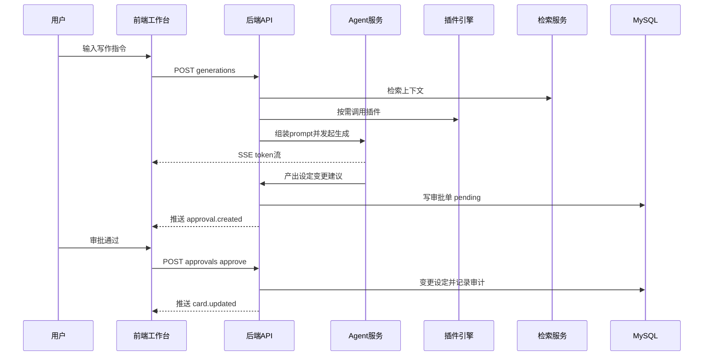

# PenMate 统一全量后台接口设计 v1.0

> 对齐 [`prd-v0.2`](docs/project-specifications/prd/prd-v0.2.md)、[`DDD架构规范`](docs/project-specifications/backend/DDD架构规范.md)、[`RBAC接口与表结构设计`](docs/project-specifications/backend/RBAC接口与表结构设计.md)。

## 1. 接口总约定

## 1.1 基础约定
- Base Path：`/api/v1`
- 认证：Bearer JWT
- 授权：RBAC权限码 + 项目成员角色校验
- 时区：UTC，前端按本地时区展示
- 幂等：写接口支持 `Idempotency-Key`
- 追踪：响应头返回 `X-Trace-Id`

## 1.2 统一响应

成功：
```json
{
  "data": {},
  "meta": {
    "traceId": "01HT...",
    "timestamp": "2026-04-12T08:00:00.000Z"
  }
}
```

分页：
```json
{
  "data": [],
  "pagination": {
    "totalItems": 127,
    "totalPages": 13,
    "currentPage": 2,
    "pageSize": 10
  },
  "meta": {
    "traceId": "01HT...",
    "timestamp": "2026-04-12T08:00:00.000Z"
  }
}
```

错误：
```json
{
  "status": 403,
  "errorCode": "INSUFFICIENT_PERMISSIONS",
  "message": "Missing permission novel:project:update",
  "details": null,
  "meta": {
    "traceId": "01HT...",
    "timestamp": "2026-04-12T08:00:00.000Z"
  }
}
```

## 1.3 状态码
- `200` 查询/更新成功
- `201` 创建成功
- `204` 删除成功
- `400` 参数或业务校验失败
- `401` 未认证或Token失效
- `403` 权限不足
- `404` 资源不存在
- `409` 唯一冲突/状态冲突
- `422` 语义正确但流程不可执行
- `500` 服务异常

---

## 2. 认证与会话

## 2.1 登录
- `POST /api/v1/auth/login`
- 权限：公开
- 请求：
```json
{
  "email": "author@penmate.ai",
  "password": "StrongPass!23"
}
```
- 响应：
```json
{
  "data": {
    "accessToken": "jwt...",
    "tokenType": "Bearer",
    "expiresIn": 7200,
    "refreshToken": "rft...",
    "user": {
      "id": 1001,
      "email": "author@penmate.ai",
      "displayName": "作者A"
    }
  }
}
```

## 2.2 登出
- `POST /api/v1/auth/logout`
- 权限：已登录
- 行为：写入denylist并撤销当前`jti`

## 2.3 刷新令牌
- `POST /api/v1/auth/refresh`

## 2.4 当前用户信息
- `GET /api/v1/auth/me`

---

## 3. RBAC与后台管理接口

## 3.1 用户管理
- `GET /api/v1/users` 权限 `users:list`
- `POST /api/v1/users` 权限 `users:create`
- `GET /api/v1/users/{id}` 权限 `users:read`
- `PUT /api/v1/users/{id}` 权限 `users:update`
- `PATCH /api/v1/users/{id}` 权限 `users:update`
- `DELETE /api/v1/users/{id}` 权限 `users:delete`
- `POST /api/v1/users/{id}/roles` 权限 `users:assign_roles`
- `DELETE /api/v1/users/{userId}/roles/{roleId}` 权限 `users:assign_roles`

筛选参数：`page,pageSize,sortBy,sortOrder,filter[status],filter[email]`

## 3.2 角色与权限
- `GET /api/v1/roles` `roles:list`
- `POST /api/v1/roles` `roles:create`
- `GET /api/v1/roles/{id}` `roles:read`
- `PUT /api/v1/roles/{id}` `roles:update`
- `DELETE /api/v1/roles/{id}` `roles:delete`
- `POST /api/v1/roles/{id}/permissions` `roles:assign_permissions`
- `DELETE /api/v1/roles/{roleId}/permissions/{permissionId}` `roles:assign_permissions`
- `GET /api/v1/permissions` `permissions:list`

## 3.3 菜单管理
- `GET /api/v1/menus` `menus:manage`
- `POST /api/v1/menus` `menus:manage`
- `PUT /api/v1/menus/{id}` `menus:manage`
- `PATCH /api/v1/menus/{id}/move` `menus:manage`
- `DELETE /api/v1/menus/{id}` `menus:manage`
- `GET /api/v1/profile/menus` 已登录

---

## 4. 小说项目域接口

## 4.1 项目管理
- `GET /api/v1/novels` 权限 `novel:project:list`
- `POST /api/v1/novels` 权限 `novel:project:create`
- `GET /api/v1/novels/{projectId}` 权限 `novel:project:read`
- `PUT /api/v1/novels/{projectId}` 权限 `novel:project:update`
- `DELETE /api/v1/novels/{projectId}` 权限 `novel:project:delete`

创建示例：
```json
{
  "title": "第七星环",
  "summary": "赛博东方长篇",
  "initialStyleProfileId": 301,
  "defaultModelPolicyId": 501
}
```

## 4.2 项目成员
- `GET /api/v1/novels/{projectId}/members` `novel:member:list`
- `POST /api/v1/novels/{projectId}/members` `novel:member:add`
- `PATCH /api/v1/novels/{projectId}/members/{userId}` `novel:member:update`
- `DELETE /api/v1/novels/{projectId}/members/{userId}` `novel:member:remove`

## 4.3 卷与章节
- `GET /api/v1/novels/{projectId}/volumes` `novel:volume:list`
- `POST /api/v1/novels/{projectId}/volumes` `novel:volume:create`
- `PUT /api/v1/novels/{projectId}/volumes/{volumeId}` `novel:volume:update`
- `DELETE /api/v1/novels/{projectId}/volumes/{volumeId}` `novel:volume:delete`

- `GET /api/v1/novels/{projectId}/chapters` `novel:chapter:list`
- `POST /api/v1/novels/{projectId}/chapters` `novel:chapter:create`
- `GET /api/v1/novels/{projectId}/chapters/{chapterId}` `novel:chapter:read`
- `PUT /api/v1/novels/{projectId}/chapters/{chapterId}` `novel:chapter:update`
- `DELETE /api/v1/novels/{projectId}/chapters/{chapterId}` `novel:chapter:delete`
- `POST /api/v1/novels/{projectId}/chapters/{chapterId}/publish` `novel:chapter:publish`

## 4.4 章节版本
- `GET /api/v1/novels/{projectId}/chapters/{chapterId}/versions` `novel:chapter:version:list`
- `POST /api/v1/novels/{projectId}/chapters/{chapterId}/versions` `novel:chapter:version:create`
- `GET /api/v1/novels/{projectId}/chapters/{chapterId}/versions/{versionNo}` `novel:chapter:version:read`
- `POST /api/v1/novels/{projectId}/chapters/{chapterId}/versions/{versionNo}/restore` `novel:chapter:version:restore`

---

## 5. 大纲与设定域接口

## 5.1 大纲树
- `GET /api/v1/novels/{projectId}/outlines/tree` `novel:outline:list`
- `POST /api/v1/novels/{projectId}/outlines/nodes` `novel:outline:create`
- `PUT /api/v1/novels/{projectId}/outlines/nodes/{nodeId}` `novel:outline:update`
- `PATCH /api/v1/novels/{projectId}/outlines/nodes/{nodeId}/move` `novel:outline:move`
- `DELETE /api/v1/novels/{projectId}/outlines/nodes/{nodeId}` `novel:outline:delete`

移动请求示例：
```json
{
  "newParentId": 90021,
  "newSortOrder": 3
}
```

## 5.2 实体卡管理
- `GET /api/v1/novels/{projectId}/cards` `novel:card:list`
- `POST /api/v1/novels/{projectId}/cards` `novel:card:create`
- `GET /api/v1/novels/{projectId}/cards/{cardId}` `novel:card:read`
- `PUT /api/v1/novels/{projectId}/cards/{cardId}` `novel:card:update`
- `DELETE /api/v1/novels/{projectId}/cards/{cardId}` `novel:card:delete`

查询参数：`type,status,keyword,page,pageSize`

## 5.3 关系图谱
- `GET /api/v1/novels/{projectId}/card-relations` `novel:card:relation:list`
- `POST /api/v1/novels/{projectId}/card-relations` `novel:card:relation:create`
- `DELETE /api/v1/novels/{projectId}/card-relations/{relationId}` `novel:card:relation:delete`

---

## 6. 文风管理接口

## 6.1 文风配置
- `GET /api/v1/novels/{projectId}/styles` `style:list`
- `POST /api/v1/novels/{projectId}/styles` `style:create`
- `GET /api/v1/novels/{projectId}/styles/{styleId}` `style:read`
- `PUT /api/v1/novels/{projectId}/styles/{styleId}` `style:update`
- `DELETE /api/v1/novels/{projectId}/styles/{styleId}` `style:delete`

## 6.2 文风切换
- `POST /api/v1/novels/{projectId}/styles/switch` `style:switch`

请求示例：
```json
{
  "toStyleId": 301,
  "warningConfirmed": true,
  "reason": "进入终章，提升节奏"
}
```

若 `warningConfirmed=false` 返回 `422 STYLE_SWITCH_NOT_CONFIRMED`

## 6.3 样文学习
- `POST /api/v1/novels/{projectId}/styles/analyze-sample` `style:analyze`

---

## 7. 插件工坊接口

## 7.1 插件目录
- `GET /api/v1/plugins/catalog` `plugin:catalog:list`
- `GET /api/v1/plugins/catalog/{pluginCode}` `plugin:catalog:read`

## 7.2 项目安装与配置
- `GET /api/v1/novels/{projectId}/plugins` `plugin:install:list`
- `POST /api/v1/novels/{projectId}/plugins/install` `plugin:install:create`
- `PATCH /api/v1/novels/{projectId}/plugins/{pluginCode}` `plugin:install:update`
- `DELETE /api/v1/novels/{projectId}/plugins/{pluginCode}` `plugin:install:delete`

## 7.3 调用日志
- `GET /api/v1/novels/{projectId}/plugins/call-logs` `plugin:log:list`

---

## 8. BYOK与模型路由接口

## 8.1 模型与提供商
- `GET /api/v1/model/providers` `model:provider:list`
- `GET /api/v1/model/providers/{providerCode}/models` `model:provider:model:list`

## 8.2 用户密钥
- `GET /api/v1/model/keys` `model:key:list`
- `POST /api/v1/model/keys` `model:key:create`
- `PATCH /api/v1/model/keys/{keyId}` `model:key:update`
- `DELETE /api/v1/model/keys/{keyId}` `model:key:delete`

创建示例：
```json
{
  "providerCode": "openai-compatible",
  "keyName": "my-gpt-key",
  "baseUrl": "https://api.example.com/v1",
  "apiKey": "sk-xxxx",
  "isDefault": true
}
```

## 8.3 项目模型策略
- `GET /api/v1/novels/{projectId}/model-policies` `model:policy:list`
- `POST /api/v1/novels/{projectId}/model-policies` `model:policy:create`
- `PUT /api/v1/novels/{projectId}/model-policies/{policyId}` `model:policy:update`
- `DELETE /api/v1/novels/{projectId}/model-policies/{policyId}` `model:policy:delete`
- `POST /api/v1/novels/{projectId}/model-policies/{policyId}/set-default` `model:policy:set-default`

---

## 9. Agent协作接口

## 9.1 会话与消息
- `GET /api/v1/novels/{projectId}/agent/conversations` `agent:conversation:list`
- `POST /api/v1/novels/{projectId}/agent/conversations` `agent:conversation:create`
- `GET /api/v1/novels/{projectId}/agent/conversations/{conversationId}/messages` `agent:message:list`
- `POST /api/v1/novels/{projectId}/agent/conversations/{conversationId}/messages` `agent:message:create`

## 9.2 生成任务
- `POST /api/v1/novels/{projectId}/agent/generations` `agent:generation:create`
- `GET /api/v1/novels/{projectId}/agent/generations/{taskId}` `agent:generation:read`
- `POST /api/v1/novels/{projectId}/agent/generations/{taskId}/apply` `agent:generation:apply`

生成请求示例：
```json
{
  "conversationId": 7001,
  "chapterId": 30021,
  "taskType": "draft",
  "instruction": "按第三卷第二章大纲生成约2500字，加入轻微幽默",
  "replaceSelection": false
}
```

## 9.3 SSE流式输出
- `GET /api/v1/novels/{projectId}/agent/generations/{taskId}/stream`
- 响应类型：`text/event-stream`
- 事件：`token`、`tool_call`、`approval_suggested`、`done`、`error`

---

## 10. Human-in-the-loop审批接口

## 10.1 审批单列表
- `GET /api/v1/novels/{projectId}/approvals` `approval:list`
- 筛选：`status,type,riskLevel,page,pageSize`

## 10.2 审批详情
- `GET /api/v1/novels/{projectId}/approvals/{approvalId}` `approval:read`

## 10.3 审批动作
- `POST /api/v1/novels/{projectId}/approvals/{approvalId}/approve` `approval:review`
- `POST /api/v1/novels/{projectId}/approvals/{approvalId}/reject` `approval:review`

批准请求：
```json
{
  "comment": "确认新增派系设定",
  "applyMode": "immediate"
}
```

拒绝请求：
```json
{
  "comment": "设定冲突，需调整命名"
}
```

---

## 11. RAG知识库接口

## 11.1 文档管理
- `GET /api/v1/novels/{projectId}/rag/documents` `rag:document:list`
- `POST /api/v1/novels/{projectId}/rag/documents` `rag:document:create`
- `GET /api/v1/novels/{projectId}/rag/documents/{docId}` `rag:document:read`
- `DELETE /api/v1/novels/{projectId}/rag/documents/{docId}` `rag:document:delete`

## 11.2 向量化任务
- `POST /api/v1/novels/{projectId}/rag/documents/{docId}/index` `rag:index:run`
- `GET /api/v1/novels/{projectId}/rag/retrieval-logs` `rag:log:list`

---

## 12. WebSocket与事件总线约定

频道：`/ws/projects/{projectId}`

事件类型：
- `outline.node.created`
- `card.updated`
- `generation.token`
- `approval.created`
- `approval.reviewed`
- `style.switched`

事件包：
```json
{
  "event": "approval.created",
  "projectId": 10001,
  "payload": {
    "approvalId": 88001,
    "type": "create_card"
  },
  "occurredAt": "2026-04-12T08:00:00.000Z"
}
```

---

## 13. 权限点矩阵建议

| 模块 | 权限码 |
|---|---|
| 小说项目 | `novel:project:list/create/read/update/delete` |
| 卷章节 | `novel:volume:*` `novel:chapter:*` |
| 大纲 | `novel:outline:list/create/update/move/delete` |
| 设定卡 | `novel:card:list/create/read/update/delete` |
| 文风 | `style:list/create/read/update/delete/switch/analyze` |
| 插件 | `plugin:catalog:list/read` `plugin:install:*` |
| 模型 | `model:provider:list` `model:key:*` `model:policy:*` |
| Agent | `agent:conversation:*` `agent:message:*` `agent:generation:*` |
| 审批 | `approval:list/read/review` |
| RAG | `rag:document:*` `rag:index:run` `rag:log:list` |

---

## 14. 关键流程时序



---

## 15. 非功能与中间件建议

- 网关：Spring Cloud Gateway 或 Nginx+网关层
- 缓存：Redis（会话、权限缓存、热点大纲）
- 消息：Kafka/RabbitMQ（审批事件、异步索引、日志汇聚）
- 搜索：OpenSearch/ES（卡片与文档检索）
- 向量库：Milvus/Pinecone（RAG）
- 可观测：OpenTelemetry + Prometheus + Grafana + Loki

---

## 16. 兼容与迁移

- 保留原RBAC接口路径与语义，新增统一权限码命名
- 旧接口通过网关适配为新响应包装格式
- 分阶段切换：先读兼容、后写兼容、最终下线旧实现

