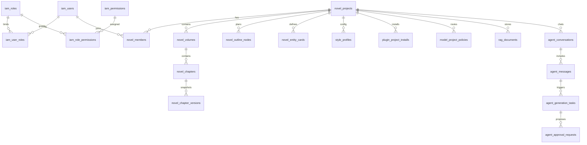

# PenMate 统一全量后台表结构设计 v1.0

> 依据 [`prd-v0.2`](docs/project-specifications/prd/prd-v0.2.md)、[`DDD架构规范`](docs/project-specifications/backend/DDD架构规范.md)、[`RBAC接口与表结构设计`](docs/project-specifications/backend/RBAC接口与表结构设计.md) 整合输出。

## 1. 设计范围与默认约束

### 1.1 推荐默认值
- 数据库：MySQL 8.0
- 字符集：`utf8mb4` + `utf8mb4_0900_ai_ci`
- 接口版本兼容目标：`/api/v1`
- 删除策略：
  - 业务主表默认软删除 `deleted_at`
  - 关系表与日志表默认硬删除或追加写
- 时间字段：统一 `datetime(3)`（UTC）
- 主键策略：`bigint unsigned` 自增（便于运维与排障）

### 1.2 DDD 聚合边界
- 身份与访问聚合：用户、角色、权限、菜单、会话
- 小说项目聚合：小说、成员、卷、章节、版本
- 结构化设定聚合：大纲、实体卡（角色/世界观/派系/道具）
- AI协作聚合：会话、消息、生成任务、审批单
- 能力配置聚合：文风、插件、模型与密钥、RAG知识库

---

## 2. 分库分域与命名规范

### 2.1 逻辑域划分
- `iam_*`：身份认证、授权、菜单
- `novel_*`：小说内容生产主域
- `agent_*`：对话、任务、审批
- `style_*`：文风配置与变更记录
- `plugin_*`：插件中心与安装挂载
- `model_*`：BYOK、模型路由、调用策略
- `rag_*`：知识文档、切片、索引元数据
- `ops_*`：审计、幂等、事件外盒

### 2.2 通用字段约定
所有业务主表建议包含：
- `id` 主键
- `created_at`、`updated_at`
- `created_by`、`updated_by`
- `deleted_at`（软删除场景）
- `version`（乐观锁）

---

## 3. ER 总览



---

## 4. 表清单

## 4.1 IAM 与安全域

### 4.1.1 `iam_users`
| 字段 | 类型 | 约束 | 说明 |
|---|---|---|---|
| id | bigint unsigned | PK | 用户ID |
| email | varchar(255) | UNIQUE, NOT NULL | 登录邮箱 |
| password_hash | varchar(255) | NOT NULL | bcrypt/argon2哈希 |
| display_name | varchar(80) | NOT NULL | 显示名 |
| status | tinyint unsigned | NOT NULL default 1 | 1启用 2禁用 3冻结 |
| auth_method | varchar(32) | NOT NULL default 'local' | local/google/github |
| last_login_at | datetime(3) |  | 最近登录 |
| created_at/updated_at | datetime(3) | NOT NULL | 时间 |
| deleted_at | datetime(3) | INDEX | 软删除 |

索引：`uk_iam_users_email`、`idx_iam_users_status_deleted`

### 4.1.2 `iam_roles`
- `id,name,code,description,is_system,created_at,updated_at,deleted_at`
- 唯一：`uk_iam_roles_code`

### 4.1.3 `iam_permissions`
- `id,name,code,module,description,created_at`
- 唯一：`uk_iam_permissions_code`

### 4.1.4 `iam_user_roles`
- `user_id,role_id,created_at`
- 复合主键：`(user_id, role_id)`
- 反向索引：`idx_user_roles_role_user(role_id,user_id)`

### 4.1.5 `iam_role_permissions`
- `role_id,permission_id,created_at`
- 复合主键：`(role_id, permission_id)`
- 反向索引：`idx_role_perm_perm_role(permission_id,role_id)`

### 4.1.6 `iam_menus`
- 延续邻接表 + 嵌套集混合：`parent_id/sort_order/lft/rgt`
- 关键字段：`menu_type,directory,path,component,required_permission_code`
- 索引：`idx_menus_parent_sort`、`idx_menus_lft_rgt`

### 4.1.7 `iam_user_sessions`
- 用于JWT撤销与设备会话管理
- 核心字段：`jti,user_id,expires_at,revoked_at,ip,user_agent`
- 唯一：`uk_sessions_jti`

### 4.1.8 `ops_audit_logs`
- 记录接口审计：`trace_id,user_id,module,action,resource_type,resource_id,request_json,response_code,created_at`
- 索引：`idx_audit_user_created`、`idx_audit_module_created`

---

## 4.2 小说核心业务域

### 4.2.1 `novel_projects`
| 字段 | 类型 | 约束 | 说明 |
|---|---|---|---|
| id | bigint unsigned | PK | 小说项目ID |
| owner_user_id | bigint unsigned | INDEX, NOT NULL | 所有者 |
| title | varchar(200) | NOT NULL | 小说标题 |
| summary | text |  | 简介 |
| status | tinyint unsigned | NOT NULL default 1 | 1草稿 2连载 3完结 4归档 |
| current_style_profile_id | bigint unsigned |  | 当前文风 |
| default_model_policy_id | bigint unsigned |  | 默认模型策略 |
| total_word_count | int unsigned | NOT NULL default 0 | 总字数 |
| created_at/updated_at | datetime(3) | NOT NULL | 时间 |
| deleted_at | datetime(3) | INDEX | 软删除 |
| version | int unsigned | NOT NULL default 1 | 乐观锁 |

### 4.2.2 `novel_members`
- `project_id,user_id,member_role,joined_at`
- 复合主键：`(project_id,user_id)`
- 说明：支持作者团队协作

### 4.2.3 `novel_volumes`
- `project_id,title,sort_order,description`
- 唯一：`uk_volume_project_sort(project_id,sort_order,deleted_at)`

### 4.2.4 `novel_chapters`
- `project_id,volume_id,title,chapter_no,outline_node_id,status,word_count,content_md,last_generated_at`
- 状态：1草稿 2审阅中 3已发布
- 索引：`idx_chapter_project_volume_no`、`idx_chapter_outline`

### 4.2.5 `novel_chapter_versions`
- `chapter_id,version_no,content_md,change_type,change_reason,created_by,created_at`
- 唯一：`uk_chapter_version(chapter_id,version_no)`

### 4.2.6 `novel_outline_nodes`
- 树结构字段：`parent_id,node_type,title,summary,plot_goal,sort_order,depth,path`
- `node_type`：volume/chapter/plotline/beat
- 索引：`idx_outline_project_parent_sort`、`idx_outline_project_path`

### 4.2.7 `novel_entity_cards`
- 统一角色、世界观、派系、地点、道具等设定卡
- 核心字段：
  - `project_id`
  - `card_type` character/world/faction/location/item
  - `name`
  - `attributes_json`（结构化属性）
  - `source` manual/agent
  - `status` pending/approved/rejected/archived
- 索引：`idx_card_project_type_status`、`idx_card_project_name`

### 4.2.8 `novel_entity_relations`
- `project_id,source_card_id,target_card_id,relation_type,strength,remark`
- 索引：`idx_relation_source`、`idx_relation_target`

---

## 4.3 文风管理域

### 4.3.1 `style_profiles`
- `project_id,name,is_default,pace,tone,narrative_focus,lexicon_rules_json,prompt_template,sample_text`
- 说明：存储文风参数 + 系统注入Prompt模板
- 索引：`idx_style_project_default`

### 4.3.2 `style_switch_logs`
- `project_id,from_style_id,to_style_id,switched_by,warning_confirmed,reason,created_at`
- 说明：满足PRD中的文风切换强提示审计

---

## 4.4 插件工坊域

### 4.4.1 `plugin_catalog`
- 平台插件目录：`code,name,category,provider,status,latest_version`

### 4.4.2 `plugin_versions`
- `plugin_id,version,manifest_json,tool_schema_json,release_notes,status`
- 唯一：`uk_plugin_version(plugin_id,version)`

### 4.4.3 `plugin_project_installs`
- 项目级安装：`project_id,plugin_id,version,config_json,enabled,installed_by,installed_at`
- 唯一：`uk_project_plugin(project_id,plugin_id)`

### 4.4.4 `plugin_call_logs`
- `project_id,plugin_code,tool_name,request_json,response_json,latency_ms,status,error_msg,created_at`

---

## 4.5 模型与BYOK域

### 4.5.1 `model_providers`
- `code,name,base_url,auth_type,status`

### 4.5.2 `model_provider_models`
- `provider_id,model_code,model_name,context_window,max_output,pricing_json,status`

### 4.5.3 `model_user_api_keys`
- `user_id,provider_id,key_name,encrypted_api_key,masked_api_key,is_default,last_used_at,status`
- 说明：密钥只存密文 + 掩码；密钥托管建议KMS

### 4.5.4 `model_project_policies`
- `project_id,policy_name,scene,provider_model_id,user_key_id,temperature,top_p,max_tokens,fallback_policy_json,is_default`
- `scene`：chat/generation/rewrite/rag_summary

### 4.5.5 `model_invocation_logs`
- `project_id,conversation_id,provider_model_id,input_tokens,output_tokens,latency_ms,status,error_code,created_at`

---

## 4.6 Agent协作与审批域

### 4.6.1 `agent_conversations`
- `project_id,user_id,title,context_scope_json,last_message_at,status`

### 4.6.2 `agent_messages`
- `conversation_id,role,user_message_type,content_md,attachments_json,tool_calls_json,seq_no,created_at`
- `role`：system/user/assistant/tool

### 4.6.3 `agent_generation_tasks`
- `project_id,conversation_id,chapter_id,task_type,prompt_snapshot,style_profile_snapshot,plugin_snapshot,status,started_at,finished_at,error_msg`
- `task_type`：draft/rewrite/expand/summarize

### 4.6.4 `agent_approval_requests`
- Human-in-the-loop审批单
- `project_id,task_id,approval_type,payload_json,risk_level,status,requested_by,reviewed_by,reviewed_at,review_comment`
- `approval_type`：create_card/update_card/delete_card/batch_apply

### 4.6.5 `agent_approval_actions`
- 审批操作流水：`request_id,action,operator_id,comment,created_at`

---

## 4.7 RAG知识库域

### 4.7.1 `rag_documents`
- `project_id,doc_type,title,source_ref,content_md,status,indexed_at`

### 4.7.2 `rag_chunks`
- `document_id,chunk_no,content_text,token_count,embedding_provider,embedding_model,vector_ref,metadata_json`
- 索引：`idx_chunk_doc_no(document_id,chunk_no)`

### 4.7.3 `rag_retrieval_logs`
- `project_id,conversation_id,query_text,top_k,retrieved_chunk_ids,latency_ms,created_at`

---

## 5. 关键DDL示例（MySQL 8）

```sql
CREATE TABLE iam_users (
  id BIGINT UNSIGNED PRIMARY KEY AUTO_INCREMENT,
  email VARCHAR(255) NOT NULL,
  password_hash VARCHAR(255) NOT NULL,
  display_name VARCHAR(80) NOT NULL,
  status TINYINT UNSIGNED NOT NULL DEFAULT 1,
  auth_method VARCHAR(32) NOT NULL DEFAULT 'local',
  last_login_at DATETIME(3) NULL,
  created_at DATETIME(3) NOT NULL DEFAULT CURRENT_TIMESTAMP(3),
  updated_at DATETIME(3) NOT NULL DEFAULT CURRENT_TIMESTAMP(3) ON UPDATE CURRENT_TIMESTAMP(3),
  deleted_at DATETIME(3) NULL,
  UNIQUE KEY uk_iam_users_email (email),
  KEY idx_iam_users_status_deleted (status, deleted_at)
) ENGINE=InnoDB DEFAULT CHARSET=utf8mb4;

CREATE TABLE novel_projects (
  id BIGINT UNSIGNED PRIMARY KEY AUTO_INCREMENT,
  owner_user_id BIGINT UNSIGNED NOT NULL,
  title VARCHAR(200) NOT NULL,
  summary TEXT NULL,
  status TINYINT UNSIGNED NOT NULL DEFAULT 1,
  current_style_profile_id BIGINT UNSIGNED NULL,
  default_model_policy_id BIGINT UNSIGNED NULL,
  total_word_count INT UNSIGNED NOT NULL DEFAULT 0,
  version INT UNSIGNED NOT NULL DEFAULT 1,
  created_by BIGINT UNSIGNED NULL,
  updated_by BIGINT UNSIGNED NULL,
  created_at DATETIME(3) NOT NULL DEFAULT CURRENT_TIMESTAMP(3),
  updated_at DATETIME(3) NOT NULL DEFAULT CURRENT_TIMESTAMP(3) ON UPDATE CURRENT_TIMESTAMP(3),
  deleted_at DATETIME(3) NULL,
  KEY idx_novel_owner_status (owner_user_id, status, deleted_at),
  KEY idx_novel_updated_at (updated_at)
) ENGINE=InnoDB DEFAULT CHARSET=utf8mb4;

CREATE TABLE agent_approval_requests (
  id BIGINT UNSIGNED PRIMARY KEY AUTO_INCREMENT,
  project_id BIGINT UNSIGNED NOT NULL,
  task_id BIGINT UNSIGNED NOT NULL,
  approval_type VARCHAR(40) NOT NULL,
  payload_json JSON NOT NULL,
  risk_level TINYINT UNSIGNED NOT NULL DEFAULT 2,
  status VARCHAR(20) NOT NULL DEFAULT 'pending',
  requested_by BIGINT UNSIGNED NOT NULL,
  reviewed_by BIGINT UNSIGNED NULL,
  reviewed_at DATETIME(3) NULL,
  review_comment VARCHAR(500) NULL,
  created_at DATETIME(3) NOT NULL DEFAULT CURRENT_TIMESTAMP(3),
  updated_at DATETIME(3) NOT NULL DEFAULT CURRENT_TIMESTAMP(3) ON UPDATE CURRENT_TIMESTAMP(3),
  KEY idx_approval_project_status (project_id, status, created_at),
  KEY idx_approval_task (task_id)
) ENGINE=InnoDB DEFAULT CHARSET=utf8mb4;
```

---

## 6. 索引与性能策略

- 高频过滤字段建立组合索引：`project_id + status + updated_at`
- 列表页统一走覆盖索引，正文大字段与列表分离
- 长文本字段与操作日志避免过多二级索引
- 审批单、调用日志按月分区可选：`PARTITION BY RANGE (TO_DAYS(created_at))`
- 关键唯一约束防重：
  - 用户邮箱唯一
  - 插件安装唯一 `(project_id, plugin_id)`
  - 章节版本唯一 `(chapter_id, version_no)`

---

## 7. 安全与合规策略

- 密钥加密：`model_user_api_keys.encrypted_api_key` 使用KMS/信封加密
- JWT撤销：Redis拒绝列表 + `iam_user_sessions.jti`
- 数据隔离：所有业务表必须携带 `project_id` 或 `owner_user_id`
- 审计闭环：写操作全部落 `ops_audit_logs`
- 敏感脱敏：日志中禁止明文密钥、禁止输出完整prompt中敏感片段

---

## 8. 与PRD逐条映射

| PRD能力 | 表支撑 |
|---|---|
| 大纲树与多面板同步 | `novel_outline_nodes`、`novel_chapters` |
| Agent长文生成 | `agent_conversations`、`agent_messages`、`agent_generation_tasks` |
| 审批卡片 | `agent_approval_requests`、`agent_approval_actions` |
| 文风管理与切换警告 | `style_profiles`、`style_switch_logs` |
| 插件工坊 | `plugin_catalog`、`plugin_versions`、`plugin_project_installs` |
| BYOK模型管理 | `model_user_api_keys`、`model_project_policies` |
| RAG检索 | `rag_documents`、`rag_chunks`、`rag_retrieval_logs` |

---

## 9. 实施顺序建议

1. 先落IAM与基础审计表
2. 再落小说核心主链路（项目-卷-章-版本-大纲）
3. 再落Agent审批、文风、插件、模型、RAG
4. 最后开启分区、归档与冷热分层

