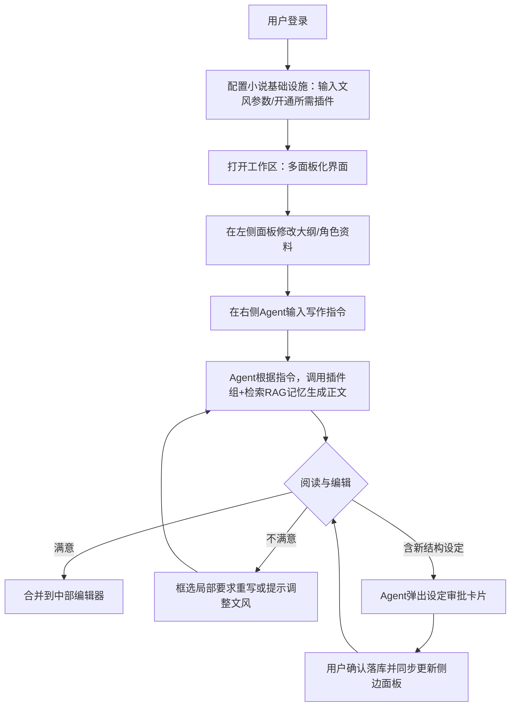
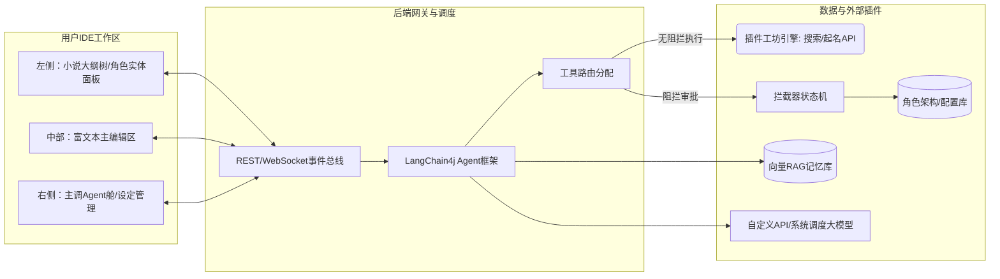

# AI小说Copilot产品需求文档（PRD） v0.2

## 一、概述（为什么做）

### 1.1 背景介绍
当前的辅助写作工具大多基于传统的“你一句我一句”或是简单的实时纠错模式，这往往会打断作者的心流。而在代码领域，AI Coding IDE（如Cursor、GitHub Copilot）通过侧边栏Agent深度统筹项目上下文、通过审批流修改代码，极大提升了开发效率。本产品旨在将这一成功的交互理念引入网络小说创作领域，打造一个专为小说设计的AI写作平台。

### 1.2 产品概述
本产品是一个专业的**AI自动写作Web平台（网站）**。核心理念转变为：**AI是主力写手，作者充当导演与编辑**。通过Web编辑器与侧栏Agent的双向联动，作者下达大纲与局部修改指令，AI负责大段文本生成；支持作者建立小说大纲与结构化资料；Agent还可以自主操作小说数据库并通过弹窗请求用户确认审批（Human-in-the-loop）。
同时，平台引入**开放工坊/插件生态**以拓展AI工具链能力，并增加了**文风管理体系**保证行文统一度。

### 1.3 目标用户
- **业余写作者（爱好者）**：创意丰富但时间和笔力有限，希望由AI承包大部分文字产出，自己只做设定和审核。
- **专业作者/网文工作室**：追求日更效率和文风稳定，利用IDE式的高效协作、文风固化机制与审批流进行规模化生产。

### 1.4 名词说明
- **Agent（智能体）**：侧边栏的AI对话核心，具备调用系统接口与外部插件（Tool/Plugin）的能力。
- **Human-in-the-loop（人在回路）**：AI执行关键操作（如修改数据库）时不直接执行，而是变为前端组件等待用户点击确认。
- **插件工坊（Plugin Workshop）**：提供类似“联网搜索”、“时间获取”、“热点梗词表”等额外能力库，可挂载于Agent增强其生成。
- **文风管理（Style Control）**：为当前小说设定系统级语气与行文特征锚点，AI产出内容将严格参考此配置。
- **BYOK（Bring Your Own Key）**：用户在系统内配置自己购买的第三方大模型API Key。
- **RAG（检索增强生成）**：在生成正文前，自动检索并注入向量数据库中保存的小说原有记忆与角色设定。

### 1.5 角色及权限
- **普通用户（作者）**：拥有自己名下小说的创建、编写、导出及个人API池管理权限，自由选择安装插件工坊中的工具。无全局配置权限。

---

## 二、产品描述（做什么）

### 2.1 产品需求描述
平台采用类似高级IDE的经典三栏或多面板布局（操作面板-编辑器-AI会话板）。主要需求包括：支持AI基于大纲流式生成长篇章节；支持多面板操作UI（大纲编辑、角色卡管理）；设立插件工坊增强Agent能力；增加专门的文风管控模块；Agent自动提取实体触发CRUD审批卡片；支持用户自定义模型API。

### 2.2 产品整体流程

#### 2.2.1 主工作流与交互流


### 2.3 全局说明
#### 2.3.1 全局异常处理
- **API或插件调用超时**：提示对应资源不可用或响应超时。
- **切换文风拦截**：若在写作中途切换文风，需弹出**全局警告**（因严重影响上下文语义连贯性），由作者强势确认后方可执行。

#### 2.3.2 布局交互架构思想
工作区并非单一面板，而是“中心为主、两侧挂载面板”的布局（参考IDE与大型管理面板）。
- **左侧（资源树面板）**：项目大纲树、角色设定卡片列表、文档资源区，支持拖拽排序。
- **中部（核心创作区）**：长文本编辑器，主要阅览、沉淀和局部框选修改操作。
- **右侧（主副控制台）**：Agent会话窗、系统消息、文风管理入口、已挂载插件提示。

### 2.4 功能清单
- IDE化多面版核心工作区（大纲面板、角色资源面板、富文本编辑区）
- 侧边栏Agent交互（长文生成与局部重构框选）
- Human-in-the-loop 设定操作审批机制
- **小说文风管控体系**
- **插件工坊与工具挂载系统**
- BYOK自定义模型与API池管理

---

## 三、功能需求（怎么做）

### 3.1 核心工作区多面板结构（大纲与角色卡布局）

#### 3.1.1 描述
作者需要多维度的信息展示面板来梳理长篇小说的复杂逻辑。

#### 3.1.2 界面及交互
- **左侧资源导航树**：
  1. 类似IDE的文件树。上方为“卷-章节_大纲树”，支持以树状视图展开，可点击直达章节。
  2. 下方为“图鉴/数据库”列表，点击“角色设定”、“世界设定”等可划出对应的结构化详情二级页面或右侧浮窗进行查阅与编辑。
- **中部编辑器**：常规带格式支持文档显示区。
- **顶部操作栏**：提供小说标题、字数统计、环境设置（包含文风快速总览和模型切换入口）。

### 3.2 侧栏Agent交互与写作辅助

#### 3.2.1 描述
右侧对话框为主Agent交互枢纽。AI承担大量长文本生成任务。

#### 3.2.2 核心业务流程与交互
1. **下达生成指令**：作者查阅左侧大纲，在右侧对Agent下令：“开始写第三卷第二章，按照大纲设定，加入些幽默氛围”。
2. **上下文检索增强**：系统提取大纲、近前本章文本以及右侧所配置的相关“文风”，发往LLM。
3. **流式显示与应用**：AI在右侧输出。作者可点击 [合并至编辑器尾部] 或选中左侧某段落点击 [替换所选]。
4. **审批卡片响应**：当生成中出现新派系“暗网”，Agent输出完成后向其下方挂载卡片：「检测到新设定：暗网。是否创建并归档至“世界设定库”？」，供作者点击。

### 3.3 文风管理系统 (Style Control)

#### 3.3.1 描述
作者可设定和统一个该小说的整体行文基调（非系统前端UI），避免由不同API或多次调用导致的行文割裂感。

#### 3.3.2 用户故事
作为作者，我不希望上一千字是优美伤感的辞藻，下一千字突然变成了干瘪的直白叙述。我需要系统替我管注文风。

#### 3.3.3 功能设计
1. 提供**文风录入与微调**：在创建小说或“项目设置”二级面板中，具备专门的“文风配置页”。
   - 支持多参数勾选（如节奏：快/慢；语气：诙谐/严肃/古风文言化/克苏鲁神秘感；描写偏好：动作多/心理多）。
   - 支持“提供范本学习”：作者粘贴一段500字参考样文，系统自动解析并固化文风描述参数。
2. **生成约束（Prompt Inject）**：Agent的每一次长文生成请求，后台都强制将文风参数转译为系统提示词（`System Message`）固化。
3. **切换警告机制**：若用户中途在全局修改文风，系统弹窗警告：“中途切换将导致前后文风格脱节！请确认。”

### 3.4 插件工坊系统 (Plugin Workshop)

#### 3.4.1 描述
开放模型连接外部能力，使Agent不止于“只能查文本”。

#### 3.4.2 业务流程与设计
1. 提供“插件中心”二级页面，供作者像在Chrome/VSCode中一样安装插件或卸载插件。
2. 核心首发插件示例：
   - **今日热网词获取**：使Agent可以搜索最近网络爆火语句。
   - **历史事件与时间联网查询**：帮助考究党写作者实时确认某朝代的细节常识。
   - **网文起名助手**：挂接专业的词典API处理大量特殊名字需求。
3. **原理解析**：安装插件即向LangChain模型的底层添加新的`@Tool`注解接口，当用户问题涉及插件场景时，大模型自主规划并先调用该插件获取网络返回值，再进入回答生成。

### 3.5 模型与API池管理（BYOK）
（继用v0.1原有逻辑：支持加密保存用户的`BaseURL`及`API Key`，或以平台额度抵扣进行模型路由动态构建。）

---

## 四、非功能需求（注意事项）

1. **复杂面板的数据同步**：多面板（左侧树、中间正文、右侧聊天）之间需要保持极致的响应状态一致性（如：Agent创建角色成功时，左侧资源树需无刷自动长出该节点），依靠Vuex/Redux等前端全局状态机配合WebSocket广播事件流实现。
2. **安全性**：加密存储用户API密钥；保证独立用户之间的向量库完全隔离，不泄露私有数据。

---

## 五、技术实现方案（历史架构传承）

为指导后续开发，本部分详细记录系统核心底层的技术与架构设计。

### 5.1 LangChain4j工具拓展与插件工坊实现
原先我们将角色处理作为基础Tool拦截。随着插件加入，工具体系转为“拦截型（Human-in-the-loop）”与“执行型（插件）”双轨制：
```java
// 拦截型示例（拦截阻断并呈现卡片）
@Tool(description = "创建新的角色档案")
public ToolResponse createCharacter(String name) { ... }

// 执行型插件示例（直接执行并获取外部数据给LLM增强生成）
@Tool(description = "进行外部网络检索历史事实")
public String searchHistoricalFact(String query) { ... }
```

### 5.2 RAG记忆检索体系实现
底层以Redis、MySQL配搭Pinecone/Milvus向量数据库：
```java
// 结合文风System Message与动态知识库检索配置
Assistant assistant = AiServices.builder(Assistant.class)
    .chatLanguageModel(dynamicChatModel)
    .systemMessageProvider(chatMemoryId -> getStylePromptForStory(chatMemoryId))
    .contentRetriever(EmbeddingStoreContentRetriever.from(userSpecificEmbeddingStore))
    .build();
```

### 5.3 插件体系与主面板架构流向图

